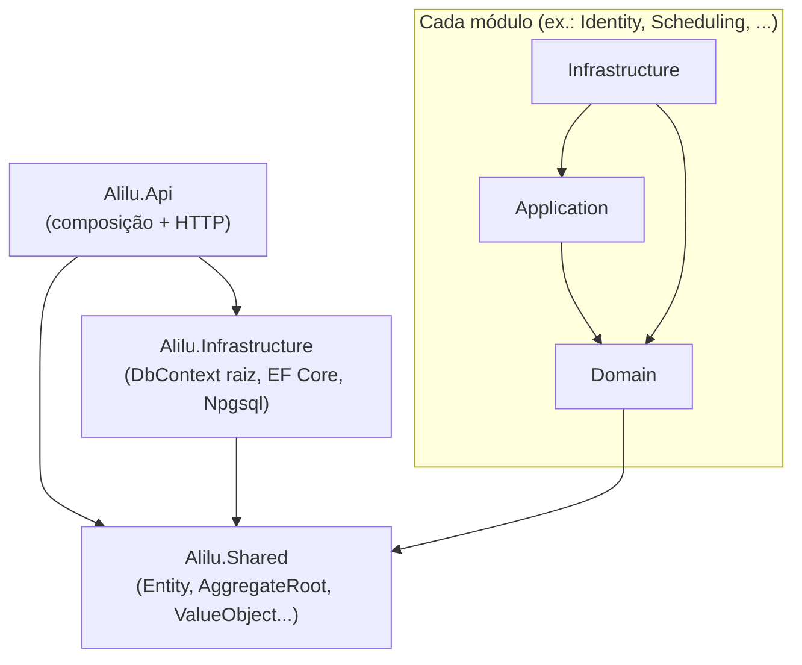

# Arquitetura do backend ALILU

> Documento de arquitetura da **Etapa 01 (Backend modular)**. Descreve a
> fundação modular criada — nenhuma entidade de negócio existe ainda.

## Visão geral

O backend é um **Modular Monolith**: uma única API (`Alilu.Api`) organizada
em módulos de negócio independentes. Cada módulo é dividido em três
projetos .csproj — **Domain**, **Application** e **Infrastructure** — para
manter as regras de negócio isoladas de detalhes de framework e persistência.

```
backend/
├── Alilu.sln
├── Directory.Build.props        # TargetFramework, Nullable, etc. comuns a todos os projetos
├── src/
│   ├── Api/
│   │   └── Alilu.Api/                       # composição da aplicação + exposição HTTP
│   ├── Shared/
│   │   └── Alilu.Shared/                    # Entity, AggregateRoot, ValueObject, DomainException, IDomainEvent
│   ├── Infrastructure/
│   │   └── Alilu.Infrastructure/            # AliluDbContext (raiz), EF Core + Npgsql, configuração de conexão
│   └── Modules/
│       ├── Identity/{Domain,Application,Infrastructure}/
│       ├── Condominium/{Domain,Application,Infrastructure}/
│       ├── Resident/{Domain,Application,Infrastructure}/
│       ├── Professional/{Domain,Application,Infrastructure}/
│       ├── Scheduling/{Domain,Application,Infrastructure}/
│       ├── Reviews/{Domain,Application,Infrastructure}/
│       ├── Recommendations/{Domain,Application,Infrastructure}/
│       ├── Notifications/{Domain,Application,Infrastructure}/
│       └── Administration/{Domain,Application,Infrastructure}/
└── scripts/
    └── check-references.py      # valida as regras de dependência abaixo
```

30 projetos no total: `Alilu.Api`, `Alilu.Shared`, `Alilu.Infrastructure` e
9 módulos × 3 camadas.

## Por que "Alilu.Shared" e não mais "Alilu.BuildingBlocks.Domain"?

Na Etapa 00 o kit de DDD (Entity/AggregateRoot/ValueObject/DomainException)
tinha sido criado como `Alilu.BuildingBlocks.Domain`. A Etapa 01 pede
explicitamente um projeto `Alilu.Shared` na raiz da solução — então esse
projeto foi **renomeado** (mesmo conteúdo, mesmo propósito, novo nome e
namespace `Alilu.Shared`) em vez de criar um projeto duplicado. Referências
em `Alilu.Api` e `Alilu.Infrastructure` foram atualizadas.

`Alilu.Infrastructure` (DbContext raiz + configuração do Postgres) não foi
mencionado na lista de estrutura do PROMPT 01, mas foi mantido tal como
criado na Etapa 00: ele não é um "módulo de negócio", é a composição de
persistência da aplicação, e a seção POSTGRES deste prompt pede exatamente
o que ele já provê (DbContext, configuração de conexão, EF Core). Nenhum
módulo depende dele nem o contrário — ele só é referenciado pela `Alilu.Api`.

## Regras de dependência entre camadas e módulos



Regras aplicadas (e verificadas por `scripts/check-references.py`):

1. **Domain não depende de Infrastructure** (nem de Application) — só de `Alilu.Shared`.
2. **Application não depende de Api** — nem de Infrastructure; só do Domain do próprio módulo.
3. **Infrastructure implementa persistência/integrações** — depende do Domain e da Application do próprio módulo.
4. **Nenhum módulo referencia outro módulo** (Identity não conhece Condominium, etc.) — cada módulo é independente.
5. **Api é só composição + HTTP** — hoje referencia apenas `Alilu.Infrastructure` e `Alilu.Shared`; ainda não referencia nenhum módulo, porque nenhum módulo expõe nada para compor (sem entidades/casos de uso implementados nesta etapa). Cada módulo passará a ser referenciado pela Api quando tiver uma Application/Infrastructure com algo a registrar (ex.: `AddIdentityModule()`).
6. **Sem dependências circulares** no grafo de 30 projetos (confirmado pelo script).

## Verificação automática

```bash
cd backend
python3 scripts/check-references.py
```

O script lê todos os `.csproj` da solução, reconstrói o grafo de
`ProjectReference` e falha (exit code 1) se encontrar: referência de um
módulo para outro, referência de Application/Domain para `Alilu.Api`,
violação da direção Domain→Application→Infrastructure, ou qualquer ciclo
no grafo. Rodado nesta etapa: **30 projetos, 0 violações, 0 ciclos.**

## PostgreSQL / EF Core — status

- `Alilu.Infrastructure` referencia `Microsoft.EntityFrameworkCore`,
  `Npgsql.EntityFrameworkCore.PostgreSQL` e
  `Microsoft.EntityFrameworkCore.Design`.
- `AliluDbContext` (em `src/Infrastructure/Alilu.Infrastructure/Persistence/`)
  é o DbContext raiz da aplicação. Ainda **sem nenhum `DbSet`** — nenhuma
  tabela de negócio foi criada, conforme pedido nesta etapa.
- A connection string vem de `ConnectionStrings:AliluDatabase`
  (`appsettings.Development.json` aponta para o Postgres local do
  `docker-compose.yml`).
- **Migrations:** ainda não existe nenhuma migration — não há nada para
  migrar enquanto `AliluDbContext` não tiver `DbSet`s. Quando o primeiro
  módulo (Identity) implementar suas entidades, a primeira migration será
  criada com:
  ```bash
  dotnet tool install --global dotnet-ef   # uma vez, se ainda não tiver
  dotnet ef migrations add InitialCreate \
    --project src/Infrastructure/Alilu.Infrastructure \
    --startup-project src/Api/Alilu.Api
  ```

## Build

Rodar a solução inteira:

```bash
cd backend
dotnet restore
dotnet build
```

> **Nota sobre o ambiente de build usado pelo Claude (sandbox):** este
> container não tem acesso a `api.nuget.org`. Os 28 projetos que só têm
> `ProjectReference` (sem pacote NuGet externo — `Alilu.Shared` e os 27
> projetos de módulo) foram compilados individualmente aqui com **0 erros**.
> `Alilu.Api` e `Alilu.Infrastructure` (que dependem de EF Core/Npgsql)
> não puderam ser restaurados neste sandbox — o mesmo já acontecia na
> Etapa 00 e foi confirmado que compilam normalmente na sua máquina (você
> já rodou `dotnet build` localmente com sucesso após o Prompt 00).

## O que NÃO foi feito nesta etapa (de propósito)

- Nenhuma entidade, Value Object ou regra de negócio em nenhum módulo.
- Nenhuma tabela/migration do Postgres.
- Módulo Identity não implementado.
- Módulo Condominium não implementado.
- `Alilu.Api` ainda não referencia nenhum módulo (nada para compor ainda).
