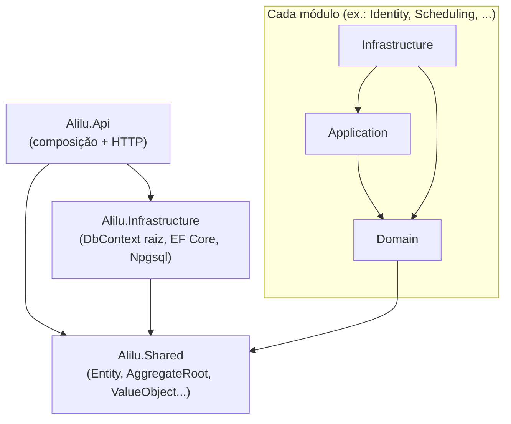

# Arquitetura do backend ALILU

> Documento de arquitetura. Seções sem indicação de etapa descrevem a
> fundação criada na **Etapa 01 (Backend modular)**; as seções **"Etapa 03 —
> módulo Identity"**, **"Etapa 04 — módulo Condominium"** e **"Etapa 05 —
> módulo Resident (validação do morador)"**, no final, descrevem o que
> mudou com cada módulo de negócio real.

## Visão geral

O backend é um **Modular Monolith**: uma única API (`Alilu.Api`) organizada
em módulos de negócio independentes. Cada módulo é dividido em três
projetos .csproj — **Domain**, **Application** e **Infrastructure** — para
manter as regras de negócio isoladas de detalhes de framework e persistência.

```
backend/
├── Alilu.sln
├── Directory.Build.props        # TargetFramework, Nullable, etc. comuns a todos os projetos
├── src/
│   ├── Api/
│   │   └── Alilu.Api/                       # composição da aplicação + exposição HTTP
│   ├── Shared/
│   │   └── Alilu.Shared/                    # Entity, AggregateRoot, ValueObject, DomainException, IDomainEvent
│   ├── Infrastructure/
│   │   └── Alilu.Infrastructure/            # AliluDbContext (raiz), EF Core + Npgsql, configuração de conexão
│   └── Modules/
│       ├── Identity/{Domain,Application,Infrastructure}/
│       ├── Condominium/{Domain,Application,Infrastructure}/
│       ├── Resident/{Domain,Application,Infrastructure}/
│       ├── Professional/{Domain,Application,Infrastructure}/
│       ├── Scheduling/{Domain,Application,Infrastructure}/
│       ├── Reviews/{Domain,Application,Infrastructure}/
│       ├── Recommendations/{Domain,Application,Infrastructure}/
│       ├── Notifications/{Domain,Application,Infrastructure}/
│       └── Administration/{Domain,Application,Infrastructure}/
└── scripts/
    └── check-references.py      # valida as regras de dependência abaixo
```

30 projetos no total: `Alilu.Api`, `Alilu.Shared`, `Alilu.Infrastructure` e
9 módulos × 3 camadas.

## Por que "Alilu.Shared" e não mais "Alilu.BuildingBlocks.Domain"?

Na Etapa 00 o kit de DDD (Entity/AggregateRoot/ValueObject/DomainException)
tinha sido criado como `Alilu.BuildingBlocks.Domain`. A Etapa 01 pede
explicitamente um projeto `Alilu.Shared` na raiz da solução — então esse
projeto foi **renomeado** (mesmo conteúdo, mesmo propósito, novo nome e
namespace `Alilu.Shared`) em vez de criar um projeto duplicado. Referências
em `Alilu.Api` e `Alilu.Infrastructure` foram atualizadas.

`Alilu.Infrastructure` (DbContext raiz + configuração do Postgres) não foi
mencionado na lista de estrutura do PROMPT 01, mas foi mantido tal como
criado na Etapa 00: ele não é um "módulo de negócio", é a composição de
persistência da aplicação, e a seção POSTGRES deste prompt pede exatamente
o que ele já provê (DbContext, configuração de conexão, EF Core). Nenhum
módulo depende dele nem o contrário — ele só é referenciado pela `Alilu.Api`.

## Regras de dependência entre camadas e módulos



Regras aplicadas (e verificadas por `scripts/check-references.py`):

1. **Domain não depende de Infrastructure** (nem de Application) — só de `Alilu.Shared`.
2. **Application não depende de Api** — nem de Infrastructure; só do Domain do próprio módulo.
3. **Infrastructure implementa persistência/integrações** — depende do Domain e da Application do próprio módulo.
4. **Nenhum módulo referencia outro módulo** (Identity não conhece Condominium, etc.) — cada módulo é independente.
5. **Api é composição + HTTP** — referencia `Alilu.Infrastructure` e `Alilu.Shared`, mais a Application/Infrastructure de cada módulo que já tiver algo a compor (ex.: `AddIdentityModule()` — ver "Etapa 03" abaixo). Isso é permitido: a regra é módulo↛módulo, e Domain/Application↛Api — nunca Api↛módulo.
6. **Sem dependências circulares** no grafo de projetos (confirmado pelo script a cada etapa).

## Verificação automática

```bash
cd backend
python3 scripts/check-references.py
```

O script lê todos os `.csproj` da solução, reconstrói o grafo de
`ProjectReference` e falha (exit code 1) se encontrar: referência de um
módulo para outro, referência de Application/Domain para `Alilu.Api`,
violação da direção Domain→Application→Infrastructure, ou qualquer ciclo
no grafo. Rodado nesta etapa: **30 projetos, 0 violações, 0 ciclos.**

## PostgreSQL / EF Core — status (atualizado na Etapa 05)

- `Alilu.Infrastructure` referencia `Microsoft.EntityFrameworkCore`,
  `Npgsql.EntityFrameworkCore.PostgreSQL` e
  `Microsoft.EntityFrameworkCore.Design`.
- `AliluDbContext` (em `src/Infrastructure/Alilu.Infrastructure/Persistence/`)
  é o DbContext raiz da aplicação. Propositalmente **não expõe
  `DbSet<T>` como propriedades** para nenhuma entidade de nenhum módulo —
  isso exigiria `Alilu.Infrastructure` referenciar o Domain de cada módulo,
  quebrando a independência entre eles. Os repositórios de cada módulo
  acessam suas entidades via `dbContext.Set<T>()`, que funciona para
  qualquer tipo já presente no modelo (registrado dinamicamente — ver
  seções "Etapa 03"/"Etapa 04" abaixo) sem precisar de uma propriedade
  `DbSet` declarada.
- Tabelas de negócio até agora: `identity.users`,
  `identity.refresh_tokens` (Etapa 03), `condominium.condominiums`,
  `condominium.condominium_units`, `condominium.condominium_invitations`
  (Etapa 04), `resident.condominium_memberships` (Etapa 05) — schemas
  separados por módulo, mapeadas em
  `Alilu.Modules.<Módulo>.Infrastructure/Persistence/`.
- A connection string vem de `ConnectionStrings:AliluDatabase`
  (`appsettings.Development.json` aponta para o Postgres local do
  `docker-compose.yml`, na porta **5433** do host — remapeada da porta
  padrão 5432 porque, na máquina de desenvolvimento usada até aqui, a 5432
  já estava ocupada por outro projeto local. Se isso não se aplicar ao seu
  ambiente, pode voltar para `5432:5432` no `docker-compose.yml` e no
  `appsettings.Development.json` — só mantenha os dois arquivos
  consistentes entre si.)
- **Migrations:** a primeira migration (`InitialCreateIdentity`, Etapa 03)
  e a migration da Etapa 04 (`AddCondominiumModule`) já foram geradas e
  aplicadas com sucesso pelo usuário. A migration da Etapa 05 (tabela
  `resident.condominium_memberships`, incluindo o índice único filtrado —
  ver seção "Etapa 05" abaixo) ainda **não foi gerada neste sandbox** —
  ver limitação abaixo — gere-a na sua máquina com:
  ```bash
  dotnet ef migrations add AddResidentModule \
    --project src/Infrastructure/Alilu.Infrastructure \
    --startup-project src/Api/Alilu.Api
  dotnet ef database update \
    --project src/Infrastructure/Alilu.Infrastructure \
    --startup-project src/Api/Alilu.Api
  ```
  (o `docker-compose.yml` da raiz sobe o Postgres local usado pela
  connection string de desenvolvimento — confira que o container está no
  ar, `docker compose up -d`, antes de rodar `database update`.)

  As ferramentas do EF Core procuram `Microsoft.EntityFrameworkCore.Design`
  no projeto de **startup** (`Alilu.Api`), não só no projeto do DbContext
  — e como esse pacote está marcado `PrivateAssets="all"` em
  `Alilu.Infrastructure` (não deve "vazar" para quem o referencia), ele
  precisa estar referenciado nos dois `.csproj`. `Alilu.Api.csproj` já
  inclui essa referência.

- **Seed de desenvolvimento (Etapa 04):** `Alilu.Api/Program.cs` roda
  `ICondominiumSeeder.SeedAsync()` logo após `app.MapControllers()`,
  **só quando `app.Environment.IsDevelopment()`** — cria o condomínio
  "Monte Carlo" e algumas unidades fictícias, de forma idempotente
  (confere se o CNPJ de seed já existe antes de inserir). Nunca roda em
  produção e nunca cria usuários/moradores — ver `CondominiumSeeder.cs`.
  O módulo Resident (Etapa 05) **não tem seed** — o vínculo nasce do fluxo
  real (resgatar um convite ou solicitar acesso), nunca de dado fictício.

## Build

Rodar a solução inteira:

```bash
cd backend
dotnet restore
dotnet build
```

> **Nota sobre o ambiente de build usado pelo Claude (sandbox):** este
> container não tem acesso a `api.nuget.org`. Os projetos que só têm
> `ProjectReference` entre si (sem pacote NuGet externo — `Alilu.Shared`,
> os projetos `Domain`/`Application` de cada módulo) foram compilados
> individualmente aqui com **0 erros**. `Alilu.Api`, `Alilu.Infrastructure`
> e a `Infrastructure`/`Application.Tests` de cada módulo (todos dependem
> de pacotes NuGet externos — EF Core/Npgsql, JWT, xUnit) não puderam ser
> restaurados neste sandbox — confirmado que compilam normalmente na sua
> máquina (você já rodou `dotnet build`/`dotnet ef` localmente com sucesso
> após os Prompts 00 e 03).

## O que NÃO foi feito na Etapa 01 (de propósito, histórico)

- Nenhuma entidade, Value Object ou regra de negócio em nenhum módulo.
- Nenhuma tabela/migration do Postgres.
- Módulo Identity não implementado.
- Módulo Condominium não implementado.
- `Alilu.Api` ainda não referenciava nenhum módulo (nada para compor ainda).

---

## Etapa 03 — módulo Identity

Primeiro módulo de negócio real da solução: autenticação completa
(cadastro, login, refresh token com rotação, revogação, `/me`). O módulo
Condominium **continua não implementado** — o usuário autenticado desta
etapa ainda não tem, necessariamente, vínculo com um condomínio (isso é
do módulo Resident, futuro).

### Duas referências novas, ambas já permitidas pelas regras da Etapa 01

1. **`Alilu.Modules.Identity.Infrastructure` → `Alilu.Infrastructure`
   (raiz).** O módulo precisa do `AliluDbContext` compartilhado para
   persistir `User`/`RefreshToken` — não faz sentido cada módulo ter seu
   próprio `DbContext`/conexão. Isso não é uma referência *entre módulos*
   (a regra 4 proíbe módulo→módulo; `Alilu.Infrastructure` não é um
   módulo) e não cria um ciclo: `Alilu.Infrastructure` continua sem
   nenhuma referência de projeto para dentro de qualquer módulo.

   O lado "sem conhecer o módulo" é resolvido em runtime, não em
   compile-time: `AliluDbContext.OnModelCreating` varre
   `AppDomain.CurrentDomain.GetAssemblies()` procurando assemblies cujo
   nome comece com `"Alilu."` e aplica (`ApplyConfigurationsFromAssembly`)
   qualquer `IEntityTypeConfiguration<T>` encontrada neles. Como
   `Alilu.Api` referencia `Alilu.Modules.Identity.Infrastructure`, o
   assembly do módulo já está carregado no processo quando a Api sobe —
   então `UserConfiguration`/`RefreshTokenConfiguration` são descobertas
   sem `Alilu.Infrastructure` jamais precisar de um `using
   Alilu.Modules.Identity...`. Esse era exatamente o plano descrito
   (como comentário) no `AliluDbContext` da Etapa 01.

2. **`Alilu.Api` → `Alilu.Modules.Identity.Application` e
   `Alilu.Modules.Identity.Infrastructure`.** A Api precisa de
   `IAuthService`/DTOs (Application) para o `AuthController`, e de
   `AddIdentityModule()` (Infrastructure) para registrar tudo no DI. A
   regra 5 já previa esse caso: "cada módulo passará a ser
   referenciado pela Api quando tiver algo a registrar".

`scripts/check-references.py` já cobria os dois casos acima sem precisar
de nenhuma mudança — a regra "Infrastructure só referencia Domain/Application
do próprio módulo" nunca proibiu uma referência a um projeto *fora* do
sistema de módulos (`Alilu.Infrastructure` tem `module = None` para o
script), e a Api (`module = None`) nunca teve nenhuma restrição de
referência. Rodado após a Etapa 03: **31 projetos (30 + o novo projeto de
testes), 0 violações, 0 ciclos.**

### Estrutura de `Alilu.Modules.Identity.Infrastructure`

```
Infrastructure/
├── Persistence/
│   ├── UserConfiguration.cs        # IEntityTypeConfiguration<User> (Email como owned type)
│   ├── RefreshTokenConfiguration.cs
│   ├── UserRepository.cs           # IUserRepository via AliluDbContext
│   ├── RefreshTokenRepository.cs
│   └── UnitOfWork.cs               # IUnitOfWork -> AliluDbContext.SaveChangesAsync
├── Security/
│   ├── JwtOptions.cs                # seção "Jwt" do appsettings
│   └── JwtTokenGenerator.cs         # IJwtTokenGenerator via System.IdentityModel.Tokens.Jwt
├── Email/
│   └── NoOpEmailSender.cs           # IEmailSender que só loga (envio real: etapa futura)
└── DependencyInjection.cs           # AddIdentityModule(IServiceCollection, IConfiguration)
```

`Email` (Value Object de Domain) é mapeado como *owned type* do EF Core
(`OwnsOne`), não como um `HasConversion` simples — isso permite consultas
como `u => u.Email.Value == normalizedEmail` serem traduzidas para SQL de
verdade, em vez de dependerem de tradução de operador customizado.

Enums (`UserRole`, `UserStatus`) são armazenados como texto
(`HasConversion<string>()`) para o banco ficar legível e não quebrar se a
ordem dos valores do enum mudar no futuro.

### Testes

`src/Modules/Identity/Application.Tests/` (xUnit) — cobre cadastro
(sucesso, e-mail duplicado, senha fraca, papel privilegiado), login
(sucesso, senha inválida, usuário inexistente, e a garantia de que os
dois casos de erro geram a mesma exceção — proteção contra enumeração de
usuários), refresh (rotação, token já usado, token desconhecido, token
expirado), revogação (marca revogado, idempotência, token desconhecido) e
`/me` (usuário válido, usuário inexistente). Usa fakes em memória para os
repositórios/JWT e as implementações **reais** de `PasswordHasher` e
`RefreshTokenGenerator` (só BCL, sem custo de rodar Postgres).

### Limitação do sandbox de build (Claude) nesta etapa

Igual à Etapa 01: este container não tem acesso a `api.nuget.org`, então
`Alilu.Modules.Identity.Infrastructure`, `Alilu.Api` e o projeto de testes
xUnit (todos dependem de pacotes externos — EF Core, JWT, xUnit) não
puderam ser restaurados/compilados aqui. O que **foi** verificado neste
sandbox:

- `Alilu.Modules.Identity.Domain` e `Alilu.Modules.Identity.Application`
  (zero dependências NuGet externas) compilam com **0 erros/0 warnings**.
- Toda a lógica de `AuthService` (as mesmas regras exercitadas pelos
  testes xUnit) foi validada rodando manualmente contra os fakes em
  memória — **todos os cenários passaram**.
- `python3 scripts/check-references.py` — 0 violações, 0 ciclos.

Rode `dotnet restore && dotnet build` e `dotnet test
src/Modules/Identity/Application.Tests` na sua máquina para a verificação
completa (Infrastructure/Api/testes xUnit).

---

## Etapa 04 — módulo Condominium

Segundo módulo de negócio: cadastro administrativo de condomínios,
unidades e convites de associação a uma unidade. Continua **multi-condomínio
desde o início** (nada aqui assume um único condomínio). O módulo Resident
(quem de fato consome um convite e vira morador de uma unidade) continua
não implementado — ver ressalva no README do módulo.

### Entidades e Value Objects (`Alilu.Modules.Condominium.Domain`)

- **`Condominium`** — `Name`, `Cnpj` (Value Object), `Address`/`Number`/
  `Neighborhood`/`City`/`State`/`ZipCode` (campos simples — diferente do
  CNPJ, nenhuma regra desta etapa precisa consultar/normalizar o endereço
  como um todo), `Status` (`Active`/`Inactive`), `CreatedAt`.
- **`Cnpj`** — Value Object que normaliza para 14 dígitos (sem máscara) e
  valida os dígitos verificadores pelo algoritmo oficial da Receita
  Federal (não é só checagem de tamanho) — mesma ideia de `Email` no
  módulo Identity: normalização é o que permite checar duplicidade de
  forma confiável.
- **`CondominiumUnit`** — `CondominiumId`, `Code`, `Type`
  (`Apartment`/`House`/`Commercial`), `Status`, `CreatedAt`. **De propósito
  sem navegação/FK para `Condominium`** — mesma decisão de `RefreshToken`
  em relação a `User` no módulo Identity (duas raízes de agregado, sem
  acoplar por navegação EF). A existência do condomínio é conferida pela
  Application antes de criar a unidade; a unicidade do código *dentro do
  condomínio* é conferida pela Application (`ExistsByCondominiumIdAndCodeAsync`)
  e reforçada por um índice único composto `(CondominiumId, Code)` em
  Infrastructure.
- **`CondominiumInvitation`** — `CondominiumId`, `UnitId`, `Email`,
  `CodeHash`, `ExpiresAt`, `UsedAt`, `CreatedAt`. Mesma política de
  segurança do `RefreshToken`: só o hash do código é armazenado, nunca o
  valor bruto. Também sem navegação/FK para `Condominium`/`CondominiumUnit`.
  `MarkAsUsed()` lança `DomainException` se o convite já foi usado ou já
  expirou — diferente de `RefreshToken.Revoke()` (idempotente), aqui
  reaproveitar um convite é um erro, não um no-op, porque o convite é uma
  autorização de uso único para uma unidade específica.
- **`IInvitationCodeGenerator`/`InvitationCodeGenerator`** — gera um
  código de 10 caracteres de um alfabeto sem caracteres ambíguos (sem
  `0/O`, `1/I/L`), pensado para ser digitado por uma pessoa (diferente do
  refresh token, que nunca é digitado) — só BCL, mesmo espírito de
  `RefreshTokenGenerator`.

### Autorização em duas camadas

"Não permitir que usuário comum crie condomínios" (e, por extensão, os
demais endpoints administrativos deste módulo) é aplicado em dois lugares:

1. **Api:** `[Authorize(Roles = "CondominiumAdmin,SuperAdmin")]` no nível
   do controller (`CondominiumsController`/`CondominiumInvitationsController`)
   — primeira linha de defesa, via pipeline padrão do ASP.NET Core.
2. **Application:** `CondominiumService` recebe um `CondominiumRequesterRole`
   (enum próprio deste módulo, com os mesmos nomes de
   `Identity.Domain.UserRole` — mas um tipo independente, já que nenhum
   módulo referencia outro) em toda operação, e chama `EnsureIsAdmin(...)`
   no início de cada uma, lançando `InsufficientPermissionsException` (403)
   caso contrário. Isso repete a regra de negócio como segunda camada de
   defesa (mesma filosofia de
   `InvalidRoleForSelfRegistrationException` no módulo Identity) — e é o
   que permite testar "autorização" com testes rápidos em memória, sem
   precisar de um host HTTP real (que este projeto não tem configurado).

### Fluxo de convite nesta etapa

Só existem **criar** e **consultar** convite (ver PROMPT 04 — API). Não
existe endpoint de "resgatar convite" — isso pertence ao módulo Resident,
futuro. `GetInvitationAsync` calcula o status (`Pending`/`Used`/`Expired`)
a partir de `UsedAt`/`ExpiresAt` no momento da consulta, sem guardar esse
status como coluna. Os testes do cenário "convite utilizado" simulam
diretamente o que o futuro fluxo de resgate fará (chamar
`CondominiumInvitation.MarkAsUsed()`), sem precisar desse endpoint existir
ainda.

### Estrutura de `Alilu.Modules.Condominium.Infrastructure`

```
Infrastructure/
├── Persistence/
│   ├── CondominiumConfiguration.cs            # Cnpj como owned type
│   ├── CondominiumUnitConfiguration.cs        # índice único (CondominiumId, Code)
│   ├── CondominiumInvitationConfiguration.cs
│   ├── CondominiumRepository.cs
│   ├── CondominiumUnitRepository.cs
│   ├── CondominiumInvitationRepository.cs
│   └── UnitOfWork.cs
├── Seed/
│   ├── ICondominiumSeeder.cs
│   └── CondominiumSeeder.cs                    # "Monte Carlo" + unidades fictícias, só em Development
└── DependencyInjection.cs                      # AddCondominiumModule(IServiceCollection, IConfiguration)
```

### Testes

`src/Modules/Condominium/Application.Tests/` (xUnit) — cobre os 6
cenários pedidos: criação (condomínio, unidade, convite — incluindo
normalização de CNPJ e rejeição de CNPJ inválido), unidade duplicada
(mesmo código no mesmo condomínio rejeitado; mesmo código em condomínios
diferentes aceito), convite (criação retorna o código bruto uma única
vez; unidade de outro condomínio rejeitada), convite expirado (mesma
técnica de `RefreshTests` no módulo Identity: convite com validade de
100ms + `Task.Delay(250)`), convite utilizado (`MarkAsUsed()` direto na
entidade, simulando o futuro fluxo de resgate; usar duas vezes lança
`DomainException`) e autorização (`AuthorizationTests.cs` varre as 6
operações com papéis não-admin e admin). Usa fakes em memória para os
repositórios e a implementação **real** de `InvitationCodeGenerator` (só
BCL, sem custo de rodar Postgres) — mesmo padrão do módulo Identity.

### Limitação do sandbox de build (Claude) nesta etapa

Igual às Etapas 01/03: `Alilu.Modules.Condominium.Infrastructure`,
`Alilu.Api` e o projeto de testes xUnit (dependem de EF Core/xUnit) não
puderam ser restaurados/compilados aqui. O que **foi** verificado neste
sandbox:

- `Alilu.Modules.Condominium.Domain` e `Alilu.Modules.Condominium.Application`
  (zero dependências NuGet externas) compilam com **0 erros/0 warnings**.
- Toda a lógica de `CondominiumService` (os mesmos 6 cenários pedidos pelo
  PROMPT 04, incluindo os testes de `AuthorizationTests.cs`) foi validada
  rodando manualmente contra os fakes em memória, usando o
  `InvitationCodeGenerator` real — **35 verificações, todas passaram**.
- `python3 scripts/check-references.py` — **32 projetos, 0 violações, 0
  ciclos.**

Rode `dotnet restore && dotnet build`, `dotnet test
src/Modules/Condominium/Application.Tests` e os comandos de migration (ver
seção "PostgreSQL / EF Core" acima) na sua máquina para a verificação
completa.

## Etapa 05 — módulo Resident (validação do morador)

Terceiro módulo de negócio, e o primeiro que **liga** os outros dois: o
vínculo seguro morador↔condomínio↔unidade. Antes desta etapa, um usuário
autenticado (Identity) não tinha nenhuma ligação formal com um condomínio/
unidade (Condominium) — a partir de agora, essa ligação existe como sua
própria entidade, com seu próprio ciclo de vida. Diaristas/prestadores de
serviço continuam **fora de escopo**, de propósito (ver PROMPT 05).

### `CondominiumMembership` (`Alilu.Modules.Resident.Domain`)

Exatamente os campos pedidos no prompt — `Id`, `UserId`, `CondominiumId`,
`UnitId`, `Status`, `ValidatedAt`, `ValidatedBy`, `CreatedAt`, `UpdatedAt`
— e nada além disso. Em particular, **não tem `Name`/`Phone`**: esses
dados já existem em `Identity.User` (Etapa 03); duplicá-los aqui criaria
duas fontes de verdade para a mesma informação. A tela de solicitação
(FLUXO 2) não pede nome/telefone de novo — a Api já os tem a partir do
usuário autenticado.

`MembershipStatus`: `Pending`/`Active`/`Rejected`/`Blocked`. Mesma decisão
de design de `CondominiumUnit`/`CondominiumInvitation`: **sem
navegação/FK** para `User`/`Condominium`/`CondominiumUnit` — só os Ids
como valores simples (e, tecnicamente, nem haveria como declarar essa
navegação: nenhum módulo referencia outro). Dois construtores estáticos,
um para cada fluxo:

- `CreateActiveFromInvitation` (FLUXO 1) — nasce direto `Active`.
  `ValidatedBy` fica `null`: ninguém "aprovou" isto agora, a autorização
  já tinha sido concedida quando o administrador criou o convite (Etapa
  04); essa informação (quem criou o convite) pertence ao módulo
  Condominium e não é replicada aqui.
- `CreatePendingRequest` (FLUXO 2) — nasce `Pending`, aguardando
  `Approve`/`Reject` por um administrador.

`Block` só é válido a partir de `Active`; `Approve`/`Reject` só a partir
de `Pending` — cada um lança `DomainException` fora da transição válida.

### O problema central desta etapa: dois módulos que não podem se falar

O PROMPT 01 estabeleceu que nenhum módulo pode referenciar outro, em
nenhuma camada — regra verificada por `scripts/check-references.py` desde
a Etapa 01, e que continua valendo aqui: `Alilu.Modules.Resident.Application`
só referencia `Alilu.Modules.Resident.Domain`, nunca o módulo Condominium.

Só que o FLUXO 1 (convite) por definição precisa dos dois módulos ao
mesmo tempo: validar o convite é uma regra do módulo Condominium (código,
validade, uso, e-mail — dados que só existem em `CondominiumInvitation`);
criar o `CondominiumMembership` é uma regra do módulo Resident. Nenhum
dos dois pode chamar o outro para resolver isso sozinho.

A solução: a **Api é a composição raiz** (mesmo papel que já cumpre desde
a Etapa 01/03 — ver `Alilu.Api.csproj`, que pode referenciar a Application
e a Infrastructure de qualquer módulo, só os módulos entre si que não
podem). `ResidentMembershipsController.RedeemInvitation` injeta
`IInvitationRedemptionService`/`ICondominiumDirectoryService` (módulo
Condominium) **e** `IMembershipService` (módulo Resident) lado a lado, e
orquestra a sequência:

1. `IInvitationRedemptionService.ValidateInvitationAsync` (Condominium) —
   valida o convite e devolve `CondominiumId`/`UnitId` **resolvidos a
   partir do próprio convite**, nunca de nada que o corpo da requisição
   informe (o corpo só tem o código digitado, ver `RedeemInvitationBody`
   — sem nenhum campo de condomínio/unidade).
2. `IMembershipService.CreateMembershipFromInvitationAsync` (Resident) —
   recebe os Ids já resolvidos e cria o vínculo (`Active`).
3. Só depois do passo 2 ter sucesso, `IInvitationRedemptionService.MarkInvitationAsUsedAsync`
   (Condominium) marca o convite como usado.

Por que a ordem 1→2→3, e não marcar o convite como usado logo no passo 1:
se a criação do vínculo (passo 2) falhar por qualquer motivo — ex.:
`DuplicateMembershipException`, "usuário já vinculado" — um convite
"queimado" à toa deixaria a pessoa sem conseguir tentar de novo, mesmo
sem ter conseguido se vincular. Separar validar (só leitura, passo 1) de
marcar como usado (escrita, passo 3) evita esse problema — é por isso que
`IInvitationRedemptionService` tem os dois métodos separados em vez de um
`RedeemAsync` único.

O FLUXO 2 (solicitação) tem o mesmo formato, mais simples: `RequestAccess`
chama `ICondominiumDirectoryService.ValidateUnitAsync` (Condominium —
confirma que a unidade existe e pertence ao condomínio informado) antes
de chamar `IMembershipService.RequestResidentAccessAsync` (Resident).

### SEGURANÇA — "nunca confiar em condominiumId/unitId vindos do cliente"

Duas interpretações diferentes, dependendo do fluxo:

- **FLUXO 1 (convite):** o cliente **nunca envia** condomínio/unidade — só
  o código (`RedeemInvitationBody(string Code, string? Email)`). Segurança
  por construção: não existe parâmetro para o cliente "escolher" a
  unidade errada, porque o método nem aceita esse parâmetro.
  `InvitationRedemptionTests.ValidateInvitationAsync_NeverAcceptsCondominiumOrUnitFromTheCaller_...`
  prova isso.
- **FLUXO 2 (solicitação):** aqui o cliente necessariamente informa
  condomínio/unidade (é o próprio ato de "escolher minha unidade" no
  diretório público) — a defesa aqui é **revalidar no servidor**:
  `ICondominiumDirectoryService.ValidateUnitAsync` confirma que os dois
  Ids realmente existem e se relacionam antes de deixar o módulo Resident
  criar a solicitação, em vez de aceitar cegamente o que veio do corpo da
  requisição.

"Não permitir vínculo duplicado": checado em duas camadas, mesmo padrão
já usado nas Etapas 03/04 — `MembershipService`/`IMembershipRepository.ExistsActiveOrPendingAsync`
antes de persistir (`DuplicateMembershipException`), e reforçado por um
índice único **filtrado** em `MembershipConfiguration`
(`HasFilter("\"Status\" IN ('Pending','Active')")` — de propósito não
cobre `Rejected`/`Blocked`, para permitir uma nova tentativa depois de uma
rejeição).

**Regra explicitamente adiada** (PROMPT 05 já veio com essa ressalva: "se
essa for a regra definida para o condomínio"): "uma unidade não deve ter
dois moradores principais ativos" **não foi implementada** nesta etapa —
não há, ainda, o conceito de "morador principal" vs. "morador adicional"
em `CondominiumMembership`, nem configuração por condomínio para essa
regra. Fica para uma etapa futura, quando essa regra for de fato
especificada.

### Duas interfaces de Application por módulo (self-service vs. admin)

Mesmo padrão dos dois lados:

- **Condominium:** `ICondominiumService` (administrativo, Etapa 04) +
  `IInvitationRedemptionService`/`ICondominiumDirectoryService` (novos,
  públicos — sem checagem de papel, porque resgatar convite/consultar o
  diretório não é uma ação administrativa).
- **Resident:** `IMembershipService` (self-service — sempre restrito ao
  próprio usuário autenticado, nunca recebe um `userId` de fora; "seguro
  por construção") + `IMembershipAdministrationService` (aprovar/rejeitar/
  bloquear — recebe `ResidentRequesterRole` e chama `EnsureIsAdmin(...)`
  no início de cada operação, mesmo padrão de `CondominiumService`).

### Endpoints novos

- `GET /api/resident/memberships` — `[Authorize]`, lista os vínculos do
  usuário autenticado.
- `GET /api/resident/memberships/active` — `[Authorize]`, vínculo `Active`
  do usuário, ou `204 No Content` ("acesso sem vínculo").
- `POST /api/resident/memberships/redeem-invitation` — `[Authorize]`,
  FLUXO 1.
- `POST /api/resident/memberships/request-access` — `[Authorize]`, FLUXO 2.
- `GET /api/admin/memberships/pending` — `[Authorize(Roles = "CondominiumAdmin,SuperAdmin")]`.
- `POST /api/admin/memberships/{id}/approve` — idem.
- `POST /api/admin/memberships/{id}/reject` — idem.
- `POST /api/admin/memberships/{id}/block` — idem.
- `GET /api/directory/condominiums` — `[Authorize]`, diretório público
  (só condomínios `Active`).
- `GET /api/directory/condominiums/{id}/units` — `[Authorize]`, idem (só
  unidades `Active`).

`ClaimsPrincipalExtensions` ganhou `GetResidentRequesterRole()` (espelha
`GetCondominiumRequesterRole()`) e `GetUserId()` (extraído do claim de
subject do JWT — usado por todo endpoint self-service, para nunca confiar
em um `userId` vindo do corpo da requisição).

`ExceptionHandlingMiddleware`: como os módulos Condominium e Resident
definem, cada um, seu próprio `InsufficientPermissionsException` (mesmo
nome, namespaces diferentes — não têm como compartilhar um tipo comum),
o mapeamento usa o nome totalmente qualificado para essas duas linhas
específicas, para não gerar ambiguidade de nome no `switch`.

### Mobile — fluxo de validação (`mobile/src/modules/resident/`)

Cinco telas pedidas pelo prompt, mais o "gate" que decide entre elas
(`app/(resident)/index.tsx`, a partir de `useMyMemberships` — TanStack
Query sobre `GET /api/resident/memberships`):

- **Nenhum vínculo** (nem `Active`, nem `Pending`) → `ChooseCondominiumScreen`
  — o início do fluxo: botão "Tenho um código de convite" (→ `EnterInvitationCodeScreen`)
  ou a lista de condomínios do diretório público, para quem vai pelo
  FLUXO 2.
- Escolher um condomínio na lista → `RequestResidentAccessScreen`
  (recebe `condominiumId` via parâmetro de rota do expo-router) — lista as
  unidades daquele condomínio (`GET /api/directory/.../units`), o morador
  escolhe a sua e confirma; a solicitação nasce `Pending`.
- **Vínculo `Pending`** → `WaitingApprovalScreen` — tela de espera com um
  botão "Verificar novamente" (refaz a consulta) e logout.
- **Vínculo `Active`** → `ResidentHomeScreen` — área do morador (ainda só
  com os dados básicos do vínculo + logout; as demais telas do morador —
  buscar profissional, agendamentos, avaliações — continuam não
  implementadas, como já eram desde a Etapa 01).

`EnterInvitationCodeScreen` só pede o código — o e-mail enviado ao backend
(campo opcional de `POST .../redeem-invitation`) é sempre o do próprio
usuário autenticado (`useAuth().user.email`), nunca digitado de novo.

Todas as mutações (`useRedeemInvitation`/`useRequestResidentAccess`, em
`modules/resident/hooks.ts`) invalidam a query de "meus vínculos" ao
terminar — por isso basta `router.replace('/(resident)')` depois de uma
mutação com sucesso: o gate detecta o novo estado sozinho, sem precisar
de nenhuma lógica de navegação condicional espalhada pelas telas.

### Testes

- `Condominium.Application.Tests/InvitationRedemptionTests.cs` — convite
  válido (com e sem e-mail informado), e-mail que não bate
  (`InvitationEmailMismatchException`), código inexistente
  (`InvitationNotFoundException`), convite expirado (mesma técnica de
  100ms + `Task.Delay(250)` já usada na Etapa 04), convite já usado
  (`InvitationAlreadyUsedException`), "convite para outra unidade" (prova
  que o resultado sempre traz a unidade *real* do convite, nunca outra —
  a própria assinatura do método não aceita esse parâmetro) e o padrão de
  duas fases (validar não consome o convite; só `MarkInvitationAsUsedAsync`
  consome).
- `Condominium.Application.Tests/CondominiumDirectoryTests.cs` — diretório
  público (só ativos) e `ValidateUnitAsync` (aceita/rejeita).
- `Resident.Application.Tests/` (novo projeto, mesmo padrão dos demais) —
  `RedeemInvitationTests` (vínculo nasce `Active`; "usuário já vinculado"
  → `DuplicateMembershipException`), `RequestResidentAccessTests`
  (solicitação nasce `Pending`; duplicidade), `ApprovalAndRejectionTests`
  (aprovação, rejeição, "depois de rejeitado pode solicitar de novo",
  bloqueio, transições inválidas), `NoActiveMembershipTests` ("acesso sem
  vínculo" — `GetMyActiveMembershipAsync` devolve `null`) e
  `AuthorizationTests` (as 4 operações administrativas, papel admin vs.
  não-admin).

### Limitação do sandbox de build (Claude) nesta etapa

Mesma limitação das Etapas 03/04: `Alilu.Modules.Resident.Infrastructure`,
`Alilu.Api` e os projetos de teste xUnit (dependem de EF Core/xUnit) não
puderam ser restaurados/compilados aqui. O que **foi** verificado neste
sandbox:

- `Alilu.Modules.Resident.Domain`, `Alilu.Modules.Resident.Application` e
  `Alilu.Modules.Condominium.Application` (com os novos serviços desta
  etapa) — todos com zero dependências NuGet externas — compilam com **0
  erros/0 warnings**.
- Toda a lógica de negócio desta etapa (os 10 cenários pedidos pelo PROMPT
  05: convite válido, expirado, já usado, para outra unidade, usuário já
  vinculado, solicitação, aprovação, rejeição, bloqueio, acesso sem
  vínculo) foi validada rodando manualmente contra fakes em memória,
  reaproveitando as mesmas implementações reais dos dois módulos
  (`InvitationCodeGenerator` real, serviços reais) — **27 verificações,
  todas passaram**.
- `python3 scripts/check-references.py` — **33 projetos, 0 violações, 0
  ciclos** — confirma que `Alilu.Modules.Resident.Application` de fato não
  referencia nada do módulo Condominium, mesmo orquestrando os dois na Api.
- Mobile: `npx tsc --noEmit` e `npx eslint .` — **0 erros** em todo o
  projeto (incluindo os arquivos novos desta etapa).

Rode `dotnet restore && dotnet build`, `dotnet test
src/Modules/Resident/Application.Tests`, `dotnet test
src/Modules/Condominium/Application.Tests` e os comandos de migration (ver
seção "PostgreSQL / EF Core" acima) na sua máquina para a verificação
completa.

## Etapa 06 — módulo Professional (profissionais e diaristas)

Quarto módulo de negócio. "Professional NÃO é automaticamente morador"
(PROMPT 06) — este módulo não tem nenhuma relação com `CondominiumMembership`
(módulo Resident): um mesmo usuário poderia, em tese, ter os dois papéis
(morador e profissional), mas um não implica o outro. Agenda/disponibilidade/
atendimentos continuam **fora de escopo** ("Ainda NÃO criar agenda" —
PROMPT 06).

### Entidades (`Alilu.Modules.Professional.Domain`)

Quatro raízes de agregado, exatamente os campos pedidos no prompt, cada
uma **sem navegação/FK** para entidades de outro tipo/módulo — mesma
decisão já usada em `CondominiumUnit`/`CondominiumMembership`: só Ids como
valores simples, checados pela Application antes de persistir e reforçados
por índices em Infrastructure.

- **`Professional`** — perfil profissional de um usuário (`UserId`,
  `DisplayName`, `Description`, `Phone`, `PhotoUrl`, `Status`, `CreatedAt`,
  `UpdatedAt`). `ProfessionalStatus`: `Active`/`Inactive`. Um usuário só
  pode ter um perfil (índice único em `UserId`).
- **`ServiceCategory`** — categoria de serviço (`Name`, `Description`,
  `Active`). Lista **global**, não pertence a nenhum profissional/
  condomínio — as sete categorias iniciais (Diarista, Jardineiro,
  Piscineiro, Eletricista, Encanador, Pedreiro, Pintor) são inseridas por
  `ServiceCategorySeeder` (dev-only, idempotente por nome — mesmo padrão
  de `CondominiumSeeder`); não há endpoint de CRUD de categoria nesta
  etapa (não pedido pelo prompt).
- **`ProfessionalService`** — vínculo profissional↔categoria ("selecionar
  serviços"). Um profissional pode ter vários. Índice único **filtrado**
  em `(ProfessionalId, ServiceCategoryId)` só para `Active = TRUE` —
  permite readicionar a mesma categoria depois de removida.
- **`ProfessionalCondominium`** — "significa que o profissional atende
  aquele condomínio" (definição do próprio prompt). `ProfessionalCondominiumStatus`:
  `Pending`/`Active`/`Rejected`/`Inactive`. `ProfessionalCondominiumSource`:
  `AdminApproved`/`ResidentRecommended`/`CompletedService`/`ProfessionalRequested`
  (os quatro valores exatos pedidos no prompt). Dois construtores
  estáticos: `RequestService` (o profissional solicita atendimento — nasce
  `Pending`, `Source = ProfessionalRequested`) e `CreateActive` (um
  administrador vincula diretamente, já `Active` — não aceita
  `ProfessionalRequested` como origem, esse caminho sempre nasce
  `Pending`). Índice único filtrado em `(ProfessionalId, CondominiumId)`
  só para `Pending`/`Active` — mesmo padrão de `CondominiumMembership`.

**Nota sobre `ResidentRecommended`/`CompletedService`:** o prompt pediu os
quatro valores de `Source`, mas só `ProfessionalRequested` (self-service,
"solicitar atendimento em condomínios") tem, nesta etapa, um caminho de
criação real exposto pela Api. `ResidentRecommended` remete ao módulo
Recommendations e `CompletedService` aos módulos Scheduling/Reviews —
os três já existem hoje (Etapas 08, 09 e 10), mas nenhum dos prompts
recebidos até agora pediu a ligação entre eles e este `Source`: a
`Recommendation` da Etapa 10, em particular, é uma indicação de confiança
independente, não um gatilho automático para criar/alterar um
`ProfessionalCondominium`. Os valores já estão no enum (o tipo já nasceu
"pronto" para o dia em que essa ligação for pedida), mas nenhum caso de
uso os produz ainda — mesmo espírito de deixar uma regra explicitamente
adiada, como a Etapa 05 fez com "morador principal por unidade".

### Três interfaces de Application (self-service / diretório público / admin)

Um padrão a mais que o das Etapas 04/05 (que tinham duas): aqui há também
um diretório público **sem dono** (não é "do profissional" nem "do
morador" — qualquer autenticado consulta).

- **`IProfessionalProfileService`** (self-service) — sempre restrito ao
  próprio `userId` autenticado, nunca recebe papel para checar ("seguro
  por construção", mesmo padrão de `IMembershipService`). Cobre perfil
  (criar/editar/consultar), serviços (adicionar/remover — desativação
  lógica, não exclusão) e `RequestCondominiumAsync` ("solicitar
  atendimento em condomínios").
- **`IProfessionalDirectoryService`** (público, sem checagem de papel) —
  usado pelo morador: `ListCategoriesAsync`, `ListProfessionalsAsync`
  (com filtro opcional de categoria) e `GetProfessionalProfileAsync`. Só
  devolve perfis `Active` — um perfil desativado não aparece na busca nem
  é encontrado por Id direto.
- **`IProfessionalAdministrationService`** (admin, `EnsureIsAdmin(ProfessionalRequesterRole)`)
  — fila de solicitações de atendimento pendentes + aprovar/rejeitar.
  Contrapartida natural de `RequestCondominiumAsync`: sem isso, toda
  solicitação ficaria pendente para sempre — mesmo raciocínio que já
  justificou `IMembershipAdministrationService` na Etapa 05 para o FLUXO 2.

`ProfessionalRequesterRole`: mesmo padrão de `ResidentRequesterRole`/
`CondominiumRequesterRole` — tipo independente deste módulo (mesmos nomes/
valores de `Identity.UserRole`, mas sem referenciar o módulo Identity).

### O mesmo problema da Etapa 05, de novo: dois módulos que não podem se falar

`RequestCondominiumAsync` recebe um `condominiumId` — e, pela mesma regra
de segurança da Etapa 05 ("nunca confiar em Ids vindos do cliente"), esse
Id precisa ser confirmado contra o módulo Condominium antes de o módulo
Professional criar a associação. Só que `ICondominiumDirectoryService.ValidateUnitAsync`
(criado na Etapa 05) exige uma unidade — aqui não há unidade nenhuma
envolvida, só o condomínio.

Solução: **estender** `ICondominiumDirectoryService` (módulo Condominium,
Application) com `ValidateCondominiumAsync(condominiumId)` — confirma só a
existência do condomínio, lança `CondominiumNotFoundException` quando não
encontrado (mesma exceção que `ValidateUnitAsync` já usava, reaproveitada).
`ProfessionalProfileController.RequestCondominium` injeta os dois serviços
lado a lado (`ICondominiumDirectoryService` + `IProfessionalProfileService`)
e orquestra: 1) valida o condomínio (Condominium); 2) só então cria a
solicitação (Professional) — exatamente o mesmo papel de composição raiz
que a Api já cumpre desde a Etapa 05.

### Endpoints novos

Self-service (`[Authorize]`, sempre restrito ao próprio usuário):

- `GET /api/professional/profile` — meu perfil, ou `204 No Content`.
- `POST /api/professional/profile` — criar.
- `PUT /api/professional/profile` — editar.
- `GET /api/professional/profile/services` — meus serviços.
- `POST /api/professional/profile/services` — adicionar serviço.
- `DELETE /api/professional/profile/services/{id}` — remover (desativar) serviço.
- `GET /api/professional/profile/condominiums` — meus vínculos com condomínios.
- `POST /api/professional/profile/condominiums` — "solicitar atendimento em condomínios".

Diretório público (`[Authorize]`, qualquer autenticado):

- `GET /api/directory/professionals/categories` — categorias ativas.
- `GET /api/directory/professionals?categoryId=` — profissionais ativos, filtro opcional.
- `GET /api/directory/professionals/{id}` — perfil de um profissional (404 se não existir/não estiver ativo).

Administrativos (`[Authorize(Roles = "CondominiumAdmin,SuperAdmin")]`):

- `GET /api/admin/professional-condominiums/pending`
- `POST /api/admin/professional-condominiums/{id}/approve`
- `POST /api/admin/professional-condominiums/{id}/reject`

`ClaimsPrincipalExtensions` ganhou `GetProfessionalRequesterRole()`
(espelha `GetResidentRequesterRole()`/`GetCondominiumRequesterRole()`);
`GetUserId()` (Etapa 05) é reaproveitado sem alteração.

`ExceptionHandlingMiddleware`: mesmo raciocínio já registrado na Etapa 05
— `Alilu.Modules.Professional.Application.InsufficientPermissionsException`
precisa de nome totalmente qualificado (terceiro módulo com um tipo de
mesmo nome). Com quatro módulos agora repetindo o padrão, o comentário do
middleware já sinaliza que uma quinta repetição deveria extrair um
contrato comum em `Alilu.Shared`.

### Mobile — `mobile/src/modules/professional/`

Quatro telas pedidas pelo prompt, divididas entre os dois papéis:

- **`ProfessionalEditScreen`** (profissional) — "editar perfil; selecionar
  serviços" + "solicitar atendimento em condomínios". Serve dois modos
  com o mesmo componente: sem perfil (`profile === null`) mostra só o
  formulário de criação; com perfil, mostra o formulário de edição mais
  duas seções — "Meus serviços" (um botão por categoria, alterna
  oferece/não oferece) e "Atendo estes condomínios" (um botão "Solicitar"
  por condomínio sem vínculo, ou o status do vínculo existente). É a
  própria tela inicial do profissional: `app/(professional)/index.tsx` é
  o gate (a partir de `useMyProfessionalProfile`), mesmo padrão do gate
  de `(resident)/index.tsx` da Etapa 05 — sem perfil → formulário de
  criação; com perfil → o perfil completo.
- **`ServiceCategoryScreen`** (morador) — lista de categorias; escolher
  uma navega para `ProfessionalListScreen` já filtrada; "Ver todos os
  profissionais" pula o filtro.
- **`ProfessionalListScreen`** (morador) — "listar profissionais; filtrar
  categoria" (`categoryId` opcional via parâmetro de rota).
- **`ProfessionalProfileScreen`** (morador) — "visualizar perfil"
  (`GET /api/directory/professionals/{id}`).

Roteamento: as três telas do morador ficam em `app/(resident)/`
(`professional-categories`, `professionals`, `professionals/[id]`) —
`ResidentHomeScreen` ganhou o botão "Buscar profissional" apontando para
`professional-categories`, fechando o "ainda não implementadas" que a
Etapa 05 tinha deixado registrado ali.

### Testes

`Professional.Application.Tests/` (novo projeto, mesmo padrão dos demais)
— sem lista de cenários prescrita pelo prompt (diferente das Etapas 04/05),
cobertura própria: `ProfileTests` (criar/consultar/editar, perfil
duplicado), `ServicesTests` (adicionar/remover, categoria inativa/
inexistente, duplicidade, readicionar depois de remover, isolamento entre
profissionais), `CondominiumRequestTests` (solicitação nasce `Pending` com
`Source = ProfessionalRequested`, duplicidade, condomínios diferentes não
conflitam), `AdministrationTests` (fila pendente, aprovar, rejeitar,
transições inválidas, autorização) e `DirectoryTests` (só ativos aparecem,
filtro por categoria, perfil por Id, categorias só ativas).

### Limitação do sandbox de build (Claude) nesta etapa

Mesma limitação das Etapas 03/04/05: `Alilu.Modules.Professional.Infrastructure`,
`Alilu.Api` e os projetos de teste xUnit não puderam ser restaurados/
compilados aqui. O que **foi** verificado neste sandbox:

- `Alilu.Modules.Professional.Domain`, `Alilu.Modules.Professional.Application`
  e `Alilu.Modules.Condominium.Application` (com o novo `ValidateCondominiumAsync`)
  — todos com zero dependências NuGet externas — compilam com **0
  erros/0 warnings**.
- Toda a lógica de negócio desta etapa foi validada rodando manualmente
  contra fakes em memória (as mesmas implementações reais dos serviços) —
  **33 verificações, todas passaram**, incluindo a composição com
  `CondominiumDirectoryService.ValidateCondominiumAsync` real.
- `python3 scripts/check-references.py` — **34 projetos, 0 violações, 0
  ciclos**.
- Mobile: `npx tsc --noEmit` e `npx eslint .` — **0 erros** em todo o
  projeto (incluindo os arquivos novos desta etapa).

Rode `dotnet restore && dotnet build`, `dotnet test
src/Modules/Professional/Application.Tests` e os comandos de migration
(`dotnet ef migrations add AddProfessionalModule --project src/Infrastructure/Alilu.Infrastructure --startup-project src/Api/Alilu.Api`,
depois `dotnet ef database update ...`) na sua máquina para a verificação
completa.

## Etapa 07 — disponibilidade profissional

Continuação do módulo Professional (mesmo módulo, novas entidades) —
"Implementar SOMENTE disponibilidade profissional" (PROMPT 07). Booking/
reservas continuam **fora de escopo** ("Ainda NÃO criar Booking" — PROMPT
07); esta etapa só guarda a agenda do profissional, sem nenhum conceito de
cliente reservando um horário.

### Entidades (`Alilu.Modules.Professional.Domain`)

Duas novas raízes de agregado, mesma decisão de sempre: sem navegação/FK
para `Professional` (mesmo módulo) — só `ProfessionalId` como valor
simples.

- **`ProfessionalAvailability`** — um intervalo recorrente num dia da
  semana (`DayOfWeek` — enum nativo do .NET, não um tipo próprio deste
  projeto —, `StartTime`, `EndTime`, `Active`). Um profissional pode ter
  vários intervalos no mesmo dia (exemplo do próprio prompt: "Segunda:
  08:00-12:00, 13:00-17:00"). Um dia sem nenhum intervalo `Active` é, por
  definição, "indisponível" (exemplo da Quarta no prompt) — não existe um
  valor próprio para isso, é só a ausência de intervalos. `Reschedule`
  edita um intervalo existente (PUT); `Deactivate`/`Activate` fazem a
  remoção lógica (DELETE) — mesmo padrão de `ProfessionalService`.
- **`ProfessionalAvailabilityException`** — uma exceção pontual numa data
  (`Date`, `StartTime`/`EndTime` opcionais, `Type`, `Reason`).
  `ProfessionalAvailabilityExceptionType`: `Blocked` ("bloquear datas") ou
  `Available` ("liberar horários específicos", ex.: abrir um horário numa
  quarta normalmente indisponível). `StartTime`/`EndTime` nulos **em
  conjunto** representam o dia inteiro (`IsFullDay`); quando informados,
  são sempre os dois juntos (validado na própria entidade) e valem só
  para aquela janela dentro do dia. Ao contrário do restante do módulo,
  uma exceção **não tem "reativar"** — ela é, por natureza, um ajuste
  pontual e transitório; removê-la (`DELETE .../exceptions/{id}`) É o
  próprio ato de desbloquear/desliberar a data, então
  `IProfessionalAvailabilityExceptionRepository.RemoveAsync` é exclusão
  definitiva (hard delete), não desativação — única exceção a essa
  convenção em todo o módulo, documentada aqui e no próprio repositório.

### "Não permitir horários sobrepostos" — onde a regra vive

A regra pedida no prompt é uma interseção de intervalos, não uma simples
combinação de colunas — por isso não virou um índice único em
Infrastructure (ao contrário de, por exemplo, `ProfessionalService`).
Cada entidade expõe um método de comparação consigo mesma
(`ProfessionalAvailability.OverlapsWith(dayOfWeek, start, end)` e
`ProfessionalAvailabilityException.OverlapsWith(otherStart, otherEnd)`,
interseção clássica de intervalos `a < d && c < b`), e
`ProfessionalAvailabilityService` é quem carrega os demais registros do
profissional e pergunta a cada um se colide com o candidato — para
intervalos recorrentes, só entre o mesmo `DayOfWeek`; para exceções, só
entre a mesma `Date` (um bloqueio de dia inteiro colide com qualquer outra
exceção naquela data, cheia ou parcial). Ao editar um intervalo (PUT), a
checagem ignora o próprio registro sendo editado (`excludeId`) — senão um
intervalo colidiria consigo mesmo. "Não permitir StartTime >= EndTime" é
validado na própria entidade (`DomainException`, mapeada para 400) — não
depende de nenhum outro registro, então não precisa da Application.

### Timezone — por que não há um campo de fuso horário

"Timezone deverá ser tratado corretamente" (regra do prompt) foi resolvida
pela escolha de tipo, não por um campo novo: `StartTime`/`EndTime` usam
`TimeOnly` e `Date` usa `DateOnly` (tipos do .NET, não `DateTime`) — um
horário de parede/uma data civil **pura**, sem fuso nem offset embutidos.
Isso evita exatamente a ambiguidade de fuso/`DateTime.Kind` que `DateTime`
traria para um dado que é, por natureza, só "08:00" ou "25/12/2026" — não
importa o fuso do servidor que salvou nem o fuso do dispositivo que exibe.
O prompt não pediu um campo de fuso horário (`TimeZoneId`) na lista de
entidades, então nenhum foi adicionado; se um profissional algum dia
precisar de uma agenda em fuso diferente do restante do sistema, esse
campo pode ser adicionado depois sem quebrar o desenho atual (bastaria
guardar um IANA id junto de `Professional` e interpretar `TimeOnly`/
`DateOnly` relativos a ele). O provider Npgsql (EF Core) mapeia `TimeOnly`/
`DateOnly` nativamente para as colunas `time`/`date` do PostgreSQL desde a
v7 — nenhum conversor customizado foi necessário.

**Detalhe de serialização (JSON) que afeta o mobile:** o conversor padrão
do `System.Text.Json` para `TimeOnly` exige o formato completo `"HH:mm:ss"`
— `"08:00"` sozinho (sem segundos) é rejeitado na desserialização. Isso foi
confirmado rodando um pequeno teste manual durante a implementação. Por
isso `mobile/src/modules/professional/availabilityFormat.ts` expõe
`toApiTime`/`fromApiTime` para nunca vazar esse detalhe de formato para as
telas — o profissional só digita/vê "HH:MM".

### Um único endpoint GET para as quatro telas

A lista de endpoints do PROMPT 07 pede um único `GET availability`
(diferente de, por exemplo, o módulo Resident, que tem GETs separados por
recurso). Em vez de inventar GETs adicionais não pedidos, `GET
/api/professional/availability` devolve `ProfessionalAvailabilityOverviewResponse`
— agenda recorrente **e** exceções juntas, numa única consulta — e as
quatro telas React Native pedidas (AvailabilityScreen/AvailabilityEditor/
BlockedDatesScreen/CalendarAvailabilityScreen) partem todas dela no mobile
(uma única chave de cache no TanStack Query,
`['professional', 'availability', 'mine']`, invalidada por qualquer
mutação). Os demais endpoints seguem exatamente a lista do prompt:

- `GET /api/professional/availability`
- `POST /api/professional/availability` — cria um intervalo recorrente.
- `PUT /api/professional/availability/{id}` — edita um intervalo existente.
- `DELETE /api/professional/availability/{id}` — remoção lógica.
- `POST /api/professional/availability/exceptions` — cria uma exceção.
- `DELETE /api/professional/availability/exceptions/{id}` — remoção
  definitiva (ver nota sobre `ProfessionalAvailabilityException` acima).

Todos self-service (`[Authorize]`, sempre restritos a
`User.GetUserId()` — mesmo padrão de `ProfessionalProfileController`), sem
necessidade de uma interface de diretório público ou administrativa nesta
etapa: o prompt não pediu nenhuma tela para o morador ver a disponibilidade
de um profissional (isso é natural de Booking, que "Ainda NÃO" existe), só
telas para o próprio profissional configurar a agenda. Por isso
`IProfessionalAvailabilityService` é a única interface nova de Application
— ao contrário das Etapas 05/06, que precisaram de duas ou três.
`ProfessionalAvailabilityNotFoundException`/`OverlappingAvailabilityException`/
`ProfessionalAvailabilityExceptionNotFoundException` seguem no mesmo
arquivo `ProfessionalExceptions.cs` (convenção de um arquivo de exceções
por módulo) e no mesmo `ExceptionHandlingMiddleware`.

### React Native

- **`AvailabilityScreen`** — agenda recorrente agrupada por dia da semana
  (ordem PT-BR, segunda a domingo — `DAY_OF_WEEK_ORDER` em
  `availabilityFormat.ts`), cada dia com seus intervalos `Active` ou
  "Indisponível" quando não há nenhum; editar/remover por intervalo;
  botão "Adicionar horário" e atalhos para as outras duas telas. É a tela
  inicial da seção de disponibilidade (`app/(professional)/availability/index.tsx`).
- **`AvailabilityEditor`** — "configurar dias; configurar horários": dia
  da semana (botões, mesmo padrão de seleção por toggle de
  `ServicesSection` na Etapa 06) + início/término em texto livre
  "HH:MM", convertido para o formato da Api (`toApiTime`) só no envio. Um
  único componente cria (sem `id` na rota) ou edita (`id` de um intervalo
  existente) — mesmo padrão de reuso de formulário de
  `ProfessionalEditScreen`.
- **`BlockedDatesScreen`** — "bloquear datas; liberar horários
  específicos": formulário (data, tipo Bloquear/Liberar, dia inteiro ou
  horário específico, motivo opcional) mais a lista de exceções já
  cadastradas, cada uma com um botão remover.
- **`CalendarAvailabilityScreen`** — grade de mês própria (sem nenhuma
  biblioteca de calendário/data — este projeto não usa uma até agora;
  `buildMonthGrid` em `availabilityFormat.ts` calcula tudo com `Date`
  nativo), dias com exceção destacados por cor (bloqueado/liberado) e
  navegação entre meses; tocar num dia leva para `BlockedDatesScreen`
  (esta tela é só visualização + atalho, quem cria/remove é a outra).

Roteamento: as quatro telas ficam em `app/(professional)/availability/`
(diferente das telas do morador da Etapa 06, que ficam em
`(resident)/`) — aqui o consumidor é sempre o próprio profissional.
`ProfessionalEditScreen` ganhou o botão "Configurar disponibilidade"
apontando para `availability/index`, mesmo padrão do botão "Buscar
profissional" que a Etapa 06 adicionou em `ResidentHomeScreen`.

### Testes

`AvailabilityTests` (agenda recorrente: criação, `Start >= End` inválido,
sem perfil, sobreposição no mesmo dia/dias diferentes, edição sem colidir
consigo mesma, edição sobrepondo outro intervalo, isolamento entre
profissionais na edição/remoção, remover e readicionar o mesmo horário) e
`AvailabilityExceptionTests` (bloqueio de dia inteiro, janela parcial,
só um de início/término informado, sobreposição entre exceções na mesma
data — incluindo bloqueio de dia inteiro contra qualquer outra, datas
diferentes não conflitam, remoção definitiva e readição, isolamento entre
profissionais na remoção) — mesmo projeto `Professional.Application.Tests`
da Etapa 06, mesmos fakes em memória (`ProfessionalServiceTestFixture`
ganhou `CreateAvailabilitySut()`).

### Limitação do sandbox de build (Claude) nesta etapa

Mesma limitação das etapas anteriores: `Alilu.Modules.Professional.Infrastructure`,
`Alilu.Api` e os projetos de teste xUnit não puderam ser restaurados/
compilados aqui (pacotes NuGet só resolvíveis com acesso à internet, que
este sandbox não tem). O que **foi** verificado:

- `Alilu.Modules.Professional.Domain` e `Alilu.Modules.Professional.Application`
  (ambos sem dependências NuGet externas) compilam com **0 erros/0
  warnings**, com as duas novas entidades e o novo serviço.
- Toda a lógica de negócio desta etapa (sobreposição de intervalos e de
  exceções, validação de horário, remoção lógica vs. definitiva, isolamento
  entre profissionais) foi validada rodando manualmente contra fakes em
  memória (as mesmas implementações reais dos serviços) — **26
  verificações, todas passaram**.
- `python3 scripts/check-references.py` — **34 projetos, 0 violações, 0
  ciclos** (nenhum projeto novo nesta etapa, só arquivos dentro dos
  projetos já existentes do módulo Professional).
- Mobile: `npx tsc --noEmit` e `npx eslint .` — **0 erros/0 warnings** em
  todo o projeto (incluindo os oito arquivos novos e os quatro editados
  desta etapa).

Também confirmado por leitura cuidadosa (sem poder compilar): o
desserializador `TimeOnly`/`DateOnly` do .NET exige os formatos
`"HH:mm:ss"`/`"yyyy-MM-dd"` — testado isoladamente com
`System.Text.Json.JsonSerializer` num projeto console descartável (não
faz parte da entrega). Rode `dotnet restore && dotnet build`, `dotnet test
src/Modules/Professional/Application.Tests` e o comando de migration
(`dotnet ef migrations add AddProfessionalAvailability --project src/Infrastructure/Alilu.Infrastructure --startup-project src/Api/Alilu.Api`,
depois `dotnet ef database update ...`) na sua máquina para a verificação
completa.

## Etapa 08 — agendamento (Scheduling)

"O módulo mais crítico" (PROMPT 08) — o primeiro módulo novo desde a
Etapa 06 e o primeiro cujo caso de uso central (criar um agendamento)
cruza três módulos ao mesmo tempo (Resident, Professional, Scheduling).
Fluxo do morador: "escolher profissional → escolher data → verificar
disponibilidade → escolher horário → selecionar serviços → adicionar
observações → enviar solicitação". Fluxo do profissional: "receber
solicitação → aceitar ou recusar" (mais concluir/marcar não comparecimento
e cancelar, para fechar o ciclo de vida por completo).

### Entidades (`Alilu.Modules.Scheduling.Domain`)

Módulo novo (`Alilu.Modules.Scheduling.*`), mesma estrutura em quatro
camadas dos demais.

- **`Booking`** — a própria raiz de agregado do módulo: `ResidentId`,
  `ProfessionalId`, `CondominiumId`, `UnitId`, `ScheduledDate`
  (`DateOnly`), `StartTime`/`EndTime` (`TimeOnly`, mesma decisão de
  timezone da Etapa 07), `Status` (`BookingStatus`, 8 valores —
  `Requested`/`Confirmed`/`Rejected`/`CancelledByResident`/
  `CancelledByProfessional`/`InProgress`/`Completed`/`NoShow`), `Notes`.
  Mesma decisão de sempre: sem navegação/FK para `User` (Identity),
  `Professional` nem `Condominium`/`CondominiumUnit` — só os Ids como
  valores simples. `ResidentId` é o próprio `User.Id` do morador (não
  existe uma entidade "Resident" própria — mesma convenção de
  `CondominiumMembership.UserId`, Etapa 05); `ProfessionalId` é o
  `Professional.Id` (perfil, Etapa 06), nunca o `User.Id` do profissional.
- **`BookingItem`** — um serviço escolhido no passo "selecionar serviços"
  (`ServiceCategoryId`, `Description` opcional, `Quantity`). Também sem
  FK para `ServiceCategory` (módulo Professional) — a existência/atividade
  da categoria não é revalidada por este módulo (mesma decisão de não
  duplicar validações de outro módulo dentro de uma entidade que não pode
  referenciá-lo); é o React Native quem só oferece categorias que o
  profissional realmente cadastrou (`professional.categories`, resolvido
  pela camada de rotas — ver seção "React Native" abaixo).

`OccupiesSlot` marca quais status ainda "seguram" um horário na agenda
(`Requested`/`Confirmed`/`InProgress`/`Completed`); os demais
(`Rejected`/`CancelledByResident`/`CancelledByProfessional`/`NoShow`)
liberam o horário para um novo agendamento — é essa propriedade que
alimenta a checagem de conflito (ver seção de concorrência abaixo).

### Transições de status — onde cada regra vive

Toda transição é um método da própria entidade (`Confirm`/`Reject`/
`CancelByResident`/`CancelByProfessional`/`MarkInProgress`/`Complete`/
`MarkNoShow`), cada um validando a partir de qual(is) status é válido e
lançando `Alilu.Shared.DomainException` (mapeada para 400) caso contrário
— mesma convenção de `CondominiumMembership.Approve`/`Reject`/`Block`
(Etapa 05): uma transição de status inválida nunca ganhou uma exceção de
Application própria neste projeto, sempre é a exceção de domínio genérica.

- `Confirm`/`Reject` — só a partir de `Requested` ("aceitar"/"recusar").
- `CancelByResident`/`CancelByProfessional` — "cancelamentos devem
  respeitar regras de negócio" (REGRA CRÍTICA): só a partir de
  `Requested` ou `Confirmed` — depois que o atendimento começou
  (`InProgress`) ou terminou (`Completed`) não há mais o que cancelar.
- `MarkInProgress` — só a partir de `Confirmed`.
- `Complete`/`MarkNoShow` — a partir de `Confirmed` **ou** `InProgress`
  (o profissional pode ter pulado o marco "iniciar atendimento" e ainda
  assim concluir ou marcar não comparecimento).

### Conflito de agendamento e concorrência — a única regra que este módulo garante sozinho

"Não permitir conflitos de agendamento", "verificação de conflito deve
acontecer no servidor" e "deve usar transação e mecanismo de concorrência
adequado" (REGRAS CRÍTICAS) são a única responsabilidade que `Scheduling`
pode cumprir sozinho, porque `Booking` é o único dado desta regra que
pertence ao módulo — as demais REGRAS CRÍTICAS (Membership Active,
profissional atende o condomínio, horário disponível) dependem de outros
módulos e são responsabilidade da Api (ver "Composição" abaixo).

- `Booking.OverlapsWith(professionalId, scheduledDate, startTime, endTime)`
  — mesma fórmula de interseção de intervalos de
  `ProfessionalAvailability.OverlapsWith` (Etapa 07): `[a,b)` sobrepõe
  `[c,d)` quando `a < d && c < b`; só considera `this` quando
  `OccupiesSlot` é verdadeiro.
- `IUnitOfWork.ExecuteInSerializableTransactionAsync<T>` (Application) —
  abstração sem nenhuma dependência de Npgsql; `BookingService.CreateBookingAsync`
  roda inteiro dentro dela: primeiro busca os agendamentos que ainda
  "seguram" o horário daquele profissional naquele dia
  (`ListHoldingByProfessionalIdAndDateAsync`) e verifica em memória se
  algum colide (`OverlapsWith`) — isso resolve o caso comum (duas
  requisições sequenciais, ou concorrentes mas espaçadas o suficiente
  para uma terminar antes da outra começar). A implementação real
  (`Scheduling.Infrastructure.Persistence.UnitOfWork`) abre a transação
  com `IsolationLevel.Serializable` do PostgreSQL — a rede de segurança
  para a corrida **genuína** entre duas requisições verdadeiramente
  concorrentes, que a checagem em memória sozinha não pega: se o
  PostgreSQL detectar um conflito de serialização (`SqlState 40001`), o
  `DbUpdateException` correspondente é traduzido para
  `BookingConflictException` (409) depois de desfazer a transação
  (`RollbackAsync`) — nunca vaza a exceção crua do Npgsql para cima. Este
  sandbox não tem acesso a um PostgreSQL real, então só o caminho "em
  memória" pôde ser testado aqui (ver seção de testes); o caminho
  `Serializable` foi verificado por leitura cuidadosa do código e é o que
  de fato importa em produção sob carga concorrente real.

### Composição — onde as REGRAS CRÍTICAS entre módulos são aplicadas

Nenhum dos três módulos envolvidos pode referenciar os outros (PROMPT 01),
então é a Api — composição raiz — quem aplica, em sequência, ANTES de
deixar `Scheduling` criar o agendamento (`BookingsController.Create`):

1. `IMembershipService.ValidateActiveMembershipAsync` (Resident) — "só
   morador com Membership Active pode criar Booking" + "morador só pode
   agendar para a própria Unit" (a própria assinatura do método já exige
   `condominiumId`/`unitId`, então validar que o vínculo Active do
   morador é exatamente esse par resolve as duas regras de uma vez).
2. `IProfessionalDirectoryService.ValidateAttendsCondominiumAsync`
   (Professional) — "profissional deve atender o condomínio".
3. `IProfessionalDirectoryService.ValidateAvailableAsync` (Professional)
   — "o horário deve estar disponível" / "nunca confiar no calendário do
   React Native": resolve agenda recorrente **e** exceções da Etapa 07
   (ver algoritmo abaixo).
4. Só então `IBookingService.CreateBookingAsync` (Scheduling) — que ainda
   garante sozinho, dentro da transação `Serializable`, que não há
   conflito (ver seção anterior).

Se qualquer uma das três primeiras validações falhar, a criação nem chega
a abrir a transação do passo 4 — falha rápido, sem gastar uma
conexão/transação de banco numa requisição que já se sabe inválida. O
mesmo raciocínio se aplica, mais simples, a
`ProfessionalBookingsController` (fluxo do profissional): como
`Booking.ProfessionalId` é o `Professional.Id` (perfil) e não o `User.Id`
de quem está autenticado, e `Scheduling` não pode referenciar o módulo
Professional para resolver esse Id sozinho, é a Api quem resolve o
próprio perfil do profissional autenticado
(`IProfessionalProfileService.GetMyProfileAsync`) antes de repassar o
`professionalId` já resolvido para `IProfessionalBookingService`.

### "Verificar disponibilidade" sem expor a agenda do profissional

O fluxo do morador pede uma checagem explícita antes de enviar a
solicitação, mas a Etapa 07 decidiu deliberadamente não expor a agenda de
um profissional publicamente (só endpoints self-service). A solução foi
um endpoint Api-only, só-leitura, que reaproveita a validação já existente
sem vazar a agenda: `GET
/api/directory/professionals/{id}/availability-check?date=&startTime=&endTime=`
chama `IProfessionalDirectoryService.ValidateAvailableAsync` dentro de um
try/catch e devolve `{ available: true }` ou `{ available: false }` como
uma resposta 200 normal — nenhum horário livre é listado, só um sim/não
sobre a janela exata perguntada. "Nunca confiar no calendário do React
Native" continua valendo: esta consulta só melhora a experiência antes do
envio, a verificação que de fato impede um agendamento inválido é a
repetida no servidor dentro de `POST /api/resident/bookings`.

### Endpoints

Self-service dos dois lados (`[Authorize]`, sempre restritos ao próprio
usuário — segunda camada de defesa nos repositórios: `GetOwnBookingOrThrowAsync`/
`GetOwnRequestOrThrowAsync` devolvem `BookingNotFoundException` também
quando o registro existe mas pertence a outro morador/profissional, nunca
um 403 que confirmaria a existência do registro para quem não é dono).

Lado do morador (`BookingsController`, `api/resident/bookings`):

- `GET /api/resident/bookings` — "meus agendamentos".
- `GET /api/resident/bookings/{id}`
- `POST /api/resident/bookings` — cria a solicitação (composição completa,
  ver acima).
- `POST /api/resident/bookings/{id}/cancel`

Lado do profissional (`ProfessionalBookingsController`, `api/professional/bookings`):

- `GET /api/professional/bookings?status=` — "solicitações recebidas";
  `status` opcional filtra (ex.: só `Requested`).
- `GET /api/professional/bookings/{id}`
- `POST /api/professional/bookings/{id}/accept`
- `POST /api/professional/bookings/{id}/reject`
- `POST /api/professional/bookings/{id}/cancel`
- `POST /api/professional/bookings/{id}/start`
- `POST /api/professional/bookings/{id}/complete`
- `POST /api/professional/bookings/{id}/no-show`

### React Native

Cinco telas do fluxo do morador, encadeadas via parâmetros de rota do
expo-router (este projeto não usa Redux/Zustand — o estado do "wizard" de
agendamento vive só na URL, acumulando a cada passo; TanStack Query
continua cuidando de tudo que é dado de servidor):

- **`ProfessionalBookingScreen`** — "escolher profissional": confirma o
  profissional escolhido (chegando de `ProfessionalProfileScreen`, botão
  "Agendar") e o vínculo que será usado — o morador nunca escolhe
  condomínio/unidade manualmente, sempre o vínculo Active do próprio
  usuário, fechando a REGRA CRÍTICA "morador só pode agendar para a
  própria Unit" já na interface (o servidor revalida de qualquer jeito).
- **`DateSelectionScreen`** — "escolher data": grade de mês própria
  (mesma técnica de `CalendarAvailabilityScreen`, Etapa 07, duplicada em
  `schedulingFormat.ts#buildMonthGrid`), datas passadas desabilitadas.
- **`TimeSelectionScreen`** — "verificar disponibilidade; escolher
  horário": não lista horários livres (a agenda não é pública), o morador
  digita um horário candidato e pede uma checagem explícita
  (`GET .../availability-check`); mudar o horário invalida a checagem
  anterior, "Continuar" só libera depois de uma checagem OK para os
  valores atuais.
- **`BookingServicesScreen`** — "selecionar serviços": só oferece as
  categorias que o profissional escolhido realmente cadastrou.
- **`BookingConfirmationScreen`** — "adicionar observações; enviar
  solicitação": revisão final, observações (opcional) e o `POST`.

Mais três telas de acompanhamento:

- **`MyBookingsScreen`** (morador) — lista dos próprios agendamentos.
- **`ProfessionalRequestsScreen`** (profissional) — "solicitações
  recebidas", com aceitar/recusar diretamente na lista para as
  pendentes.
- **`BookingDetailsScreen`** — um único componente para as duas visões
  (`role: 'resident' | 'professional'`, passado pela rota que a
  renderiza); as ações disponíveis mudam por papel e pelo status atual,
  espelhando exatamente as transições válidas de `Booking.cs` (ex.:
  "Concluir"/"Não compareceu" só aparecem em `Confirmed`/`InProgress`).

**Composição no app, espelhando a Api:** assim como nenhum módulo do
backend referencia outro (a Api é quem compõe), nenhuma tela de
`modules/scheduling/` importa `modules/resident`/`modules/professional`
diretamente — os DTOs enxutos que ela precisa exibir
(`BookingProfessionalSummary`/`BookingMembershipSummary`/
`BookingCondominiumSummary`/`BookingUnitSummary`) são duplicados em
`scheduling/types.ts`, mesma convenção de `CondominiumSummary` duplicado
entre Resident e Professional desde a Etapa 06. Quem resolve os dados de
verdade e os passa como props prontos é a camada de rotas (`app/(resident)/booking/[professionalId]/*.tsx`),
o mesmo papel que `BookingsController` cumpre no backend. Enriquecimento
de exibição que não depende de composição em tempo real (nome do
profissional/condomínio/categoria a partir de um Id já salvo num
`Booking`) usa diretórios públicos próprios do módulo
(`schedulingDirectoryApi`, duplicando chamadas que já existem em
`modules/professional/api.ts`/`modules/resident/api.ts`) — mesmo espírito
de `ResidentHomeScreen` desde a Etapa 05.

Roteamento: `app/(resident)/booking/[professionalId]/{index,date,time,services,confirm}.tsx`
(o fluxo de criação) e `app/(resident)/bookings/{index,[id]}.tsx` (o
acompanhamento) para o morador; `app/(professional)/requests/{index,[id]}.tsx`
para o profissional. `ResidentHomeScreen` ganhou "Meus agendamentos";
`ProfessionalProfileScreen` ganhou "Agendar"; `ProfessionalEditScreen`
ganhou "Solicitações".

### Testes

`Scheduling.Application.Tests/` (novo projeto) — `BookingCreationTests`
(criação válida, sem nenhum item, dois moradores tentando o mesmo horário
exato, janelas sobrepostas mas não idênticas, mesmo horário com
profissional diferente não conflita, horários adjacentes não se
sobrepõem, horário liberado depois de uma rejeição deixa de conflitar) e
`BookingLifecycleTests` (aceitar, recusar, aceitar duas vezes falha,
concluir, concluir sem antes aceitar falha, marcar não comparecimento,
cancelar `Requested`, cancelar `Confirmed`, cancelar `InProgress` falha,
cancelar `Completed` falha, cancelar pelo profissional, isolamento entre
usuários nas quatro operações que dependem de dono). `Resident.Application.Tests`
ganhou `ActiveMembershipValidationTests` (5 testes: vínculo Active
correto, sem vínculo, vínculo Pending, condomínio errado, unidade errada)
e `Professional.Application.Tests/DirectoryTests` ganhou ~13 testes novos
cobrindo `ValidateAttendsCondominiumAsync`/`ValidateAvailableAsync`
(profissional não atende o condomínio, disponível dentro de um intervalo
recorrente, fora de qualquer intervalo, profissional bloqueado por
exceção de dia inteiro, bloqueado por janela parcial, liberado por exceção
`Available` mesmo fora da agenda recorrente, exceção de bloqueio
sobrepondo parcialmente vence mesmo dentro de um intervalo recorrente,
dias diferentes não se afetam).

Cobrindo explicitamente a lista de cenários do prompt — "dois moradores
tentam agendar o mesmo horário", "profissional indisponível", "profissional
bloqueado", "morador sem Membership", "condomínio errado", "unidade
errada", "cancelamento", "aceite", "rejeição", "conclusão" — mais uma
bateria própria de casos extras (horários adjacentes, no-show, isolamento
entre usuários, etc.).

### Limitação do sandbox de build (Claude) nesta etapa

Mesma limitação de sempre: `Alilu.Modules.Scheduling.Infrastructure`,
`Alilu.Api` e os projetos de teste xUnit (`Scheduling.Application.Tests`
incluso) não puderam ser restaurados/compilados aqui (pacotes NuGet só
resolvíveis com acesso à internet, que este sandbox não tem — confirmado
de novo nesta etapa rodando `dotnet build` deliberadamente sobre
`Professional.Application.Tests` e observando o `NU1101` esperado). O que
**foi** verificado:

- `Alilu.Modules.Scheduling.Domain`, `Alilu.Modules.Scheduling.Application`,
  `Alilu.Modules.Resident.Application` (com o novo
  `ValidateActiveMembershipAsync`) e `Alilu.Modules.Professional.Application`
  (com os novos `ValidateAttendsCondominiumAsync`/`ValidateAvailableAsync`)
  — todos com zero dependências NuGet externas — compilam com **0
  erros/0 warnings**.
- Toda a lógica de negócio desta etapa (ciclo de vida completo do
  `Booking`, conflito em memória, composição entre os três módulos, o
  algoritmo "exceções sobrepõem agenda recorrente") foi validada rodando
  manualmente contra fakes em memória (as mesmas implementações reais dos
  serviços, com namespaces isolados por alias para os três módulos
  envolvidos) — **33 verificações, todas passaram**, incluindo os nove
  cenários explícitos do prompt.
- `python3 scripts/check-references.py` — **35 projetos, 0 violações, 0
  ciclos**.
- Mobile: `npx tsc --noEmit` e `npx eslint .` — **0 erros/0 warnings** em
  todo o projeto (incluindo os vinte e três arquivos novos e os cinco
  editados desta etapa).

O que este sandbox **não pode** provar é o comportamento sob concorrência
real do PostgreSQL (`IsolationLevel.Serializable`, `SqlState 40001`) — só
verificável rodando duas requisições de verdade, ao mesmo tempo, contra um
banco real. Rode `dotnet restore && dotnet build`, `dotnet test
src/Modules/Scheduling/Application.Tests` e os comandos de migration
(`dotnet ef migrations add AddSchedulingModule --project src/Infrastructure/Alilu.Infrastructure --startup-project src/Api/Alilu.Api`,
depois `dotnet ef database update ...`) na sua máquina para a verificação
completa — e, se possível, um teste manual com duas abas/dispositivos
tentando reservar o mesmo horário ao mesmo tempo, para observar o
`BookingConflictException` (409) nascido da transação `Serializable`
de verdade.

## Etapa 09 — avaliações (Reviews)

PROMPT 09 — "implementar SOMENTE Reviews". Módulo novo (`Alilu.Modules.Reviews.*`,
mesma estrutura em quatro camadas), pequeno e de escopo estrito: o morador
avalia um `Booking` `Completed`, o profissional só lê o que recebeu. Mesmo
formato de composição entre módulos já usado na Etapa 08, agora numa
direção só (Reviews depende de uma validação do Scheduling, nunca o
contrário).

### Entidade (`Alilu.Modules.Reviews.Domain`)

- **`Review`** — a própria raiz de agregado do módulo: `BookingId`,
  `ResidentId`, `ProfessionalId`, `Rating` (`int`, 1 a 5), `Comment`
  (opcional), `CreatedAt`. Mesma decisão de sempre: sem navegação/FK para
  `Booking` (Scheduling), `User` (Identity) nem `Professional`
  (Professional) — só os Ids como valores simples.
  De propósito **não há** `UpdatedAt` — o prompt listou exatamente sete
  campos para `Review`, diferente de `Booking` (Etapa 08), que listou
  `CreatedAt` **e** `UpdatedAt` explicitamente; `Edit` muda
  `Rating`/`Comment` sem tocar em nenhum campo de data, respeitando essa
  lista à risca.
  `Create`/`Edit` validam a mesma coisa (`Rating` entre 1 e 5 e, em
  `Create`, todos os três Ids não-vazios — "não permitir avaliação
  anônima" é garantido aqui: `ResidentId` nunca pode ser `Guid.Empty`) via
  `Alilu.Shared.DomainException`, mesmo estilo de `Booking.Request`.

### As REGRAS do prompt e onde cada uma vive

- **"Somente Booking Completed pode ser avaliado"** + **"somente o
  Resident daquele Booking pode avaliar"** — dependem de dados que
  pertencem ao módulo Scheduling, que o módulo Reviews não pode
  referenciar (PROMPT 01). Solução: um novo método de extensão em
  `IBookingService` (Scheduling) —
  `ValidateCompletedBookingForReviewAsync(residentId, bookingId)` —
  reaproveita o `GetOwnBookingOrThrowAsync` já existente (mesma segunda
  camada de defesa da Etapa 08: dono errado vira `BookingNotFoundException`,
  nunca um 403 que confirmaria a existência do registro) e lança a nova
  `BookingNotCompletedException` (409) quando o status não é `Completed`.
  Devolve o `ProfessionalId` do agendamento — o único jeito do módulo
  Reviews descobrir esse Id sem referenciar Scheduling. Quem chama esse
  método, e só então chama `IReviewService` (Reviews), é a Api —
  `ReviewsController.Create`/`Edit` — exatamente o mesmo papel de
  `BookingsController` na Etapa 08, só que compondo dois módulos em vez de
  três.
- **"Somente uma Review por Booking"** — a única regra desta etapa que o
  próprio módulo Reviews garante sozinho, porque `Review` é o único dado
  dela que pertence ao módulo: checagem em memória
  (`ReviewService.CreateAsync` busca por `BookingId` antes de criar) mais
  um índice único **sem filtro** em `BookingId`
  (`ReviewConfiguration.HasIndex(r => r.BookingId).IsUnique()`) como rede
  de segurança contra a corrida entre duas requisições concorrentes — mesmo
  raciocínio de `IUnitOfWork.ExecuteInSerializableTransactionAsync` na
  Etapa 08, mas resolvido com uma constraint simples de unicidade em vez de
  uma transação `Serializable`: "avaliar de novo o mesmo Booking" não tem o
  componente de janela de tempo/disponibilidade que motivou a transação
  forte de `Booking`, só uma restrição de unicidade incondicional — por
  isso **sem filtro**, diferente do índice único **filtrado** de
  `MembershipConfiguration` (Etapa 05/06, que permite nova tentativa depois
  de uma rejeição): aqui não existe "tentar de novo depois de rejeitado",
  uma vez avaliado, sempre avaliado.
- **"Rating entre 1 e 5"** — `Review.Create`/`Edit` (Domain), via
  `DomainException` (400) — mesma convenção de erro de domínio genérico já
  usada para "horário de início antes do término" (`Booking`) etc.
- **"Não permitir avaliação anônima"** — `ResidentId` obrigatório e não
  vazio em `Review.Create` (Domain) — não existe, e nunca existiu, um
  caminho para criar uma `Review` sem autor.
- **"Editar avaliação dentro da regra definida"** — decisão de escopo
  deliberada: a "regra definida" é interpretada como a mesma regra de
  autoria da criação (só quem avaliou pode editar, verificado por
  `ReviewService.EditAsync` via `GetOwnReviewOrThrowAsync`, mesmo padrão de
  `GetOwnBookingOrThrowAsync`), **não** uma nova janela de tempo inventada
  (ex.: "só pode editar em até 24h") — o prompt não especificou nenhum
  prazo, e inventar um seria extrapolar o escopo. `EditAsync` não
  revalida "Booking Completed" de novo (o status de um `Booking` nunca
  regride depois de `Completed` — ver `Booking.cs`, Etapa 08 — então se
  valia na criação, continua valendo para sempre).

### Endpoints

Self-service dos dois lados (`[Authorize]`, sempre restritos ao próprio
usuário — mesma segunda camada de defesa de sempre).

Lado do morador (`ReviewsController`, `api/resident/reviews`):

- `GET /api/resident/reviews` — "visualizar avaliações feitas".
- `GET /api/resident/reviews/booking/{bookingId}` — devolve a avaliação do
  morador para aquele agendamento, ou **204 sem corpo** quando ainda não
  existe (mesmo padrão "204" de `IMembershipService.GetMyActiveMembershipAsync`/
  `IProfessionalProfileService.GetMyProfileAsync`) — o React Native usa
  isso para decidir se abre em modo "avaliar" ou "ver/editar avaliação".
- `POST /api/resident/reviews` — "avaliar profissional" (composição
  completa, ver seção anterior).
- `PUT /api/resident/reviews/{id}` — "editar avaliação".

Lado do profissional (`ProfessionalReviewsController`, `api/professional/reviews`):

- `GET /api/professional/reviews` — "visualizar avaliações recebidas".
- `GET /api/professional/reviews/summary` — "visualizar média"
  (`ProfessionalRatingSummaryResponse`: total + média; `0`/`0` quando ainda
  não há nenhuma avaliação, sem divisão por zero).

Mesmo padrão de `ProfessionalBookingsController` (Etapa 08) para resolver
o `professionalId`: como `Review.ProfessionalId` é o `Professional.Id`
(perfil) e não o `User.Id` de quem está autenticado, e o módulo Reviews
não pode referenciar o módulo Professional, é a Api quem resolve o próprio
perfil do profissional autenticado
(`IProfessionalProfileService.GetMyProfileAsync`) antes de repassar o
`professionalId` já resolvido para `IProfessionalReviewService`.

### Decisões de escopo (o que este prompt não pediu)

Registradas explicitamente, mesmo hábito de honestidade de escopo das
etapas anteriores (ex.: "nenhum profissional/usuário fictício no seed",
Etapa 06):

- **Sem exposição pública da média para o morador** — o prompt só pediu
  "visualizar média" do lado do **profissional** ("Profissional: ...
  visualizar média"); o diretório público de profissionais (módulo
  Professional, `ProfessionalDirectoryItem`) não ganhou um campo de
  rating nesta etapa, e `RatingSummary` (React Native) só aparece em
  `ProfessionalReviewsScreen`, nunca em `ProfessionalProfileScreen`
  (visão do morador). Se uma etapa futura pedir isso, é uma extensão de
  `IProfessionalDirectoryService`/`ProfessionalDirectoryItem`, não uma
  mudança neste módulo.
- **Sem identificar o autor para o profissional** — `ReviewResponse` nunca
  devolve nome/dados do morador (só `residentId`, cru); o prompt pediu
  "visualizar avaliações recebidas", não "saber quem avaliou".
- **Sem tela de histórico dedicada além das três nomeadas** — "visualizar
  avaliações feitas" é servido por `ReviewScreen` funcionando como
  visualizador/editor quando alcançada a partir de um `Booking` específico
  (`GET .../booking/{bookingId}`) e por `GET /api/resident/reviews` (lista
  completa, exposta via `useMyReviews`, ainda que nenhuma tela desta etapa
  a exiba diretamente — fica disponível para composição futura, mesmo
  padrão de "endpoint pronto, tela específica é decisão de uma etapa
  futura" já visto em módulos anteriores) — o prompt só nomeou
  `ReviewScreen`/`ProfessionalReviewsScreen`/`RatingSummary` como
  componentes React Native, nenhuma quarta tela de "minhas avaliações" foi
  inventada.

### React Native

- **`ReviewScreen`** — "avaliar profissional" **e** "editar avaliação" na
  mesma tela: `useMyReviewForBooking(bookingId)` decide o modo (existe
  avaliação → formulário abre preenchido e o envio vira `PUT`; não existe
  → formulário em branco e o envio vira `POST`) — mesmo padrão de
  `ProfessionalEditScreen` (cria vs. edita o mesmo formulário, Etapa 06).
  O seletor de nota é uma fileira de 5 estrelas tocáveis (`Pressable` +
  `RATING_STARS`), não um campo de texto — sem necessidade de
  `z.coerce.number()` no schema Zod, diferente de
  `bookingItemQuantitySchema` (Etapa 08), porque o valor nunca é digitado.
  "Não permitir avaliação antes da conclusão" é garantido pelo **ponto de
  entrada** (só alcançável a partir de "Avaliar", que só aparece em
  `Booking` `Completed` — ver `reviewSlot` abaixo), não por uma checagem
  redundante dentro da própria tela; o servidor revalida de qualquer jeito
  (`BookingNotCompletedException`, 409, aparece como mensagem de erro
  comum se o estado mudar entre abrir a tela e enviar).
- **`ProfessionalReviewsScreen`** — "visualizar avaliações recebidas;
  visualizar média": `RatingSummary` no topo, lista das avaliações abaixo
  (estrelas + comentário + data, nunca o autor — ver decisão de escopo
  acima).
- **`RatingSummary`** — componente puro (`averageRating`/`totalReviews`),
  usado só dentro de `ProfessionalReviewsScreen` (ver decisão de escopo
  "sem exposição pública" acima).

**Ponto de extensão `reviewSlot` — o mesmo problema de composição da Etapa
08, resolvido do mesmo jeito, agora no React Native:** o módulo
`scheduling` não pode importar o módulo `reviews` (mesma regra de
independência de módulos, espelhada no app desde a Etapa 08). Como
`BookingDetailsScreen` (módulo `scheduling`) é quem decide *quando* mostrar
o botão "Avaliar"/"Ver avaliação" (`role === 'resident' && booking.status
=== 'Completed'`), mas não pode ser quem o *renderiza* (isso exigiria
importar `reviews`), a tela ganhou uma prop opcional
`reviewSlot?: (booking: Booking) => ReactNode` — um render-prop: quem
quiser mostrar algo ali fornece uma função que recebe o `Booking` e
devolve o elemento a renderizar. Quem preenche esse slot é a rota
hospedeira (`app/(resident)/bookings/[id]/index.tsx`), que importa
`modules/reviews` livremente (rotas não têm essa restrição, mesmo papel
dos controllers da Api) — ela chama `useMyReviewForBooking` para decidir o
rótulo do botão ("Avaliar profissional" vs. "Ver avaliação") antes de
navegar para `bookings/[id]/review`.

**Reestruturação de rota:** `app/(resident)/bookings/[id].tsx` (arquivo
único desde a Etapa 08) virou uma rota aninhada —
`app/(resident)/bookings/[id]/index.tsx` (o mesmo `BookingDetailsScreen`
de antes, agora com o `reviewSlot`) mais um novo
`app/(resident)/bookings/[id]/review.tsx` (`ReviewScreen`) — mesmo padrão
já usado por `booking/[professionalId]/*` (Etapa 08) e `availability/*`
(Etapa 07) para caber mais de uma tela sob o mesmo segmento dinâmico.
`review.tsx` resolve o nome do profissional (`schedulingDirectoryApi`,
módulo Scheduling) e repassa como prop pronta para `ReviewScreen` — mesma
composição de `BookingDetailsScreen`.

`ProfessionalEditScreen` ganhou um atalho "Avaliações", ao lado de
"Solicitações"/"Configurar disponibilidade", levando para
`app/(professional)/reviews/index.tsx` (`ProfessionalReviewsScreen`).

### Testes

`Reviews.Application.Tests/` (novo projeto) — `ReviewCreationTests`
(criação válida, segunda avaliação do mesmo `Booking` falha com
`DuplicateReviewException`, `Rating` 0/6/-1 falham com `DomainException`,
`ResidentId` vazio falha com `DomainException`, busca por `Booking` sem
avaliação devolve `null`, busca por `Booking` de outro morador também
devolve `null` — segunda camada de defesa mesmo no lookup "nullable") e
`ReviewEditAndProfessionalViewTests` (dono edita com sucesso, outro
morador tentando editar falha com `ReviewNotFoundException`, avaliação
inexistente falha com `ReviewNotFoundException`, `Rating` fora do
intervalo falha na edição também, listagem do profissional filtra
corretamente, média com zero avaliações é `0`/`0`, média com duas
avaliações calcula certo). `Scheduling.Application.Tests` ganhou
`BookingReviewValidationTests` (4 testes: `Booking` `Completed` do próprio
morador devolve o `ProfessionalId` certo, `Booking` `Requested` falha com
`BookingNotCompletedException`, `Booking` cancelado falha com
`BookingNotCompletedException`, `Booking` `Completed` de outro morador
falha com `BookingNotFoundException`).

Cobrindo explicitamente as REGRAS do prompt — "somente Booking Completed
pode ser avaliado", "somente o Resident daquele Booking pode avaliar",
"somente uma Review por Booking", "Rating entre 1 e 5", "não permitir
avaliação anônima" — mais os dois lados de "visualizar" (morador e
profissional).

### Limitação do sandbox de build (Claude) nesta etapa

Mesma limitação de sempre: `Alilu.Modules.Reviews.Infrastructure`,
`Alilu.Api` e os projetos de teste xUnit (`Reviews.Application.Tests`
incluso) não puderam ser restaurados/compilados aqui (pacotes NuGet só
resolvíveis com acesso à internet). O que **foi** verificado:

- `Alilu.Modules.Reviews.Domain`, `Alilu.Modules.Reviews.Application` e
  `Alilu.Modules.Scheduling.Application` (com o novo
  `ValidateCompletedBookingForReviewAsync`) — todos com zero dependências
  NuGet externas — compilam com **0 erros/0 warnings**.
- Toda a lógica de negócio desta etapa (validação cruzada Scheduling→Reviews,
  criação/edição, duplicidade, intervalo de nota, autoria, média) foi
  validada rodando manualmente contra fakes em memória (as mesmas
  implementações reais dos serviços) — **17 verificações, todas
  passaram**.
- `python3 scripts/check-references.py` — **36 projetos, 0 violações, 0
  ciclos**.
- Mobile: `npx tsc --noEmit` e `npx eslint .` — **0 erros/0 warnings** em
  todo o projeto (incluindo os arquivos novos e editados desta etapa).

O que este sandbox **não pode** provar é o índice único de
`ReviewConfiguration` de fato rejeitando uma segunda avaliação
concorrente contra um PostgreSQL real (só a checagem em memória foi
exercitada aqui) — rode `dotnet restore && dotnet build`, `dotnet test
src/Modules/Reviews/Application.Tests` e os comandos de migration
(`dotnet ef migrations add AddReviewsModule --project src/Infrastructure/Alilu.Infrastructure --startup-project src/Api/Alilu.Api`,
depois `dotnet ef database update ...`) na sua máquina para a verificação
completa.

## Etapa 10 — recomendações (Recommendations)

PROMPT 10 — "implementar SOMENTE Recommendations". Módulo novo
(`Alilu.Modules.Recommendations.*`, mesma estrutura em quatro camadas).
Diferente de `Review` (Etapa 09, sempre referente a um `Booking` concluído
DENTRO do ALILU), uma `Recommendation` é uma indicação de confiança que
pode se referir a um profissional nunca contratado pelo ALILU (indicação
externa) — por isso a entidade não depende de nenhum dado do módulo
Scheduling, e as duas REGRAS CRÍTICAS que cruzam módulos ("morador Active
pode recomendar", "se o profissional já existir no ALILU, vincular
ProfessionalId") são resolvidas reaproveitando **dois métodos já
existentes** dos módulos Resident/Professional — nenhuma mudança de código
foi necessária nesses dois módulos, diferente das Etapas 08/09, que cada
uma precisou de um método novo do lado de quem era consultado.

### Entidade (`Alilu.Modules.Recommendations.Domain`)

- **`Recommendation`** — a própria raiz de agregado do módulo:
  `CondominiumId`, `RecommendedByUserId`, `ProfessionalId` (nullable),
  `ExternalProfessionalName` (nullable), `ExternalPhone` (nullable),
  `ServiceCategoryId`, `Comment`, `Status`, `CreatedAt`, `ApprovedAt`
  (nullable), `ApprovedBy` (nullable). Mesma decisão de sempre: sem
  navegação/FK para `User` (Identity), `Professional` (Professional) nem
  `Condominium` (Condominium) — só os Ids como valores simples.
  De propósito **não há** `UpdatedAt` (mesma decisão de `Review`, Etapa
  09). O prompt marcou só três campos como "nullable" na lista da
  entidade — por contraste, **`Comment` é interpretado como
  obrigatório** (diferente de `Review.Comment`, que ficou opcional na
  Etapa 09): aqui a indicação **é** o comentário ("por que confio nesse
  profissional"), não um complemento opcional de uma nota numérica — não
  existe uma "nota" nesta entidade para o comentário complementar.
- **Indicação interna vs. externa (XOR)** — exatamente um entre
  `ProfessionalId` e `ExternalProfessionalName` deve estar preenchido
  (nunca os dois, nunca nenhum); quando `ProfessionalId` é informado,
  `ExternalProfessionalName`/`ExternalPhone` devem ser nulos. Validado
  inteiramente dentro de `Recommendation.Recommend` (Domain), via
  `Alilu.Shared.DomainException` — mesmo estilo de `Booking.Request`/
  `Review.Create`.
- **Transições de status** (`Pending → Approved`, `Pending → Rejected`,
  `Approved → Blocked`) — `Approve(Guid approvedByUserId)` recebe o ator
  porque `ApprovedBy` é um campo dedicado da entidade; `Reject()`/
  `Block()` **não** recebem ator, porque não existe nenhum campo
  equivalente para recusa/bloqueio — mesma regra aplicada em
  `ProfessionalCondominium.Approve()/Reject()` (Etapa 06, sem nenhum
  campo de auditoria) e contrastada com `CondominiumMembership.Approve/
  Reject/Block` (Etapa 05, todas as três recebem ator porque as três
  compartilham o mesmo par `ValidatedAt`/`ValidatedBy`): o parâmetro de
  ator em uma transição de Domain só existe quando há um campo dedicado
  para guardá-lo, nunca "porque parece mais seguro". `Block` parte de
  `Approved`, não de `Pending` — `Reject` já cobre o caminho
  `Pending`→negativo; bloquear é para uma indicação que já ficou pública
  e precisou ser removida depois (ex.: denúncia).

### As REGRAS do prompt e onde cada uma vive

- **"Morador Active pode recomendar"** — depende do vínculo
  morador↔condomínio (módulo Resident), que o módulo Recommendations não
  pode referenciar (PROMPT 01). Solução: **nenhum método novo** —
  `IMembershipService.GetMyActiveMembershipAsync(userId)` (já existia
  desde a Etapa 05/08) já devolve exatamente o que falta (o vínculo Active
  do usuário, incluindo `CondominiumId`) sem precisar de
  `condominiumId`/`unitId` como parâmetro. Quem chama esse método, lança
  `NoActiveMembershipException` (reaproveitado do módulo Resident, já
  mapeado para 403 desde a Etapa 08) quando `null`, e só então chama
  `IRecommendationService.RecommendAsync` (Recommendations) é a Api —
  `RecommendationsController.Create` — mesmo papel de `BookingsController`/
  `ReviewsController` nas etapas anteriores.
- **"Se o profissional já existir no ALILU, vincular ProfessionalId;
  caso contrário, armazenar indicação externa"** — mesmo raciocínio:
  **nenhum método novo** no módulo Professional —
  `IProfessionalDirectoryService.GetProfessionalProfileAsync(professionalId)`
  (Etapa 06, só profissionais `Active`) já serve para validar um
  `ProfessionalId` informado no corpo da requisição, lançando
  `ProfessionalNotFoundException` (módulo Professional, já mapeada) se
  inválido/inativo. A decisão XOR em si (vincular vs. externa) é aplicada
  no Domain (`Recommendation.Recommend`, ver seção anterior) — a Api só
  decide **quando** chamar essa validação (só se `body.ProfessionalId` foi
  informado).
- **"Administrador pode moderar"** — `IRecommendationAdministrationService`
  (Approve/Reject/Block/ListPending), mesmo padrão de
  `IMembershipAdministrationService`/`IProfessionalAdministrationService`:
  `EnsureIsAdmin` primeiro (`RecommendationRequesterRole.CondominiumAdmin`/
  `SuperAdmin`, senão `InsufficientPermissionsException`), depois um
  pré-checagem de estado com exceção dedicada
  (`RecommendationNotPendingException` para Approve/Reject,
  `RecommendationNotApprovedException` para Block) **antes** de chamar o
  método de Domain — mesma "segunda camada" de sempre (o Domain ainda
  guarda com `DomainException` genérica, mas esse caminho não deveria ser
  alcançável).
- **"Não permitir spam ilimitado"** — decisão de escopo deliberada: um
  **único mecanismo simples**, um teto de recomendações simultâneas
  `Pending` por morador (`RecommendationService.MaxPendingRecommendationsPerResident`,
  constante = 5), verificado por uma contagem
  (`CountPendingByRecommendedByUserIdAsync`) antes de criar — lança
  `TooManyPendingRecommendationsException`, mapeada para **429 Too Many
  Requests** (primeiro uso de 429 nesta Api — "spam" é, por natureza, uma
  questão de limite de taxa, não de conflito de estado ou corpo inválido).
  Deliberadamente **não** foi adicionado um segundo mecanismo (ex.: "não
  recomendar o mesmo alvo duas vezes") — o prompt pediu só "não permitir
  spam ilimitado", uma frase, uma regra; um teto por morador já resolve o
  problema descrito sem inventar escopo novo.

### Endpoints

Self-service do morador (`RecommendationsController`,
`api/resident/recommendations`, `[Authorize]`, sempre restrito ao próprio
usuário):

- `GET /api/resident/recommendations` — "minhas recomendações".
- `GET /api/resident/recommendations/{id}` — detalhe de uma recomendação
  própria.
- `POST /api/resident/recommendations` — "recomendar profissional"
  (composição completa, ver seção anterior).

Diretório público, composto na Api (`ProfessionalDirectoryController`,
módulo Professional — mesmo controller de `availability-check`, Etapa 08),
qualquer usuário autenticado:

- `GET /api/directory/professionals/{id}/recommendations` — o "perfil de
  recomendações" de um profissional do ALILU: nome (módulo Professional),
  nota média (`IProfessionalReviewService.GetRatingSummaryAsync`, módulo
  Reviews), contagem e lista de indicações aprovadas
  (`IRecommendationDirectoryService`, módulo Recommendations) — os três
  módulos combinados numa única resposta, exatamente o formato do
  objetivo de UX do prompt ("Carlos Elétrica ⭐ 4.9 Recomendado por 7
  moradores"). Sem distinção de papel — tanto o morador (avaliando quem
  contratar) quanto o próprio profissional (vendo o seu perfil) usam o
  mesmo endpoint.

Moderação administrativa (`AdminRecommendationsController`,
`api/admin/recommendations`, `[Authorize(Roles = "CondominiumAdmin,SuperAdmin")]`,
mesmo padrão de `AdminMembershipsController`/`AdminProfessionalCondominiumsController`):

- `GET /api/admin/recommendations/pending` — fila de moderação.
- `POST /api/admin/recommendations/{id}/approve`
- `POST /api/admin/recommendations/{id}/reject`
- `POST /api/admin/recommendations/{id}/block`

### Decisões de escopo (o que este prompt não pediu)

- **Sem "✓ Já prestou serviço no condomínio"** — o objetivo de UX do
  prompt mostra essa linha no exemplo, mas verificá-la exigiria uma nova
  consulta ao módulo Scheduling (ex.: "existe algum `Booking` `Completed`
  deste profissional neste condomínio?"), fora do escopo de uma etapa
  "SOMENTE Recommendations" — o próprio prompt pede "cada informação deve
  possuir origem real no banco", cumprido mostrando só o que já existe:
  nome, nota e contagem/lista de indicações aprovadas. Se uma etapa futura
  pedir isso, é uma extensão do endpoint composto acima (mais uma consulta
  ao Scheduling), não uma mudança neste módulo.
- **`ServiceCategoryId` não é cross-validado contra o diretório de
  categorias do módulo Professional** — mesmo precedente de
  `BookingItem.ServiceCategoryId` (Etapa 08): o módulo Recommendations não
  pode referenciar o módulo Professional para validar isso, e o prompt não
  pediu essa validação cruzada explicitamente.
- **Sem tela de moderação no React Native** — mesmo precedente de
  `IProfessionalAdministrationService`/`IMembershipAdministrationService`
  (Etapas 05/06, moderação sempre self-service via Api/Postman nesta fase
  do MVP): o prompt listou exatamente quatro telas React Native, nenhuma
  delas de moderação administrativa.
- **Sem tela dedicada de busca/seleção de profissional para
  RecommendProfessionalScreen** — uma recomendação vinculada a um
  profissional do ALILU só pode ser criada a partir do próprio perfil dele
  (`ProfessionalProfileScreen`, botão "Recomendar", mesmo padrão de
  "Agendar" desde a Etapa 08); chegando em `RecommendProfessionalScreen`
  sem esse contexto (a partir de "Nova recomendação" em
  `RecommendationsScreen`), a tela assume indicação externa. O prompt não
  pediu uma tela de busca dedicada, e inventar uma seria escopo novo.

### React Native

- **`RecommendationsScreen`** — "minhas recomendações": lista com status
  (rótulo PT-BR) e data, botão "Nova recomendação" (indicação externa) no
  topo. Acessível a partir de "Minhas recomendações" em
  `ResidentHomeScreen` (módulo Resident), mesmo padrão de "Meus
  agendamentos" (Etapa 08).
- **`RecommendProfessionalScreen`** — dois modos, decididos pela presença
  de `professionalId` (prop resolvida pela rota, nunca por estado interno
  da tela): **vinculado** (só categoria + comentário, profissional já
  definido) e **externo** (nome + telefone opcional + categoria +
  comentário). A lista de categorias também vem como prop resolvida pela
  rota — no modo vinculado, as categorias que o **próprio profissional**
  oferece (mesmo diretório já usado por `ProfessionalProfileScreen`); no
  modo externo, o diretório público completo (`useRecommendationCategories`,
  já que não há um profissional específico para restringir a lista).
- **`RecommendationDetailsScreen`** — detalhe de uma recomendação própria:
  status, categoria, comentário, profissional (nome resolvido pela rota
  quando vinculado, ou nome/telefone externos direto da própria entidade),
  datas de envio/aprovação.
- **`ProfessionalRecommendationsScreen`** — o "perfil de recomendações"
  público: nome + `⭐ {nota}` + "Recomendado por N moradores" + lista dos
  comentários aprovados. Usada duas vezes: pelo morador (a partir de "Ver
  recomendações" em `ProfessionalProfileScreen`) e pelo próprio
  profissional (a partir de "Recomendações" em `ProfessionalEditScreen`,
  resolvendo o próprio `professionalId` via `useMyProfessionalProfile`
  antes de renderizar a tela — mesmo padrão do gate `(professional)/index.tsx`).

**Composição no app, espelhando a Api:** assim como o módulo
`recommendations` não referencia os módulos `resident`/`professional`
(PROMPT 01, espelhado no app desde a Etapa 08), toda resolução de nome de
profissional/categoria acontece na camada de rotas
(`app/(resident)/professionals/[id]/recommend.tsx`,
`app/(resident)/recommendations/[id].tsx`) — mesmo papel dos controllers
da Api. O diretório de categorias é duplicado em
`modules/recommendations/api.ts` (`recommendationDirectoryApi.listCategories`),
mesma convenção de módulos não se importarem entre si já usada em
`modules/scheduling/api.ts#schedulingDirectoryApi`.

**Reestruturação de rota:** `app/(resident)/professionals/[id].tsx`
(arquivo único desde a Etapa 06) virou uma rota aninhada —
`app/(resident)/professionals/[id]/index.tsx` (o mesmo
`ProfessionalProfileScreen` de antes) mais dois novos arquivos,
`app/(resident)/professionals/[id]/recommend.tsx`
(`RecommendProfessionalScreen`, modo vinculado) e
`app/(resident)/professionals/[id]/recommendations.tsx`
(`ProfessionalRecommendationsScreen`) — mesmo padrão já usado por
`bookings/[id]/*` (Etapa 09) para caber mais de uma tela sob o mesmo
segmento dinâmico. **Pendência do usuário**: como a ponte com o
dispositivo só grava/sobrescreve arquivos (nunca apaga), o arquivo antigo
`app/(resident)/professionals/[id].tsx` continua no projeto depois desta
entrega — apague-o manualmente (o novo
`app/(resident)/professionals/[id]/index.tsx` já o substitui).

`ProfessionalEditScreen` ganhou um atalho "Recomendações", ao lado de
"Avaliações"/"Solicitações"/"Configurar disponibilidade", levando para
`app/(professional)/recommendations/index.tsx`.

### Testes

`Recommendations.Application.Tests/` (novo projeto) —
`RecommendationCreationTests` (indicação vinculada e externa criadas com
sucesso, XOR nos dois sentidos falha com `DomainException`, comentário
vazio/nulo falha com `DomainException`, Ids obrigatórios vazios falham com
`DomainException`, teto de `Pending` por morador estourado falha com
`TooManyPendingRecommendationsException` — e é **por morador**, não
global —, listagem/busca "minhas" respeita autoria),
`RecommendationAdministrationTests` (aprovar grava `ApprovedBy`/`ApprovedAt`,
aprovar de novo falha com `RecommendationNotPendingException`, recusar
funciona, bloquear uma `Pending` falha com `RecommendationNotApprovedException`,
bloquear uma `Approved` funciona, papel não-admin falha com
`InsufficientPermissionsException` em todas as três operações + listagem,
fila de pendentes exclui aprovadas) e `RecommendationDirectoryTests`
(contagem/lista só de aprovadas vinculadas, indicações externas nunca
aparecem no perfil de nenhum profissional).

Cobrindo explicitamente as REGRAS do prompt — "morador Active pode
recomendar" (validado na composição da Api, não aqui — ver nota em
`RecommendationCreationTests`), "vincular ProfessionalId ou indicação
externa" (XOR), "administrador pode moderar", "não permitir spam
ilimitado" — mais a consulta pública composta.

### Limitação do sandbox de build (Claude) nesta etapa

Mesma limitação de sempre: `Alilu.Modules.Recommendations.Infrastructure`
e os projetos de teste xUnit (`Recommendations.Application.Tests` incluso)
não puderam ser restaurados/compilados aqui (pacotes NuGet só resolvíveis
com acesso à internet). O que **foi** verificado, e desta vez incluindo a
própria `Alilu.Api`:

- `Alilu.Modules.Recommendations.Domain` e
  `Alilu.Modules.Recommendations.Application` — zero dependências NuGet
  externas — compilam com **0 erros/0 warnings**.
- Toda a lógica de negócio desta etapa (XOR interno/externo, comentário
  obrigatório, teto de spam por morador, moderação Approve/Reject/Block,
  checagem de papel, diretório público) foi validada rodando manualmente
  contra fakes em memória (as mesmas implementações reais dos serviços) —
  **34 verificações, todas passaram**.
- **Novidade desta etapa**: como `ClaimsPrincipalExtensions.cs`,
  `ExceptionHandlingMiddleware.cs` e os três controllers novos/editados
  (`RecommendationsController`, `AdminRecommendationsController`,
  `ProfessionalDirectoryController`) só dependem de tipos das camadas
  Application (que compilam sem NuGet) e do framework compartilhado do
  ASP.NET Core (`Microsoft.AspNetCore.App`, já instalado localmente com o
  SDK — não é um pacote NuGet), foi possível montar um projeto de
  verificação avulso, referenciando os `.dll` reais já compilados das
  Applications e compilando esses arquivos de controller/middleware junto
  com os controllers já existentes (`ReviewsController`,
  `AdminMembershipsController`, etc.) — **0 erros/0 warnings**, uma
  verificação mais forte do que a revisão manual usada nas etapas
  anteriores para este tipo de arquivo.
- `python3 scripts/check-references.py` — **0 violações, 0 ciclos**
  (agora com os quatro novos projetos do módulo Recommendations).
- Mobile: `npx tsc --noEmit` e `npx eslint .` — **0 erros/0 warnings** em
  todo o projeto (incluindo os arquivos novos e editados desta etapa).

O que este sandbox **não pode** provar é `Alilu.Modules.Recommendations.Infrastructure`
(mapeamento EF Core, índices) contra um PostgreSQL real — rode `dotnet
restore && dotnet build`, `dotnet test src/Modules/Recommendations/Application.Tests`
e os comandos de migration (`dotnet ef migrations add AddRecommendationsModule
--project src/Infrastructure/Alilu.Infrastructure --startup-project
src/Api/Alilu.Api`, depois `dotnet ef database update ...`) na sua máquina
para a verificação completa.

## Etapa 11 — notificações (Notifications)

PROMPT 11 — "implementar SOMENTE Notifications". Módulo novo
(`Alilu.Modules.Notifications.*`) com uma particularidade em relação a
todos os anteriores: ele não tem um fluxo de negócio próprio — sua única
função é ser o **ponto de extensão** que todos os outros módulos chamam
depois de completar a própria ação (criar agendamento, aceitar/recusar/
cancelar, concluir serviço, criar avaliação, aprovar indicação, aprovar/
recusar solicitação de acesso), mais um processo em segundo plano para o
único evento que não nasce de uma ação do usuário (lembrete de serviço).

### Entidades (`Alilu.Modules.Notifications.Domain`)

- **`Notification`** — a notificação interna em si: `UserId`, `Title`,
  `Message`, `Type` (`NotificationType`, dez valores, um por EVENTO do
  prompt, na mesma ordem em que o prompt os lista), `ReferenceId`
  (nullable), `ReadAt` (nullable), `CreatedAt`, mais `IsRead` computado.
  O prompt não marcou nenhum campo da entidade como nullable — `ReadAt`
  (começa nula até a leitura) e `ReferenceId` (mantido opcional para um
  eventual tipo de notificação futuro sem entidade de origem — nenhum dos
  dez EVENTOS atuais usa esse caminho) são nullable por necessidade
  lógica, não por escolha de escopo. `MarkAsRead()` é idempotente (não
  falha se já lida). Sem navegação/FK para `User` — mesma decisão de
  sempre, só o Id como valor simples.
- **`DeviceToken`** — **não está na lista de ENTIDADE do prompt** (que só
  lista `Notification`), mas é necessária para cumprir o item do React
  Native "Configurar device token": guarda o Expo push token atual de um
  usuário (`UserId`, `Token`, `CreatedAt`, `UpdatedAt`). Modela **um token
  por usuário** — `Register`/`UpdateToken` fazem upsert (o token novo
  sempre sobrescreve o anterior) — decisão de escopo deliberada de MVP:
  **não** há suporte a múltiplos dispositivos simultâneos por usuário; se
  uma etapa futura precisar disso, é uma extensão desta entidade (uma
  lista de tokens em vez de um só), não uma mudança de design.

### As REGRAS do prompt e onde cada uma vive

- **"Não enviar notificações duplicadas"** — resolvida num **único
  mecanismo central**, não uma checagem por EVENTO: `INotificationDispatcher.NotifyAsync`
  (Application) verifica `INotificationRepository.ExistsAsync(userId, type,
  referenceId)` **antes** de criar qualquer notificação, sempre que
  `referenceId` foi informado (os dez EVENTOS desta etapa sempre informam).
  Isso cobre uniformemente tanto o caso óbvio (um clique duplicado no
  cliente) quanto o caso real que motivou essa regra:
  `BookingReminderBackgroundService` roda a cada 30 minutos e pode
  encontrar o mesmo agendamento "devido" em várias rodadas antes do
  horário chegar — sem esse mecanismo, geraria um lembrete repetido a cada
  execução.
- **"Não expor informações sensíveis na notificação"** — aplicada em dois
  lugares: (1) quem monta `title`/`message` em cada controller nunca
  inclui dado sensível de outro módulo (ex.: `ReviewsController.Create`
  notifica com "Você recebeu uma nova avaliação de um morador.", nunca a
  nota nem o comentário); (2) o payload `data` enviado ao Expo
  (`type`/`referenceId`, usado só para resolver a tela ao tocar) nunca
  contém `title`/`message` sensíveis — são só um enum e um Guid, o mínimo
  necessário para navegar.
- **"Ao clicar na notificação, abrir a tela correspondente"** — dois
  casos, resolvidos com a mesma função (`resolveNotificationRoute`, mobile,
  ver seção React Native): (1) toque numa notificação do NotificationCenter
  (já se tem o `Notification` completo); (2) toque numa notificação do
  **sistema** (app em segundo plano/fechado) — só se tem o payload `data`
  do push, por isso `IPushNotificationSender.SendAsync` recebe
  `type`/`referenceId` além de `title`/`message`, e a implementação Expo
  (`ExpoPushNotificationSender`) os embute no campo `data` do payload
  (nunca no texto visível — ver regra anterior).

### Eventos → quem dispara, com que tipo

| EVENTO do prompt | Controller/serviço | `NotificationType` | Notifica |
|---|---|---|---|
| Novo agendamento | `BookingsController.Create` | `BookingCreated` | Profissional (via `IProfessionalDirectoryService.GetProfessionalUserIdAsync`, novo) |
| Agendamento aceito | `ProfessionalBookingsController.Accept` | `BookingAccepted` | Morador (`booking.ResidentId`) |
| Agendamento rejeitado | `ProfessionalBookingsController.Reject` | `BookingRejected` | Morador |
| Agendamento cancelado | `BookingsController.Cancel` (morador cancela) / `ProfessionalBookingsController.Cancel` (profissional cancela) | `BookingCancelled` | O outro lado (profissional/morador) |
| Lembrete do serviço | `BookingReminderBackgroundService` (novo, `Alilu.Api`) | `ServiceReminder` | Morador e profissional |
| Serviço concluído | `ProfessionalBookingsController.Complete` | `ServiceCompleted` | Morador |
| Nova avaliação | `ReviewsController.Create` | `NewReview` | Profissional (via `GetProfessionalUserIdAsync`) |
| Recomendação aprovada | `AdminRecommendationsController.Approve` | `RecommendationApproved` | Quem recomendou (`recommendation.RecommendedByUserId`) |
| Solicitação de acesso aprovada | `AdminMembershipsController.Approve` | `AccessRequestApproved` | Morador (`membership.UserId`) |
| Solicitação de acesso rejeitada | `AdminMembershipsController.Reject` | `AccessRequestRejected` | Morador |

Em todos os dez casos, o controller/serviço resolve sua própria ação
primeiro (cria o agendamento, aceita, aprova, etc.) e só **depois** chama
`INotificationDispatcher.NotifyAsync` — uma falha ao notificar nunca
poderia reverter a ação principal (nem consegue: `SendAsync` do push
nunca lança, e a criação da notificação em si é um `INSERT` simples que só
falharia junto com toda a transação).

### `BookingReminderBackgroundService` — o único EVENTO sem ação de usuário

Vive em `Alilu.Api/BackgroundServices` (não é um módulo — mesmo lugar que
qualquer outro artefato de composição da Api), porque "lembrete do
serviço" é o único dos dez EVENTOS que não é disparado por uma requisição
HTTP. Um `BackgroundService` com `PeriodicTimer` (a cada 30 minutos),
que cria um `IServiceScope` por rodada e compõe `IBookingService`
(Scheduling) + `IProfessionalDirectoryService` (Professional) +
`INotificationDispatcher` (Notifications) — exatamente o mesmo padrão de
composição de um controller, só que acionado por um timer em vez de uma
requisição. Busca agendamentos `Confirmed` num intervalo de datas
(`ListConfirmedBookingsByDateRangeAsync`, novo método do módulo
Scheduling), filtra em memória os que estão a menos de 24h do horário
marcado, e notifica morador e profissional para cada um. Deliberadamente
**não** foi adicionado um campo/flag "já lembrado" em `Booking` — o
dedup central do dispatcher (ver REGRA acima) já resolve o problema de
rodar a cada 30 minutos sem reenviar, sem duplicar o mecanismo de dedup.
Qualquer exceção numa rodada é capturada e logada, nunca derruba o loop.

### Duas pequenas extensões em outros módulos, só para esta etapa

Mesmo espírito das Etapas 08/09/10 (um método novo, mínimo, do lado de
quem é consultado, nunca uma referência entre módulos):

- **`IProfessionalDirectoryService.GetProfessionalUserIdAsync(professionalId)`**
  (módulo Professional) — resolve o `User.Id` por trás de um
  `professionalId`, que o DTO público `ProfessionalDirectoryItemResponse`
  propositalmente não expõe. Usado por `BookingsController.Create`,
  `ReviewsController.Create` e `BookingReminderBackgroundService` para
  saber quem notificar do lado do profissional.
- **`IBookingService.ListConfirmedBookingsByDateRangeAsync`** /
  **`IBookingRepository.ListConfirmedByScheduledDateRangeAsync`** (módulo
  Scheduling) — usado só por `BookingReminderBackgroundService` para
  buscar os agendamentos candidatos a lembrete.

### Composição de Push — Expo

`IPushNotificationSender` (Application) é implementado por
`ExpoPushNotificationSender` (Infrastructure), um `HttpClient` tipado
(`AddHttpClient<IPushNotificationSender, ExpoPushNotificationSender>()`)
que faz `POST https://exp.host/--/api/v2/push/send` — a API pública do
Expo, primeira integração HTTP externa deste backend. Contrato explícito
da interface: a implementação **nunca lança** — qualquer falha (rede
indisponível, token inválido/expirado, resposta de erro do Expo) é só
logada (`ILogger`), nunca propagada, porque uma instabilidade do serviço
de push do Expo não pode derrubar, por exemplo, a criação de um
agendamento. `NotificationDispatcher.NotifyAsync` só chama o `SendAsync`
quando o usuário tem um `DeviceToken` registrado — sem token, a
notificação interna ainda é criada normalmente (o usuário a vê ao abrir o
NotificationCenter), só não gera um push do sistema.

### Endpoints

Self-service (`NotificationsController`, `api/notifications`,
`[Authorize]`, sempre restrito ao próprio usuário — este módulo não tem
lado "administrador": notificações são sempre criadas pelos OUTROS
módulos via `INotificationDispatcher`, nunca por este controller):

- `GET /api/notifications` — minhas notificações
- `GET /api/notifications/unread-count` — contagem não lida (React Native: NotificationBadge)
- `POST /api/notifications/{id}/read` — marcar uma como lida
- `POST /api/notifications/read-all` — marcar todas como lidas
- `POST /api/notifications/device-token` — registrar/renovar o Expo push token deste dispositivo (upsert)
- `DELETE /api/notifications/device-token` — remover o token (logout)

### Decisões de escopo (o que este prompt não pediu)

- **`DeviceToken` sem suporte a múltiplos dispositivos por usuário** — ver
  seção de entidades acima.
- **Sem tela de administração/moderação no React Native** — este módulo
  não tem lado administrador; não se aplica.
- **`BookingReminderBackgroundService` roda a cada 30 minutos com uma
  janela de 24h** — o prompt só pediu "lembrete do serviço", sem
  especificar antecedência nem frequência de checagem; ambos os números
  são uma decisão de produto razoável para o MVP, fácil de ajustar depois
  (duas constantes no próprio arquivo), não uma regra de negócio
  modelada em nenhum outro lugar.
- **`refetchInterval` de 30s em `useUnreadNotificationCount`** (mobile) —
  decisão de UX, não uma regra do prompt: mantém o número do sino
  razoavelmente atual mesmo sem o usuário abrir o NotificationCenter.

### React Native

- **`NotificationCenter`** (`NotificationCenterScreen`) — "minhas
  notificações", lista completa + "marcar todas como lidas". Roteada em
  `app/notifications/index.tsx`, **fora** de `(resident)`/`(professional)`
  porque o mesmo destino serve qualquer papel autenticado.
- **`NotificationItem`** — uma linha da lista: indicador de não lida,
  rótulo do tipo (PT-BR), título (negrito se não lida), mensagem, data.
- **`NotificationBadge`** — o sino com a contagem não lida, adicionado a
  `ResidentHomeScreen` e `ProfessionalEditScreen` (mesmo critério das
  Etapas 09/10: só telas de papel já implementadas — `AdministrationHomeScreen`,
  ainda placeholder, não recebeu o badge). Composto na camada de rotas
  (`app/(resident)/index.tsx`/`app/(professional)/index.tsx`, um
  `headerSlot` passado para cada tela), nunca importado direto de dentro
  de `modules/resident`/`modules/professional` — mesmo padrão de
  composição já usado em `bookings/[id]/index.tsx` (Etapa 09) para o
  módulo Reviews, porque nenhum desses módulos pode importar o módulo
  Notifications (independência de módulos vale para o mobile também).
- **`resolveNotificationRoute`** (`notificationRouting.ts`) — a REGRA "ao
  clicar na notificação, abrir a tela correspondente", num único lugar,
  usada nos dois casos de toque (NotificationCenter e push do sistema —
  ver seção de REGRAS acima). Só depende de `NotificationType` (deste
  módulo) e `UserRole` (módulo Auth, tratado como fundação compartilhada,
  mesma convenção de `useAuth` em `ResidentHomeScreen`/
  `ProfessionalEditScreen`) — os literais de rota de outros módulos
  (`/(professional)/requests/[id]`, `/(resident)/bookings/[id]`, etc.)
  são só strings copiadas dos pontos de navegação já existentes, sem
  importar nada daqueles módulos.
- **Configurar device token** (`services/notifications.ts`) —
  `getExpoPushToken()` obtém o Expo push token via
  `Notifications.getExpoPushTokenAsync({ projectId })`; como este
  repositório ainda não tem um projeto EAS configurado (`app.json` sem
  `extra.eas.projectId`, sem `eas.json`), a função devolve `null` sem
  lançar quando o `projectId` não está disponível — **pendência de
  configuração do usuário** (rodar `eas init`), não um defeito de código;
  o app continua funcionando normalmente sem isso (só sem push remoto
  real até a configuração ser feita). `addNotificationResponseListener`
  cobre o toque em push do sistema (ver REGRA acima). Ambos orquestrados
  por `useNotificationsBootstrap` (novo hook, `modules/notifications`),
  chamado uma única vez em `app/_layout.tsx` (`RootNavigator`) — registra
  o token ao autenticar, remove ao deslogar, e liga o listener de toque
  enquanto há um usuário autenticado.

### Testes

`Notifications.Application.Tests/` (novo projeto) —
`NotificationDispatcherTests` (primeira chamada cria notificação e envia
push; sem device token, cria mas não envia; mesmo usuário+tipo+referência
não duplica nem reenvia push — cobre exatamente o cenário do
`BookingReminderBackgroundService`; tipo diferente com a mesma referência
cria as duas; mesmo tipo/referência para usuários diferentes cria as
duas — dedup nunca cruza usuários), `NotificationSelfServiceTests`
(listar/contar não lidas/marcar como lida/marcar todas, marcar
notificação de outro usuário falha com `NotificationNotFoundException`)
e `DeviceTokenTests` (registrar, upsert sobrescreve sem duplicar, remover,
remover de novo é idempotente).

### Limitação do sandbox de build (Claude) nesta etapa

Mesma limitação de sempre: `Alilu.Modules.Notifications.Infrastructure`
(EF Core, `Microsoft.Extensions.Http`) e o projeto de teste xUnit
(`Notifications.Application.Tests`) não puderam ser restaurados/compilados
aqui (pacotes NuGet só resolvíveis com acesso à internet). O que **foi**
verificado:

- `Alilu.Modules.Notifications.Domain` e
  `Alilu.Modules.Notifications.Application` — zero dependências NuGet
  externas — compilam com **0 erros/0 warnings**.
- Toda a lógica de negócio desta etapa (dedup central, criação com/sem
  device token, self-service de leitura, upsert/remoção de token) foi
  validada rodando manualmente contra fakes em memória (as mesmas
  implementações reais dos serviços, incluindo um fake de
  `IPushNotificationSender` que só registra as chamadas) — **17
  verificações, todas passaram**.
- Mesma técnica de verificação avulsa das Etapas 09/10 para a camada Api:
  um projeto referenciando os `.dll` reais já compilados de **todas** as
  Applications (Identity/Condominium/Resident/Professional/Scheduling/
  Reviews/Recommendations/Notifications/Administration) e compilando
  diretamente os arquivos de controller/middleware/background service —
  incluindo, pela primeira vez, um `BackgroundService` da Api, não só
  controllers — **0 erros/0 warnings**.
- `python3 scripts/check-references.py` — **0 violações, 0 ciclos** (38
  projetos, um a mais que a Etapa 10: o novo `Notifications.Application.Tests`
  — os três projetos de produção do módulo já existiam desde a Etapa 01
  como placeholders).
- Mobile: `npx tsc --noEmit` e `npx eslint .` — **0 erros/0 warnings** em
  todo o projeto (incluindo os arquivos novos e editados desta etapa).

O que este sandbox **não pode** provar é `Alilu.Modules.Notifications.Infrastructure`
(mapeamento EF Core, índices, o `HttpClient` tipado do Expo) contra um
PostgreSQL/Expo reais — rode `dotnet restore && dotnet build`, `dotnet
test src/Modules/Notifications/Application.Tests` e os comandos de
migration (`dotnet ef migrations add AddNotificationsModule --project
src/Infrastructure/Alilu.Infrastructure --startup-project
src/Api/Alilu.Api`, depois `dotnet ef database update ...`) na sua
máquina. Também não pode ser verificado aqui: um push de verdade chegando
num dispositivo (precisa de um projeto EAS configurado — ver seção React
Native acima, "Configurar device token").

## Etapa 12 — administração (Administration)

PROMPT 12 — "implementar SOMENTE Administração". Diferente de todas as
etapas anteriores, esta não é sobre UM módulo novo com um fluxo de negócio
próprio — é sobre fechar um buraco de autorização que existia desde a
Etapa 04: `CondominiumRequesterRole.CondominiumAdmin` (e os papéis
equivalentes dos outros módulos) sempre foi aceito pelos controllers
administrativos, mas **nenhum código, em lugar nenhum, jamais checou QUAL
condomínio aquele CondominiumAdmin podia administrar** — na prática, até
esta etapa, qualquer CondominiumAdmin autenticado conseguia aprovar
moradores, bloquear unidades ou moderar recomendações de **qualquer**
condomínio do sistema, bastando saber o Id. O prompt nomeia isso
explicitamente: "CondominiumAdmin somente pode administrar seu próprio
condomínio" e "nunca confiar no condominiumId enviado pelo frontend —
obter o escopo do usuário autenticado no backend".

### O núcleo: módulo Administration + `AdminScope`

- **`CondominiumAdministrator`** (`Administration.Domain`) — a única
  entidade nova: `UserId`, `CondominiumId`, `CreatedAt`/`UpdatedAt`.
  Modela "este usuário (CondominiumAdmin) administra este condomínio" —
  **um condomínio por administrador** nesta etapa (decisão de escopo
  deliberada de MVP, mesmo espírito de `DeviceToken` na Etapa 11: um
  usuário administrando mais de um condomínio ao mesmo tempo não foi
  pedido; se precisar no futuro, é uma extensão desta entidade, não uma
  mudança de design). `Assign` cria; `Reassign` faz upsert (o vínculo é
  substituído, nunca duplicado — `ICondominiumAdministratorRepository.GetByUserIdAsync`
  é único por `UserId`, reforçado por um índice único no EF Core).
- **`AdminScope`** (`Administration.Application`, `record AdminUserId,
  CondominiumId?`) — o resultado, já resolvido, de "o que este usuário
  autenticado pode acessar": `CondominiumId` nulo = SuperAdmin (acesso
  irrestrito); não-nulo = o único condomínio de um CondominiumAdmin.
  `CanAccess(targetId)`/`EnsureCanAccess(targetId, exceptionFactory)` são
  os dois métodos que todo o resto do sistema usa — o segundo permite a
  cada módulo lançar a **própria** `InsufficientPermissionsException` (já
  mapeada para 403 em cada mapa do `ExceptionHandlingMiddleware`) sem o
  módulo Administration precisar conhecer os tipos de exceção dos outros
  módulos.
- **`IAdminScopeService.ResolveScopeAsync(requesterRole, userId)`** — chamado
  pela Api no início de **todo** endpoint administrativo, de qualquer
  módulo. SuperAdmin sempre recebe escopo global; CondominiumAdmin sem
  nenhuma atribuição lança `AdminNotAssignedToCondominiumException` (403 —
  "este administrador ainda não foi vinculado a nenhum condomínio", ver
  Pendências abaixo); qualquer outro papel (Resident/Professional) lança
  `InsufficientPermissionsException`. `AssignAsync`/`ListAssignmentsAsync`
  (SuperAdmin-only) são o próprio mecanismo de atribuição — ver endpoint
  `AdminCondominiumAdministratorsController` abaixo.

### O padrão repetido nos cinco módulos de negócio existentes

Condominium, Resident, Professional e Recommendations (Scheduling é um
caso à parte, ver abaixo) ganharam o mesmo tratamento, method a method:

1. Todo método administrativo pré-existente ganhou um novo parâmetro
   **opcional** `Guid? scopeCondominiumId = null`, sempre posicionado
   **depois** dos parâmetros já existentes e **antes** do
   `CancellationToken` final. Isso foi deliberado: por ser opcional e por
   não mudar a ordem de nenhum parâmetro existente, **nenhuma chamada
   pré-existente** (nem de produção, nem das suítes de teste já grandes de
   cada módulo) precisou mudar — `null` preserva exatamente o
   comportamento anterior à Etapa 12 (sem restrição — é o valor que
   SuperAdmin sempre usa).
2. Dentro do método, logo depois de buscar a entidade-alvo (que quase todo
   método administrativo já fazia, para validar que ela existe), um
   helper privado `EnsureScopeMatches(scopeCondominiumId, entidade.CondominiumId)`
   lança a `InsufficientPermissionsException` **própria** do módulo quando
   `scopeCondominiumId` não é nulo e diverge do condomínio da entidade —
   **sem nenhuma query extra**, reaproveitando a entidade que o método já
   havia buscado.
3. A Api resolve o `AdminScope` uma vez, no início do método do
   controller, e repassa `scope.CondominiumId` para a Application — nunca
   confia em nenhum `condominiumId` vindo da rota/corpo da requisição para
   decidir o que o usuário **pode** acessar (só para dizer o que ele
   **quer** acessar; a Application é quem confere se ele pode).

Módulo a módulo, o que mudou:

- **Condominium** — `CreateCondominiumAsync` **não** ganhou
  `scopeCondominiumId`: virou **SuperAdmin-only** (mudança de
  comportamento explícita e testada — criar um condomínio novo não é
  "administrar o MEU condomínio [já existente]"). `ListCondominiumsAsync`
  passou a devolver só o próprio condomínio quando escopado.
  `CreateUnitAsync`/`ListUnitsAsync`/`CreateInvitationAsync`/`GetInvitationAsync`
  ganharam o parâmetro. Três métodos novos para "Unidades: editar/
  bloquear/visualizar": `EditUnitAsync` (não permite trocar de
  condomínio — `EditUnitRequest` nem tem esse campo),
  `BlockUnitAsync` (desativa — reativar não foi pedido, embora o Domain já
  suporte `Activate()`), `GetUnitAsync`. `ICondominiumUnitRepository.ExistsByCondominiumIdAndCodeAsync`
  ganhou um `excludingUnitId` opcional, para `EditUnitAsync` não se
  autobloquear por duplicidade ao manter o próprio código.
- **Resident** — `ListPendingAsync` e os três métodos de decisão
  (`ApproveAsync`/`RejectAsync`/`BlockAsync`) ganharam o parâmetro. Dois
  métodos novos: `ListByCondominiumAsync` ("Moradores: listar", qualquer
  status) e `GetByIdAsync`/`GetActiveByUnitAsync` ("Moradores: visualizar"
  e "Unidades: visualizar morador vinculado" — este último **nunca lança**
  por "não encontrado": unidade vaga é uma resposta válida, não um erro).
- **Professional** — `ListPendingCondominiumRequestsAsync`/`ApproveCondominiumAsync`/`RejectCondominiumAsync`
  ganharam o parâmetro. Três métodos novos: `ListByCondominiumAsync`
  ("visualizar histórico" — todos os status), `BlockAsync` ("Profissionais:
  bloquear" — desativa o vínculo `ProfessionalCondominium` com **este**
  condomínio, nunca o `Professional.Status` global; um mesmo profissional
  pode atender vários condomínios, e um bloqueio de um administrador não
  deve afetar sua situação nos outros) e `AssociateAsync` ("associar ao
  condomínio" — cadastro direto, sem solicitação prévia do profissional;
  primeiro caminho de código real para `ProfessionalCondominiumSource.AdminApproved`,
  reservado desde a Etapa 06). `AssociateAsync` precisou de uma nova
  dependência no construtor de `ProfessionalAdministrationService`
  (`IProfessionalRepository`, para validar que `professionalId` existe
  antes de criar o vínculo).
- **Recommendations** — `ListPendingAsync`/`ApproveAsync`/`RejectAsync`/`BlockAsync`
  ganharam o parâmetro. Um método novo, `ListByCondominiumAsync` (qualquer
  status) — **necessário para "Recomendações: bloquear" funcionar de
  verdade**: sem uma forma de listar recomendações já `Approved` de um
  condomínio, um administrador nunca teria como descobrir o Id de uma
  recomendação para bloquear (o único outro endpoint de leitura,
  `ListPendingAsync`, só devolve `Pending`).
- **Scheduling — caso à parte, de propósito.** `ListBookingsByCondominiumIdAsync`
  (novo, "agendamentos" do dashboard + "visualizar histórico" de
  profissional) **não** ganhou `scopeCondominiumId` nem nenhuma checagem
  de papel — mesma decisão de design já usada por
  `ListConfirmedBookingsByDateRangeAsync` (Etapa 11, chamado só pelo
  `BookingReminderBackgroundService`): o módulo Scheduling nunca teve
  conceito de autorização administrativa antes desta etapa, e criar um
  `SchedulingRequesterRole`/`InsufficientPermissionsException` novos só
  para este único método seria inflar o módulo por um caso de uso que a
  Api já protege inteiramente (`[Authorize(Roles = ...)]` +
  `IAdminScopeService`, resolvidos **antes** deste método ser chamado —
  ele nunca é exposto a um endpoint self-service).

### Composição com Identity — nome/e-mail do morador

`CondominiumMembership` (Resident) só guarda `UserId` — o módulo Resident
não pode referenciar Identity (independência de módulos, PROMPT 01), então
"Moradores: listar/visualizar" precisaria devolver só Guids crus, inútil
para uma tela de administração. Por isso o módulo Identity ganhou
`IAuthService.GetUsersByIdsAsync(userIds)` — uma única consulta em lote
("sem nenhuma query N+1", ids desconhecidos são omitidos, nunca lançam) —
e `AdminMembershipsController` a usa para compor `MembershipAdminResponse`
(o `MembershipResponse` do módulo + `UserName`/`UserEmail`) em todo
endpoint de leitura (`pending`, `condominiums/{id}`, `{id}`,
`units/{id}/active-membership`). Nenhuma mudança de código foi necessária
no módulo Professional para o equivalente — `Professional` já tem seu
próprio `DisplayName`, não depende de Identity para exibição.

### Endpoints

Todos exigem `[Authorize(Roles = "CondominiumAdmin,SuperAdmin")]`, exceto
onde marcado. Todo endpoint (exceto a criação de condomínio) resolve o
`AdminScope` via `IAdminScopeService` antes de chamar a Application.

`CondominiumsController` (`api/admin/condominiums`) e
`CondominiumInvitationsController` (`api/admin/invitations`):

- `POST /api/admin/condominiums` — criar condomínio (**SuperAdmin-only**)
- `GET /api/admin/condominiums` — listar (escopado)
- `POST/GET /api/admin/condominiums/{condominiumId}/units` — criar/listar unidades
- `GET /api/admin/condominiums/units/{unitId}` — "Unidades: visualizar"
- `PUT /api/admin/condominiums/units/{unitId}` — "Unidades: editar"
- `POST /api/admin/condominiums/units/{unitId}/block` — "Unidades: bloquear"
- `POST /api/admin/condominiums/{condominiumId}/invitations` — criar convite
- `GET /api/admin/invitations/{id}` — consultar convite

`AdminMembershipsController` (`api/admin/memberships`):

- `GET /api/admin/memberships/pending` — fila de solicitações
- `GET /api/admin/memberships/condominiums/{condominiumId}` — "Moradores: listar"
- `GET /api/admin/memberships/{id}` — "Moradores: visualizar"
- `GET /api/admin/memberships/units/{unitId}/active-membership` — "Unidades: visualizar morador vinculado" (200 com corpo vazio quando vaga)
- `POST /api/admin/memberships/{id}/approve|reject|block`

`AdminProfessionalCondominiumsController` (`api/admin/professional-condominiums`):

- `GET /api/admin/professional-condominiums/pending`
- `GET /api/admin/professional-condominiums/condominiums/{condominiumId}` — "visualizar histórico" (todos os status)
- `POST /api/admin/professional-condominiums/{id}/approve|reject|block`
- `POST /api/admin/professional-condominiums/associate` — "associar ao condomínio"

`AdminRecommendationsController` (`api/admin/recommendations`):

- `GET /api/admin/recommendations/pending`
- `GET /api/admin/recommendations/condominiums/{condominiumId}` — todos os status (suporte para achar uma `Approved` a bloquear)
- `POST /api/admin/recommendations/{id}/approve|reject|block`

`AdminCondominiumAdministratorsController` (`api/admin/condominium-administrators`, **SuperAdmin-only**):

- `GET /api/admin/condominium-administrators` — listar atribuições
- `POST /api/admin/condominium-administrators` — atribuir/reatribuir um CondominiumAdmin a um condomínio

`AdminDashboardController` (`api/admin/dashboard`):

- `GET /api/admin/dashboard?condominiumId={id}` — os seis números do
  prompt (moradores, unidades, profissionais, agendamentos, solicitações
  pendentes, recomendações pendentes), compostos na Api a partir dos cinco
  módulos de negócio. `condominiumId` é ignorado para CondominiumAdmin
  (sempre usa o próprio escopo) e obrigatório para SuperAdmin (escopo
  global — precisa dizer qual condomínio quer ver). Decisões de contagem
  documentadas no XML doc da classe: "moradores" conta só vínculos
  `Active`; "unidades" conta todas (qualquer status); "profissionais" conta
  só vínculos `Active`; "agendamentos" conta todos os já criados, qualquer
  status; "solicitações pendentes" soma as duas filas de decisão
  pré-existentes (acesso de morador + atendimento de profissional).

### Decisões de escopo (o que este prompt não pediu)

- **Um condomínio por `CondominiumAdmin`** — ver seção da entidade acima.
- **Sem endpoint de "reativar" unidade** — o Domain já suporta
  (`CondominiumUnit.Activate()`), só não foi pedido "Unidades: reativar".
- **"Bloquear profissional" nunca afeta o perfil global** — decisão de
  escopo documentada na Application (ver acima), para um bloqueio de um
  condomínio nunca vazar para os outros que o mesmo profissional atende.
- **Sem validação cruzada em `POST /api/admin/condominium-administrators`**
  — a Api não confere que `userId` é de fato um `CondominiumAdmin` nem que
  `condominiumId` existe; fica a critério do SuperAdmin que usa o
  endpoint, mesma confiança já dada a esse papel em outras operações
  irrestritas do sistema. Uma validação cruzada (`IAuthService`/`ICondominiumService`)
  é uma extensão direta, se pedida numa etapa futura.

### Pendência operacional — nenhum CondominiumAdmin funciona "de fábrica"

Diferente de todo módulo anterior, esta etapa não tem um seed de
desenvolvimento (nenhum `CondominiumAdministrator` fictício é criado):
**um SuperAdmin precisa usar `POST /api/admin/condominium-administrators`
para vincular um CondominiumAdmin existente ao condomínio "Monte Carlo"
antes que esse administrador consiga fazer qualquer coisa** — sem essa
atribuição, todo endpoint administrativo que ele chamar lança
`AdminNotAssignedToCondominiumException` (403). Isso é intencional (o
prompt não pediu um seed aqui, e inventar um vínculo automático
contradiria "nunca confiar" — a atribuição é, ela mesma, uma decisão
administrativa), mas é a primeira coisa a fazer depois de rodar as
migrations — ver README do módulo.

### `admin-web` — painel administrativo web (novo app)

PROMPT 12: "criar um painel web administrativo separado. NÃO colocar
funcionalidades administrativas dentro do app mobile do morador." Terceiro
app do monorepo (`admin-web/`, ao lado de `backend/` e `mobile/`) — Vite +
React + TypeScript, sem framework de UI externo (CSS simples, mesma
paleta do mobile — ver `mobile/src/theme/colors.ts` — para a mesma
identidade visual do ALILU, agora também num browser).

- **`services/api.ts`/`services/authTokenStore.ts`** — mesmo Axios com
  interceptor de refresh automático do mobile
  (`mobile/src/services/api.ts`), adaptado para browser: o access token
  vive só em memória (nunca em disco), o refresh token fica em
  `localStorage` (`utils/webStorage.ts` — equivalente web do Secure Store
  do dispositivo, usado pelo mobile).
- **`modules/auth/AuthProvider.tsx`** — mesma estrutura do
  `AuthProvider` do mobile, com uma diferença central: depois de um login
  bem-sucedido, se `user.role` não for `CondominiumAdmin`/`SuperAdmin`, a
  sessão é descartada e o refresh token recém-emitido é revogado
  (`NotAnAdminError`) — só uma conveniência de UX (a autorização de
  verdade é sempre o `[Authorize(Roles = ...)]` de cada endpoint do
  backend).
- **`modules/condominium/CondominiumScopeContext.tsx`** — resolve "qual
  condomínio esta tela está administrando" reaproveitando
  `GET /api/admin/condominiums`, que a Api já filtra pelo escopo do
  usuário: um CondominiumAdmin recebe sempre uma lista de UM item (nunca
  precisa escolher); um SuperAdmin recebe todos e escolhe pelo seletor
  (`CondominiumPicker`, some sozinho quando só há uma opção).
- **Cinco telas** (`pages/`), uma por FUNCIONALIDADE do prompt:
  `DashboardPage` (os seis números), `MoradoresPage` (listar/visualizar/
  aprovar/rejeitar/bloquear), `UnidadesPage` (criar/editar/bloquear/
  visualizar morador vinculado — reaproveita a mesma listagem de vínculos
  Active da tela de Moradores para não fazer uma segunda consulta por
  unidade), `ProfissionaisPage` (aprovar/rejeitar/bloquear/associar —
  associar usa `GET /api/directory/professionals`, o mesmo diretório
  público do morador, só para dar um seletor por nome em vez de um Guid
  cru) e `RecomendacoesPage` (aprovar/rejeitar/bloquear).
- **CORS** (`Program.cs`, `appsettings.json`, seção `Cors:AdminWebOrigins`)
  — primeira vez que este backend precisa de CORS: o app mobile não roda
  num browser, então nunca precisou. Lista de origens vazia por padrão
  (nenhuma passa) — cada ambiente configura a URL real do `admin-web`
  publicado; `appsettings.Development.json` já aponta para
  `http://localhost:5173` (porta padrão do Vite).

### Testes

Um projeto novo, `Administration.Application.Tests/`
(`AdminScopeServiceTests`/`AdminScopeTests`) — resolução de escopo por
papel, upsert/reatribuição, autorização de `AssignAsync`/`ListAssignmentsAsync`.
Cada um dos cinco módulos existentes ganhou um `AdminScopingTests.cs` novo
(Condominium também ganhou `AdminScopingTests`+`EditAndBlockUnitTests`,
e reescreveu `AuthorizationTests`/`CreateCondominiumTests` para cobrir o
SuperAdmin-only de `CreateCondominiumAsync`) cobrindo "fora do escopo
lança `InsufficientPermissionsException`" para cada operação, mais
"SuperAdmin com escopo nulo acessa qualquer condomínio". Scheduling ganhou
`AdministrationCompositionTests.cs` (só duas verificações — o método não
tem autorização própria, ver decisão de design acima).

### Limitação do sandbox de build (Claude) nesta etapa

Mesma limitação de sempre para `Infrastructure`/`Application.Tests`
(pacotes NuGet só resolvíveis com acesso à internet) — mitigada pelas
mesmas técnicas das etapas anteriores:

- Todo `Domain`/`Application` dos oito módulos (incluindo o novo
  Administration) — **0 erros/0 warnings**.
- Toda a lógica de negócio desta etapa (resolução de escopo,
  upsert/reatribuição, `EnsureScopeMatches` em cada um dos cinco módulos,
  `AssociateAsync` validando o profissional, `ListByCondominiumAsync` de
  Recommendations) validada com fakes em memória — **mais de 60
  verificações avulsas, todas passaram**, além dos testes xUnit novos
  escritos (não executáveis aqui, mas revisados linha a linha).
- A camada Api inteira (todos os 19 controllers, incluindo os dois novos
  desta etapa e os cinco editados, `ExceptionHandlingMiddleware`,
  `ClaimsPrincipalExtensions`, `BackgroundServices`) compilada contra os
  `.dll` reais de todas as Applications — **0 erros/0 warnings**. Essa
  verificação pegou uma regressão real antes da entrega:
  `CondominiumInvitationsController` (não tocado até então nesta etapa)
  chamava `GetInvitationAsync` com a assinatura antiga — o novo parâmetro
  opcional teria quebrado a compilação se este controller não tivesse
  sido incluído na verificação e corrigido.
- `python3 scripts/check-references.py` — **0 violações, 0 ciclos** (39
  projetos, um a mais que a Etapa 11: `Administration.Application.Tests`,
  que faltava no `.sln`).
- **`admin-web`, pela primeira vez neste projeto, tem acesso a
  `npm install`/`npm run build` dentro do próprio sandbox** (é JavaScript,
  não .NET — sem a limitação de pacotes NuGet): `npx tsc -b` — 0 erros;
  `npm run build` (produção, Vite) — build completo com sucesso; `npm run
  lint` (oxlint) — 0 erros (só avisos estilísticos aceitáveis, "set-state
  em efeito" — padrão comum de busca de dados, "only-export-components" —
  padrão comum de arquivo de contexto React).

O que este sandbox **não pode** provar:
`Alilu.Modules.Administration.Infrastructure` (mapeamento EF Core, índice
único) contra um PostgreSQL real — rode `dotnet restore && dotnet build`,
os comandos de migration (`dotnet ef migrations add AddAdministrationModule
--project src/Infrastructure/Alilu.Infrastructure --startup-project
src/Api/Alilu.Api`, depois `dotnet ef database update ...`) e, antes de
qualquer coisa, `POST /api/admin/condominium-administrators` (ver
Pendência operacional acima) na sua máquina. Também não pode ser
verificado aqui: o `admin-web` rodando de fato contra a Api (`npm run dev`
+ CORS real) num browser.

## Etapa 13 — integração (revisão, sem funcionalidade nova)

> PROMPT 13 pediu explicitamente para **não criar funcionalidade nova**:
> revisar a integração entre os 9 módulos já existentes (Identity,
> Condominium, Resident, Professional, Scheduling, Reviews, Recommendations,
> Notifications, Administration) ao longo dos três fluxos completos
> (morador, profissional, administrador), procurando por regra duplicada,
> regra de domínio vazada para dentro de um controller, problema de
> autorização e problema de multi-tenancy — e rodar testes de integração.
> Esta seção documenta o que foi encontrado, o que foi corrigido e o que
> foi revisado e mantido como está (com o porquê).

### Metodologia

Cada um dos três fluxos do prompt foi percorrido ponta a ponta no código
real (não apenas nos comentários/README): para cada passo, o controller
que o implementa e o(s) método(s) de Application que ele chama. Além
disso, uma varredura separada cobriu **todos** os 19+ controllers e
**todos** os serviços de Application (não interfaces) procurando por três
coisas especificamente: lógica de negócio dentro de um controller além de
tradução HTTP↔chamada de módulo; a mesma regra implementada de forma
independente em dois lugares que podem divergir; e qualquer DTO/endpoint
expondo uma entidade de Domain diretamente. Duplicação que já era um
tradeoff deliberado e documentado (ex.: `EnsureScopeMatches`/`EnsureIsAdmin`
copiados em cada um dos módulos administrativos desde a Etapa 12, porque
módulos não podem compartilhar código entre si) foi tratada como decisão
aceita, não como bug — só contaria como problema se as cópias tivessem
divergido entre si (comparadas lado a lado; não divergiram).

### Problemas encontrados e CORRIGIDOS nesta etapa

**1. Autorização/multi-tenancy — vínculo profissional↔condomínio não era
revalidado no ACEITE, só na criação do agendamento.**
`BookingsController.Create` sempre chamou
`IProfessionalDirectoryService.ValidateAttendsCondominiumAsync` (REGRA
CRÍTICA "profissional deve atender o condomínio", Etapa 08) — mas nenhum
endpoint do lado do profissional revalidava isso depois. Um administrador
podia bloquear o vínculo (`POST /api/admin/professional-condominiums/{id}/block`,
Etapa 12) DEPOIS que um morador já tinha criado uma solicitação de
agendamento para aquele profissional naquele condomínio, e o profissional
ainda conseguia `POST /api/professional/bookings/{id}/accept` (e depois
iniciar/concluir) um atendimento num condomínio do qual tinha acabado de
ser removido. **Corrigido** em `ProfessionalBookingsController.Accept`:
busca a solicitação (já validando que é do próprio profissional), revalida
`ValidateAttendsCondominiumAsync` com o `CondominiumId` real do booking, e
só então chama `AcceptAsync`. Deliberadamente **não** repetido em
`Start`/`Complete`: um agendamento já `Confirmed` é um compromisso com o
morador — revalidar de novo ali arrisca deixá-lo na mão por causa de uma
decisão administrativa tomada depois que o profissional já aceitou; o
ponto de controle é a decisão de aceitar um NOVO compromisso, não as
etapas seguintes de um que já foi aceito.

**2. Multi-tenancy — oráculo de ocupação em unidade vaga de outro
condomínio.** `MembershipAdministrationService.GetActiveByUnitAsync`
("Unidades: visualizar morador vinculado", Etapa 12) retorna `null` para
unidade vaga **antes** de chamar `EnsureScopeMatches` — não há
`CondominiumId` de vínculo nenhum para comparar quando não existe vínculo.
Isso é correto do ponto de vista do módulo Resident sozinho (ele
literalmente não sabe a que condomínio uma unidade vaga pertence — não
referencia o módulo Condominium), mas como esse era o ÚNICO lugar que
checava o escopo para este endpoint, um `CondominiumAdmin` conseguia
chamar `GET /api/admin/memberships/units/{unitId}/active-membership` com o
Id de uma unidade de OUTRO condomínio e usar a resposta (`200` com corpo
vazio = "vaga" vs. `403` = "tem morador, fora do meu escopo") como oráculo
para descobrir a taxa de ocupação de um condomínio que não administra —
mesmo sem nunca ver quem é o morador. **Corrigido** em
`AdminMembershipsController.GetActiveMembershipByUnit`: antes de perguntar
ao módulo Resident, resolve a unidade no módulo Condominium
(`ICondominiumService.GetUnitAsync`, que SEMPRE checa escopo,
independente de a unidade estar ocupada ou não) — unidade fora do escopo
agora sempre lança `403` primeiro, ocupada ou vaga. Fechando o gap na
camada certa (a Api, que é a única que conhece os dois módulos ao mesmo
tempo), não no módulo Resident.

**3. Defesa em profundidade — `AdminDashboardController` passava
`targetCondominiumId` como argumento de escopo, não `scope.CondominiumId`.**
Nas três chamadas a `ListUnitsAsync`/`ListByCondominiumAsync`, o controller
passava `targetCondominiumId` (o condomínio que vai consultar) também como
`scopeCondominiumId`, fazendo `EnsureScopeMatches` comparar o valor com ele
mesmo — sempre verdadeiro. Inofensivo hoje, porque `targetCondominiumId` já
é derivado do escopo real (`scope.CondominiumId ?? condominiumId`) antes
dessas chamadas — um `CondominiumAdmin` nunca conseguia ver outro
condomínio pelo dashboard mesmo antes desta correção (confirmado por um
teste dedicado do harness de integração desta etapa). Mas o padrão de todo
o resto do código é passar `scope.CondominiumId` (que é `null` para
SuperAdmin) — este era o único lugar que fugia da convenção, o que deixa
de demonstrar uma checagem de verdade e fica frágil a um refactor futuro.
**Corrigido** para seguir a mesma convenção dos demais controllers admin.

### Revisado e MANTIDO como está (não é bug, ou corrigir seria criar funcionalidade nova)

- **Diretório de profissionais não filtra por condomínio** — "Diaristas"
  mostra todo profissional ativo do sistema, não só quem atende o
  condomínio do morador; o filtro de tenant só acontece na hora de agendar
  (`ValidateAttendsCondominiumAsync`), então a experiência é "escolhe um
  profissional que pode não atender seu prédio, descobre isso só ao tentar
  agendar". Isso é uma decisão de escopo já documentada desde a Etapa 06 —
  corrigi-la (adicionar um filtro por `condominiumId` ao diretório) seria
  literalmente criar uma funcionalidade nova, fora do que o PROMPT 13
  autorizou. Fica como recomendação para um prompt futuro.
- **`BookingItem.ServiceCategoryId` não é validado contra os serviços que o
  profissional realmente oferece** — decisão de escopo documentada desde a
  Etapa 08 (validação client-side); não é um vazamento entre tenants
  (nenhum dado de outro morador/condomínio é exposto), só uma referência
  não validada. Mesma lógica acima: corrigir é funcionalidade nova.
- **Membership Active do morador também só é validada na criação do
  booking, não de novo em nenhum passo seguinte** — mesma forma do
  problema 1 acima, mas do lado do morador; um vínculo bloqueado
  DEPOIS de o agendamento já existir não impede o morador de, por
  exemplo, cancelar o próprio agendamento (`BookingsController.Cancel`
  não revalida). Diferente do problema 1, aqui não há um ganho indevido
  claro (cancelar o próprio agendamento não beneficia um morador bloqueado
  às custas de terceiros), então não foi tratado como bug — fica anotado
  para o caso de uma etapa futura precisar de uma regra mais estrita aqui.
- **Contagem "Moradores"/"Profissionais" do dashboard filtra por status
  dentro do próprio controller** (`memberships.Count(m => m.Status ==
  MembershipStatus.Active)`, mesma coisa para profissionais) em vez de
  perguntar ao módulo correspondente "quantos ativos". Avaliado como
  aceitável: o dashboard já recebe a lista completa (escopo já checado)
  só para compor os seis números pedidos — nenhum outro lugar do sistema
  reimplementa essa mesma contagem (não há duplicação/divergência real,
  só uma agregação local de um valor de enum já público na resposta), e
  este é o único endpoint cujo trabalho inteiro é agregar através de
  módulos que não podem se enxergar. Criar um método
  `CountActiveByCondominiumAsync` em cada módulo só para isso foi
  considerado superengenharia para o ganho (moveria uma comparação de uma
  linha, sem nenhum risco de divergência hoje).
- **Cálculo de "está na janela de 24h antes do horário" dentro de
  `BookingReminderBackgroundService`** (Etapa 11) usa aritmética de
  `DateTime` diretamente na camada Api — não pertence a nenhum módulo
  (Scheduling não sabe de lembretes, Notifications não sabe de
  agendamentos), decisão já documentada na Etapa 11. Recomendação (não
  aplicada, é só uma melhoria de testabilidade, não um bug de
  autorização/multi-tenancy): extrair o predicado para um método estático
  puro, testável sem precisar do `PeriodicTimer`.
- **`EnsureScopeMatches`/`EnsureIsAdmin` duplicados em Condominium,
  Resident, Professional e Recommendations, e os cinco `*RequesterRole`
  enums / `GetXRequesterRole()` do `ClaimsPrincipalExtensions`** —
  comparados byte a byte entre si nesta revisão: **nenhuma divergência**
  encontrada em nenhum dos dois grupos. Tradeoff deliberado da
  independência de módulos (Etapa 12), não um bug.

### Testes de integração executados nesta etapa

Sem acesso a NuGet (mesma limitação de sempre) para rodar os testes xUnit
existentes contra Postgres real, a verificação desta etapa usou dois
harnesses descartáveis (não fazem parte da entrega, só prova de trabalho):

1. **Harness de camada Api** (mesma técnica da Etapa 12: um projeto
   `Microsoft.NET.Sdk.Web` referenciando só as `*.Application.csproj` dos 9
   módulos, compilando os arquivos reais de `Controllers/`, `Middleware/`
   e `BackgroundServices/` contra o shared framework do ASP.NET Core) —
   **0 erros/0 warnings** depois das três correções acima, confirmando que
   nada foi quebrado nos outros 16+ controllers não tocados.
2. **Harness de integração NOVO desta etapa**: um executável que instancia
   os controllers `ProfessionalBookingsController` e
   `AdminMembershipsController` REAIS, junto com os serviços de
   Application REAIS de cada módulo envolvido, ligados aos TestDoubles em
   memória que já existiam em cada `Application.Tests/` — ou seja,
   exercita a composição de verdade (Api chamando múltiplos módulos em
   sequência), não só cada módulo isolado. Dois cenários, 7 verificações:
   - Cenário 1 (bug 1): cria profissional + vínculo Active + agendamento
     Requested → admin bloqueia o vínculo → `Accept` precisa lançar
     `ProfessionalDoesNotAttendCondominiumException` e o agendamento
     precisa continuar `Requested` (não aceito) → controle: com o vínculo
     Active de novo, `Accept` funciona normalmente (confirma que o fix não
     quebrou o caminho feliz).
   - Cenário 2 (bug 2): dois condomínios, cada um com uma unidade vaga →
     admin do condomínio A chama `GetActiveMembershipByUnit` para a
     unidade vaga do condomínio B → precisa lançar
     `InsufficientPermissionsException` (403) → controle: a mesma chamada
     para uma unidade vaga do PRÓPRIO condomínio A continua devolvendo
     `200`/corpo vazio (confirma que o fix não quebrou o caminho feliz).
   - Resultado: **7/7 passaram** depois das correções (e falhavam antes
     delas, confirmado manualmente revertendo cada fix isoladamente
     durante o desenvolvimento).
3. `Domain`+`Application` dos 9 módulos — **0 erros/0 warnings** (sem
   mudança nenhuma nesta etapa: nenhum arquivo de Domain foi tocado).

### Escopo desta etapa

Só 3 arquivos foram alterados — todos em `backend/src/Api/Alilu.Api/Controllers/`
(`ProfessionalBookingsController.cs`, `AdminMembershipsController.cs`,
`AdminDashboardController.cs`). Nenhum módulo, endpoint, tela ou campo
novo foi criado; nenhuma migration nova é necessária (nenhuma mudança de
schema). `admin-web` e `mobile` não precisaram de nenhuma alteração — os
contratos de resposta dos endpoints tocados não mudaram, só o
comportamento de autorização em cenários que já deveriam ter sido
recusados.
