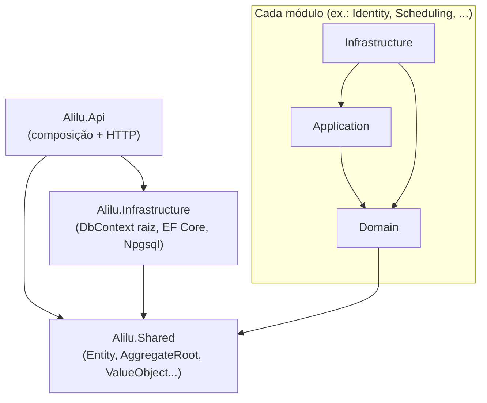

# Arquitetura do backend ALILU

> Documento de arquitetura. Seções sem indicação de etapa descrevem a
> fundação criada na **Etapa 01 (Backend modular)**; as seções **"Etapa 03 —
> módulo Identity"**, **"Etapa 04 — módulo Condominium"** e **"Etapa 05 —
> módulo Resident (validação do morador)"**, no final, descrevem o que
> mudou com cada módulo de negócio real.

## Visão geral

O backend é um **Modular Monolith**: uma única API (`Alilu.Api`) organizada
em módulos de negócio independentes. Cada módulo é dividido em três
projetos .csproj — **Domain**, **Application** e **Infrastructure** — para
manter as regras de negócio isoladas de detalhes de framework e persistência.

```
backend/
├── Alilu.sln
├── Directory.Build.props        # TargetFramework, Nullable, etc. comuns a todos os projetos
├── src/
│   ├── Api/
│   │   └── Alilu.Api/                       # composição da aplicação + exposição HTTP
│   ├── Shared/
│   │   └── Alilu.Shared/                    # Entity, AggregateRoot, ValueObject, DomainException, IDomainEvent
│   ├── Infrastructure/
│   │   └── Alilu.Infrastructure/            # AliluDbContext (raiz), EF Core + Npgsql, configuração de conexão
│   └── Modules/
│       ├── Identity/{Domain,Application,Infrastructure}/
│       ├── Condominium/{Domain,Application,Infrastructure}/
│       ├── Resident/{Domain,Application,Infrastructure}/
│       ├── Professional/{Domain,Application,Infrastructure}/
│       ├── Scheduling/{Domain,Application,Infrastructure}/
│       ├── Reviews/{Domain,Application,Infrastructure}/
│       ├── Recommendations/{Domain,Application,Infrastructure}/
│       ├── Notifications/{Domain,Application,Infrastructure}/
│       └── Administration/{Domain,Application,Infrastructure}/
└── scripts/
    └── check-references.py      # valida as regras de dependência abaixo
```

30 projetos no total: `Alilu.Api`, `Alilu.Shared`, `Alilu.Infrastructure` e
9 módulos × 3 camadas.

## Por que "Alilu.Shared" e não mais "Alilu.BuildingBlocks.Domain"?

Na Etapa 00 o kit de DDD (Entity/AggregateRoot/ValueObject/DomainException)
tinha sido criado como `Alilu.BuildingBlocks.Domain`. A Etapa 01 pede
explicitamente um projeto `Alilu.Shared` na raiz da solução — então esse
projeto foi **renomeado** (mesmo conteúdo, mesmo propósito, novo nome e
namespace `Alilu.Shared`) em vez de criar um projeto duplicado. Referências
em `Alilu.Api` e `Alilu.Infrastructure` foram atualizadas.

`Alilu.Infrastructure` (DbContext raiz + configuração do Postgres) não foi
mencionado na lista de estrutura do PROMPT 01, mas foi mantido tal como
criado na Etapa 00: ele não é um "módulo de negócio", é a composição de
persistência da aplicação, e a seção POSTGRES deste prompt pede exatamente
o que ele já provê (DbContext, configuração de conexão, EF Core). Nenhum
módulo depende dele nem o contrário — ele só é referenciado pela `Alilu.Api`.

## Regras de dependência entre camadas e módulos



Regras aplicadas (e verificadas por `scripts/check-references.py`):

1. **Domain não depende de Infrastructure** (nem de Application) — só de `Alilu.Shared`.
2. **Application não depende de Api** — nem de Infrastructure; só do Domain do próprio módulo.
3. **Infrastructure implementa persistência/integrações** — depende do Domain e da Application do próprio módulo.
4. **Nenhum módulo referencia outro módulo** (Identity não conhece Condominium, etc.) — cada módulo é independente.
5. **Api é composição + HTTP** — referencia `Alilu.Infrastructure` e `Alilu.Shared`, mais a Application/Infrastructure de cada módulo que já tiver algo a compor (ex.: `AddIdentityModule()` — ver "Etapa 03" abaixo). Isso é permitido: a regra é módulo↛módulo, e Domain/Application↛Api — nunca Api↛módulo.
6. **Sem dependências circulares** no grafo de projetos (confirmado pelo script a cada etapa).

## Verificação automática

```bash
cd backend
python3 scripts/check-references.py
```

O script lê todos os `.csproj` da solução, reconstrói o grafo de
`ProjectReference` e falha (exit code 1) se encontrar: referência de um
módulo para outro, referência de Application/Domain para `Alilu.Api`,
violação da direção Domain→Application→Infrastructure, ou qualquer ciclo
no grafo. Rodado nesta etapa: **30 projetos, 0 violações, 0 ciclos.**

## PostgreSQL / EF Core — status (atualizado na Etapa 05)

- `Alilu.Infrastructure` referencia `Microsoft.EntityFrameworkCore`,
  `Npgsql.EntityFrameworkCore.PostgreSQL` e
  `Microsoft.EntityFrameworkCore.Design`.
- `AliluDbContext` (em `src/Infrastructure/Alilu.Infrastructure/Persistence/`)
  é o DbContext raiz da aplicação. Propositalmente **não expõe
  `DbSet<T>` como propriedades** para nenhuma entidade de nenhum módulo —
  isso exigiria `Alilu.Infrastructure` referenciar o Domain de cada módulo,
  quebrando a independência entre eles. Os repositórios de cada módulo
  acessam suas entidades via `dbContext.Set<T>()`, que funciona para
  qualquer tipo já presente no modelo (registrado dinamicamente — ver
  seções "Etapa 03"/"Etapa 04" abaixo) sem precisar de uma propriedade
  `DbSet` declarada.
- Tabelas de negócio até agora: `identity.users`,
  `identity.refresh_tokens` (Etapa 03), `condominium.condominiums`,
  `condominium.condominium_units`, `condominium.condominium_invitations`
  (Etapa 04), `resident.condominium_memberships` (Etapa 05) — schemas
  separados por módulo, mapeadas em
  `Alilu.Modules.<Módulo>.Infrastructure/Persistence/`.
- A connection string vem de `ConnectionStrings:AliluDatabase`
  (`appsettings.Development.json` aponta para o Postgres local do
  `docker-compose.yml`, na porta **5433** do host — remapeada da porta
  padrão 5432 porque, na máquina de desenvolvimento usada até aqui, a 5432
  já estava ocupada por outro projeto local. Se isso não se aplicar ao seu
  ambiente, pode voltar para `5432:5432` no `docker-compose.yml` e no
  `appsettings.Development.json` — só mantenha os dois arquivos
  consistentes entre si.)
- **Migrations:** a primeira migration (`InitialCreateIdentity`, Etapa 03)
  e a migration da Etapa 04 (`AddCondominiumModule`) já foram geradas e
  aplicadas com sucesso pelo usuário. A migration da Etapa 05 (tabela
  `resident.condominium_memberships`, incluindo o índice único filtrado —
  ver seção "Etapa 05" abaixo) ainda **não foi gerada neste sandbox** —
  ver limitação abaixo — gere-a na sua máquina com:
  ```bash
  dotnet ef migrations add AddResidentModule \
    --project src/Infrastructure/Alilu.Infrastructure \
    --startup-project src/Api/Alilu.Api
  dotnet ef database update \
    --project src/Infrastructure/Alilu.Infrastructure \
    --startup-project src/Api/Alilu.Api
  ```
  (o `docker-compose.yml` da raiz sobe o Postgres local usado pela
  connection string de desenvolvimento — confira que o container está no
  ar, `docker compose up -d`, antes de rodar `database update`.)

  As ferramentas do EF Core procuram `Microsoft.EntityFrameworkCore.Design`
  no projeto de **startup** (`Alilu.Api`), não só no projeto do DbContext
  — e como esse pacote está marcado `PrivateAssets="all"` em
  `Alilu.Infrastructure` (não deve "vazar" para quem o referencia), ele
  precisa estar referenciado nos dois `.csproj`. `Alilu.Api.csproj` já
  inclui essa referência.

- **Seed de desenvolvimento (Etapa 04):** `Alilu.Api/Program.cs` roda
  `ICondominiumSeeder.SeedAsync()` logo após `app.MapControllers()`,
  **só quando `app.Environment.IsDevelopment()`** — cria o condomínio
  "Monte Carlo" e algumas unidades fictícias, de forma idempotente
  (confere se o CNPJ de seed já existe antes de inserir). Nunca roda em
  produção e nunca cria usuários/moradores — ver `CondominiumSeeder.cs`.
  O módulo Resident (Etapa 05) **não tem seed** — o vínculo nasce do fluxo
  real (resgatar um convite ou solicitar acesso), nunca de dado fictício.

## Build

Rodar a solução inteira:

```bash
cd backend
dotnet restore
dotnet build
```

> **Nota sobre o ambiente de build usado pelo Claude (sandbox):** este
> container não tem acesso a `api.nuget.org`. Os projetos que só têm
> `ProjectReference` entre si (sem pacote NuGet externo — `Alilu.Shared`,
> os projetos `Domain`/`Application` de cada módulo) foram compilados
> individualmente aqui com **0 erros**. `Alilu.Api`, `Alilu.Infrastructure`
> e a `Infrastructure`/`Application.Tests` de cada módulo (todos dependem
> de pacotes NuGet externos — EF Core/Npgsql, JWT, xUnit) não puderam ser
> restaurados neste sandbox — confirmado que compilam normalmente na sua
> máquina (você já rodou `dotnet build`/`dotnet ef` localmente com sucesso
> após os Prompts 00 e 03).

## O que NÃO foi feito na Etapa 01 (de propósito, histórico)

- Nenhuma entidade, Value Object ou regra de negócio em nenhum módulo.
- Nenhuma tabela/migration do Postgres.
- Módulo Identity não implementado.
- Módulo Condominium não implementado.
- `Alilu.Api` ainda não referenciava nenhum módulo (nada para compor ainda).

---

## Etapa 03 — módulo Identity

Primeiro módulo de negócio real da solução: autenticação completa
(cadastro, login, refresh token com rotação, revogação, `/me`). O módulo
Condominium **continua não implementado** — o usuário autenticado desta
etapa ainda não tem, necessariamente, vínculo com um condomínio (isso é
do módulo Resident, futuro).

### Duas referências novas, ambas já permitidas pelas regras da Etapa 01

1. **`Alilu.Modules.Identity.Infrastructure` → `Alilu.Infrastructure`
   (raiz).** O módulo precisa do `AliluDbContext` compartilhado para
   persistir `User`/`RefreshToken` — não faz sentido cada módulo ter seu
   próprio `DbContext`/conexão. Isso não é uma referência *entre módulos*
   (a regra 4 proíbe módulo→módulo; `Alilu.Infrastructure` não é um
   módulo) e não cria um ciclo: `Alilu.Infrastructure` continua sem
   nenhuma referência de projeto para dentro de qualquer módulo.

   O lado "sem conhecer o módulo" é resolvido em runtime, não em
   compile-time: `AliluDbContext.OnModelCreating` varre
   `AppDomain.CurrentDomain.GetAssemblies()` procurando assemblies cujo
   nome comece com `"Alilu."` e aplica (`ApplyConfigurationsFromAssembly`)
   qualquer `IEntityTypeConfiguration<T>` encontrada neles. Como
   `Alilu.Api` referencia `Alilu.Modules.Identity.Infrastructure`, o
   assembly do módulo já está carregado no processo quando a Api sobe —
   então `UserConfiguration`/`RefreshTokenConfiguration` são descobertas
   sem `Alilu.Infrastructure` jamais precisar de um `using
   Alilu.Modules.Identity...`. Esse era exatamente o plano descrito
   (como comentário) no `AliluDbContext` da Etapa 01.

2. **`Alilu.Api` → `Alilu.Modules.Identity.Application` e
   `Alilu.Modules.Identity.Infrastructure`.** A Api precisa de
   `IAuthService`/DTOs (Application) para o `AuthController`, e de
   `AddIdentityModule()` (Infrastructure) para registrar tudo no DI. A
   regra 5 já previa esse caso: "cada módulo passará a ser
   referenciado pela Api quando tiver algo a registrar".

`scripts/check-references.py` já cobria os dois casos acima sem precisar
de nenhuma mudança — a regra "Infrastructure só referencia Domain/Application
do próprio módulo" nunca proibiu uma referência a um projeto *fora* do
sistema de módulos (`Alilu.Infrastructure` tem `module = None` para o
script), e a Api (`module = None`) nunca teve nenhuma restrição de
referência. Rodado após a Etapa 03: **31 projetos (30 + o novo projeto de
testes), 0 violações, 0 ciclos.**

### Estrutura de `Alilu.Modules.Identity.Infrastructure`

```
Infrastructure/
├── Persistence/
│   ├── UserConfiguration.cs        # IEntityTypeConfiguration<User> (Email como owned type)
│   ├── RefreshTokenConfiguration.cs
│   ├── UserRepository.cs           # IUserRepository via AliluDbContext
│   ├── RefreshTokenRepository.cs
│   └── UnitOfWork.cs               # IUnitOfWork -> AliluDbContext.SaveChangesAsync
├── Security/
│   ├── JwtOptions.cs                # seção "Jwt" do appsettings
│   └── JwtTokenGenerator.cs         # IJwtTokenGenerator via System.IdentityModel.Tokens.Jwt
├── Email/
│   └── NoOpEmailSender.cs           # IEmailSender que só loga (envio real: etapa futura)
└── DependencyInjection.cs           # AddIdentityModule(IServiceCollection, IConfiguration)
```

`Email` (Value Object de Domain) é mapeado como *owned type* do EF Core
(`OwnsOne`), não como um `HasConversion` simples — isso permite consultas
como `u => u.Email.Value == normalizedEmail` serem traduzidas para SQL de
verdade, em vez de dependerem de tradução de operador customizado.

Enums (`UserRole`, `UserStatus`) são armazenados como texto
(`HasConversion<string>()`) para o banco ficar legível e não quebrar se a
ordem dos valores do enum mudar no futuro.

### Testes

`src/Modules/Identity/Application.Tests/` (xUnit) — cobre cadastro
(sucesso, e-mail duplicado, senha fraca, papel privilegiado), login
(sucesso, senha inválida, usuário inexistente, e a garantia de que os
dois casos de erro geram a mesma exceção — proteção contra enumeração de
usuários), refresh (rotação, token já usado, token desconhecido, token
expirado), revogação (marca revogado, idempotência, token desconhecido) e
`/me` (usuário válido, usuário inexistente). Usa fakes em memória para os
repositórios/JWT e as implementações **reais** de `PasswordHasher` e
`RefreshTokenGenerator` (só BCL, sem custo de rodar Postgres).

### Limitação do sandbox de build (Claude) nesta etapa

Igual à Etapa 01: este container não tem acesso a `api.nuget.org`, então
`Alilu.Modules.Identity.Infrastructure`, `Alilu.Api` e o projeto de testes
xUnit (todos dependem de pacotes externos — EF Core, JWT, xUnit) não
puderam ser restaurados/compilados aqui. O que **foi** verificado neste
sandbox:

- `Alilu.Modules.Identity.Domain` e `Alilu.Modules.Identity.Application`
  (zero dependências NuGet externas) compilam com **0 erros/0 warnings**.
- Toda a lógica de `AuthService` (as mesmas regras exercitadas pelos
  testes xUnit) foi validada rodando manualmente contra os fakes em
  memória — **todos os cenários passaram**.
- `python3 scripts/check-references.py` — 0 violações, 0 ciclos.

Rode `dotnet restore && dotnet build` e `dotnet test
src/Modules/Identity/Application.Tests` na sua máquina para a verificação
completa (Infrastructure/Api/testes xUnit).

---

## Etapa 04 — módulo Condominium

Segundo módulo de negócio: cadastro administrativo de condomínios,
unidades e convites de associação a uma unidade. Continua **multi-condomínio
desde o início** (nada aqui assume um único condomínio). O módulo Resident
(quem de fato consome um convite e vira morador de uma unidade) continua
não implementado — ver ressalva no README do módulo.

### Entidades e Value Objects (`Alilu.Modules.Condominium.Domain`)

- **`Condominium`** — `Name`, `Cnpj` (Value Object), `Address`/`Number`/
  `Neighborhood`/`City`/`State`/`ZipCode` (campos simples — diferente do
  CNPJ, nenhuma regra desta etapa precisa consultar/normalizar o endereço
  como um todo), `Status` (`Active`/`Inactive`), `CreatedAt`.
- **`Cnpj`** — Value Object que normaliza para 14 dígitos (sem máscara) e
  valida os dígitos verificadores pelo algoritmo oficial da Receita
  Federal (não é só checagem de tamanho) — mesma ideia de `Email` no
  módulo Identity: normalização é o que permite checar duplicidade de
  forma confiável.
- **`CondominiumUnit`** — `CondominiumId`, `Code`, `Type`
  (`Apartment`/`House`/`Commercial`), `Status`, `CreatedAt`. **De propósito
  sem navegação/FK para `Condominium`** — mesma decisão de `RefreshToken`
  em relação a `User` no módulo Identity (duas raízes de agregado, sem
  acoplar por navegação EF). A existência do condomínio é conferida pela
  Application antes de criar a unidade; a unicidade do código *dentro do
  condomínio* é conferida pela Application (`ExistsByCondominiumIdAndCodeAsync`)
  e reforçada por um índice único composto `(CondominiumId, Code)` em
  Infrastructure.
- **`CondominiumInvitation`** — `CondominiumId`, `UnitId`, `Email`,
  `CodeHash`, `ExpiresAt`, `UsedAt`, `CreatedAt`. Mesma política de
  segurança do `RefreshToken`: só o hash do código é armazenado, nunca o
  valor bruto. Também sem navegação/FK para `Condominium`/`CondominiumUnit`.
  `MarkAsUsed()` lança `DomainException` se o convite já foi usado ou já
  expirou — diferente de `RefreshToken.Revoke()` (idempotente), aqui
  reaproveitar um convite é um erro, não um no-op, porque o convite é uma
  autorização de uso único para uma unidade específica.
- **`IInvitationCodeGenerator`/`InvitationCodeGenerator`** — gera um
  código de 10 caracteres de um alfabeto sem caracteres ambíguos (sem
  `0/O`, `1/I/L`), pensado para ser digitado por uma pessoa (diferente do
  refresh token, que nunca é digitado) — só BCL, mesmo espírito de
  `RefreshTokenGenerator`.

### Autorização em duas camadas

"Não permitir que usuário comum crie condomínios" (e, por extensão, os
demais endpoints administrativos deste módulo) é aplicado em dois lugares:

1. **Api:** `[Authorize(Roles = "CondominiumAdmin,SuperAdmin")]` no nível
   do controller (`CondominiumsController`/`CondominiumInvitationsController`)
   — primeira linha de defesa, via pipeline padrão do ASP.NET Core.
2. **Application:** `CondominiumService` recebe um `CondominiumRequesterRole`
   (enum próprio deste módulo, com os mesmos nomes de
   `Identity.Domain.UserRole` — mas um tipo independente, já que nenhum
   módulo referencia outro) em toda operação, e chama `EnsureIsAdmin(...)`
   no início de cada uma, lançando `InsufficientPermissionsException` (403)
   caso contrário. Isso repete a regra de negócio como segunda camada de
   defesa (mesma filosofia de
   `InvalidRoleForSelfRegistrationException` no módulo Identity) — e é o
   que permite testar "autorização" com testes rápidos em memória, sem
   precisar de um host HTTP real (que este projeto não tem configurado).

### Fluxo de convite nesta etapa

Só existem **criar** e **consultar** convite (ver PROMPT 04 — API). Não
existe endpoint de "resgatar convite" — isso pertence ao módulo Resident,
futuro. `GetInvitationAsync` calcula o status (`Pending`/`Used`/`Expired`)
a partir de `UsedAt`/`ExpiresAt` no momento da consulta, sem guardar esse
status como coluna. Os testes do cenário "convite utilizado" simulam
diretamente o que o futuro fluxo de resgate fará (chamar
`CondominiumInvitation.MarkAsUsed()`), sem precisar desse endpoint existir
ainda.

### Estrutura de `Alilu.Modules.Condominium.Infrastructure`

```
Infrastructure/
├── Persistence/
│   ├── CondominiumConfiguration.cs            # Cnpj como owned type
│   ├── CondominiumUnitConfiguration.cs        # índice único (CondominiumId, Code)
│   ├── CondominiumInvitationConfiguration.cs
│   ├── CondominiumRepository.cs
│   ├── CondominiumUnitRepository.cs
│   ├── CondominiumInvitationRepository.cs
│   └── UnitOfWork.cs
├── Seed/
│   ├── ICondominiumSeeder.cs
│   └── CondominiumSeeder.cs                    # "Monte Carlo" + unidades fictícias, só em Development
└── DependencyInjection.cs                      # AddCondominiumModule(IServiceCollection, IConfiguration)
```

### Testes

`src/Modules/Condominium/Application.Tests/` (xUnit) — cobre os 6
cenários pedidos: criação (condomínio, unidade, convite — incluindo
normalização de CNPJ e rejeição de CNPJ inválido), unidade duplicada
(mesmo código no mesmo condomínio rejeitado; mesmo código em condomínios
diferentes aceito), convite (criação retorna o código bruto uma única
vez; unidade de outro condomínio rejeitada), convite expirado (mesma
técnica de `RefreshTests` no módulo Identity: convite com validade de
100ms + `Task.Delay(250)`), convite utilizado (`MarkAsUsed()` direto na
entidade, simulando o futuro fluxo de resgate; usar duas vezes lança
`DomainException`) e autorização (`AuthorizationTests.cs` varre as 6
operações com papéis não-admin e admin). Usa fakes em memória para os
repositórios e a implementação **real** de `InvitationCodeGenerator` (só
BCL, sem custo de rodar Postgres) — mesmo padrão do módulo Identity.

### Limitação do sandbox de build (Claude) nesta etapa

Igual às Etapas 01/03: `Alilu.Modules.Condominium.Infrastructure`,
`Alilu.Api` e o projeto de testes xUnit (dependem de EF Core/xUnit) não
puderam ser restaurados/compilados aqui. O que **foi** verificado neste
sandbox:

- `Alilu.Modules.Condominium.Domain` e `Alilu.Modules.Condominium.Application`
  (zero dependências NuGet externas) compilam com **0 erros/0 warnings**.
- Toda a lógica de `CondominiumService` (os mesmos 6 cenários pedidos pelo
  PROMPT 04, incluindo os testes de `AuthorizationTests.cs`) foi validada
  rodando manualmente contra os fakes em memória, usando o
  `InvitationCodeGenerator` real — **35 verificações, todas passaram**.
- `python3 scripts/check-references.py` — **32 projetos, 0 violações, 0
  ciclos.**

Rode `dotnet restore && dotnet build`, `dotnet test
src/Modules/Condominium/Application.Tests` e os comandos de migration (ver
seção "PostgreSQL / EF Core" acima) na sua máquina para a verificação
completa.

## Etapa 05 — módulo Resident (validação do morador)

Terceiro módulo de negócio, e o primeiro que **liga** os outros dois: o
vínculo seguro morador↔condomínio↔unidade. Antes desta etapa, um usuário
autenticado (Identity) não tinha nenhuma ligação formal com um condomínio/
unidade (Condominium) — a partir de agora, essa ligação existe como sua
própria entidade, com seu próprio ciclo de vida. Diaristas/prestadores de
serviço continuam **fora de escopo**, de propósito (ver PROMPT 05).

### `CondominiumMembership` (`Alilu.Modules.Resident.Domain`)

Exatamente os campos pedidos no prompt — `Id`, `UserId`, `CondominiumId`,
`UnitId`, `Status`, `ValidatedAt`, `ValidatedBy`, `CreatedAt`, `UpdatedAt`
— e nada além disso. Em particular, **não tem `Name`/`Phone`**: esses
dados já existem em `Identity.User` (Etapa 03); duplicá-los aqui criaria
duas fontes de verdade para a mesma informação. A tela de solicitação
(FLUXO 2) não pede nome/telefone de novo — a Api já os tem a partir do
usuário autenticado.

`MembershipStatus`: `Pending`/`Active`/`Rejected`/`Blocked`. Mesma decisão
de design de `CondominiumUnit`/`CondominiumInvitation`: **sem
navegação/FK** para `User`/`Condominium`/`CondominiumUnit` — só os Ids
como valores simples (e, tecnicamente, nem haveria como declarar essa
navegação: nenhum módulo referencia outro). Dois construtores estáticos,
um para cada fluxo:

- `CreateActiveFromInvitation` (FLUXO 1) — nasce direto `Active`.
  `ValidatedBy` fica `null`: ninguém "aprovou" isto agora, a autorização
  já tinha sido concedida quando o administrador criou o convite (Etapa
  04); essa informação (quem criou o convite) pertence ao módulo
  Condominium e não é replicada aqui.
- `CreatePendingRequest` (FLUXO 2) — nasce `Pending`, aguardando
  `Approve`/`Reject` por um administrador.

`Block` só é válido a partir de `Active`; `Approve`/`Reject` só a partir
de `Pending` — cada um lança `DomainException` fora da transição válida.

### O problema central desta etapa: dois módulos que não podem se falar

O PROMPT 01 estabeleceu que nenhum módulo pode referenciar outro, em
nenhuma camada — regra verificada por `scripts/check-references.py` desde
a Etapa 01, e que continua valendo aqui: `Alilu.Modules.Resident.Application`
só referencia `Alilu.Modules.Resident.Domain`, nunca o módulo Condominium.

Só que o FLUXO 1 (convite) por definição precisa dos dois módulos ao
mesmo tempo: validar o convite é uma regra do módulo Condominium (código,
validade, uso, e-mail — dados que só existem em `CondominiumInvitation`);
criar o `CondominiumMembership` é uma regra do módulo Resident. Nenhum
dos dois pode chamar o outro para resolver isso sozinho.

A solução: a **Api é a composição raiz** (mesmo papel que já cumpre desde
a Etapa 01/03 — ver `Alilu.Api.csproj`, que pode referenciar a Application
e a Infrastructure de qualquer módulo, só os módulos entre si que não
podem). `ResidentMembershipsController.RedeemInvitation` injeta
`IInvitationRedemptionService`/`ICondominiumDirectoryService` (módulo
Condominium) **e** `IMembershipService` (módulo Resident) lado a lado, e
orquestra a sequência:

1. `IInvitationRedemptionService.ValidateInvitationAsync` (Condominium) —
   valida o convite e devolve `CondominiumId`/`UnitId` **resolvidos a
   partir do próprio convite**, nunca de nada que o corpo da requisição
   informe (o corpo só tem o código digitado, ver `RedeemInvitationBody`
   — sem nenhum campo de condomínio/unidade).
2. `IMembershipService.CreateMembershipFromInvitationAsync` (Resident) —
   recebe os Ids já resolvidos e cria o vínculo (`Active`).
3. Só depois do passo 2 ter sucesso, `IInvitationRedemptionService.MarkInvitationAsUsedAsync`
   (Condominium) marca o convite como usado.

Por que a ordem 1→2→3, e não marcar o convite como usado logo no passo 1:
se a criação do vínculo (passo 2) falhar por qualquer motivo — ex.:
`DuplicateMembershipException`, "usuário já vinculado" — um convite
"queimado" à toa deixaria a pessoa sem conseguir tentar de novo, mesmo
sem ter conseguido se vincular. Separar validar (só leitura, passo 1) de
marcar como usado (escrita, passo 3) evita esse problema — é por isso que
`IInvitationRedemptionService` tem os dois métodos separados em vez de um
`RedeemAsync` único.

O FLUXO 2 (solicitação) tem o mesmo formato, mais simples: `RequestAccess`
chama `ICondominiumDirectoryService.ValidateUnitAsync` (Condominium —
confirma que a unidade existe e pertence ao condomínio informado) antes
de chamar `IMembershipService.RequestResidentAccessAsync` (Resident).

### SEGURANÇA — "nunca confiar em condominiumId/unitId vindos do cliente"

Duas interpretações diferentes, dependendo do fluxo:

- **FLUXO 1 (convite):** o cliente **nunca envia** condomínio/unidade — só
  o código (`RedeemInvitationBody(string Code, string? Email)`). Segurança
  por construção: não existe parâmetro para o cliente "escolher" a
  unidade errada, porque o método nem aceita esse parâmetro.
  `InvitationRedemptionTests.ValidateInvitationAsync_NeverAcceptsCondominiumOrUnitFromTheCaller_...`
  prova isso.
- **FLUXO 2 (solicitação):** aqui o cliente necessariamente informa
  condomínio/unidade (é o próprio ato de "escolher minha unidade" no
  diretório público) — a defesa aqui é **revalidar no servidor**:
  `ICondominiumDirectoryService.ValidateUnitAsync` confirma que os dois
  Ids realmente existem e se relacionam antes de deixar o módulo Resident
  criar a solicitação, em vez de aceitar cegamente o que veio do corpo da
  requisição.

"Não permitir vínculo duplicado": checado em duas camadas, mesmo padrão
já usado nas Etapas 03/04 — `MembershipService`/`IMembershipRepository.ExistsActiveOrPendingAsync`
antes de persistir (`DuplicateMembershipException`), e reforçado por um
índice único **filtrado** em `MembershipConfiguration`
(`HasFilter("\"Status\" IN ('Pending','Active')")` — de propósito não
cobre `Rejected`/`Blocked`, para permitir uma nova tentativa depois de uma
rejeição).

**Regra explicitamente adiada** (PROMPT 05 já veio com essa ressalva: "se
essa for a regra definida para o condomínio"): "uma unidade não deve ter
dois moradores principais ativos" **não foi implementada** nesta etapa —
não há, ainda, o conceito de "morador principal" vs. "morador adicional"
em `CondominiumMembership`, nem configuração por condomínio para essa
regra. Fica para uma etapa futura, quando essa regra for de fato
especificada.

### Duas interfaces de Application por módulo (self-service vs. admin)

Mesmo padrão dos dois lados:

- **Condominium:** `ICondominiumService` (administrativo, Etapa 04) +
  `IInvitationRedemptionService`/`ICondominiumDirectoryService` (novos,
  públicos — sem checagem de papel, porque resgatar convite/consultar o
  diretório não é uma ação administrativa).
- **Resident:** `IMembershipService` (self-service — sempre restrito ao
  próprio usuário autenticado, nunca recebe um `userId` de fora; "seguro
  por construção") + `IMembershipAdministrationService` (aprovar/rejeitar/
  bloquear — recebe `ResidentRequesterRole` e chama `EnsureIsAdmin(...)`
  no início de cada operação, mesmo padrão de `CondominiumService`).

### Endpoints novos

- `GET /api/resident/memberships` — `[Authorize]`, lista os vínculos do
  usuário autenticado.
- `GET /api/resident/memberships/active` — `[Authorize]`, vínculo `Active`
  do usuário, ou `204 No Content` ("acesso sem vínculo").
- `POST /api/resident/memberships/redeem-invitation` — `[Authorize]`,
  FLUXO 1.
- `POST /api/resident/memberships/request-access` — `[Authorize]`, FLUXO 2.
- `GET /api/admin/memberships/pending` — `[Authorize(Roles = "CondominiumAdmin,SuperAdmin")]`.
- `POST /api/admin/memberships/{id}/approve` — idem.
- `POST /api/admin/memberships/{id}/reject` — idem.
- `POST /api/admin/memberships/{id}/block` — idem.
- `GET /api/directory/condominiums` — `[Authorize]`, diretório público
  (só condomínios `Active`).
- `GET /api/directory/condominiums/{id}/units` — `[Authorize]`, idem (só
  unidades `Active`).

`ClaimsPrincipalExtensions` ganhou `GetResidentRequesterRole()` (espelha
`GetCondominiumRequesterRole()`) e `GetUserId()` (extraído do claim de
subject do JWT — usado por todo endpoint self-service, para nunca confiar
em um `userId` vindo do corpo da requisição).

`ExceptionHandlingMiddleware`: como os módulos Condominium e Resident
definem, cada um, seu próprio `InsufficientPermissionsException` (mesmo
nome, namespaces diferentes — não têm como compartilhar um tipo comum),
o mapeamento usa o nome totalmente qualificado para essas duas linhas
específicas, para não gerar ambiguidade de nome no `switch`.

### Mobile — fluxo de validação (`mobile/src/modules/resident/`)

Cinco telas pedidas pelo prompt, mais o "gate" que decide entre elas
(`app/(resident)/index.tsx`, a partir de `useMyMemberships` — TanStack
Query sobre `GET /api/resident/memberships`):

- **Nenhum vínculo** (nem `Active`, nem `Pending`) → `ChooseCondominiumScreen`
  — o início do fluxo: botão "Tenho um código de convite" (→ `EnterInvitationCodeScreen`)
  ou a lista de condomínios do diretório público, para quem vai pelo
  FLUXO 2.
- Escolher um condomínio na lista → `RequestResidentAccessScreen`
  (recebe `condominiumId` via parâmetro de rota do expo-router) — lista as
  unidades daquele condomínio (`GET /api/directory/.../units`), o morador
  escolhe a sua e confirma; a solicitação nasce `Pending`.
- **Vínculo `Pending`** → `WaitingApprovalScreen` — tela de espera com um
  botão "Verificar novamente" (refaz a consulta) e logout.
- **Vínculo `Active`** → `ResidentHomeScreen` — área do morador (ainda só
  com os dados básicos do vínculo + logout; as demais telas do morador —
  buscar profissional, agendamentos, avaliações — continuam não
  implementadas, como já eram desde a Etapa 01).

`EnterInvitationCodeScreen` só pede o código — o e-mail enviado ao backend
(campo opcional de `POST .../redeem-invitation`) é sempre o do próprio
usuário autenticado (`useAuth().user.email`), nunca digitado de novo.

Todas as mutações (`useRedeemInvitation`/`useRequestResidentAccess`, em
`modules/resident/hooks.ts`) invalidam a query de "meus vínculos" ao
terminar — por isso basta `router.replace('/(resident)')` depois de uma
mutação com sucesso: o gate detecta o novo estado sozinho, sem precisar
de nenhuma lógica de navegação condicional espalhada pelas telas.

### Testes

- `Condominium.Application.Tests/InvitationRedemptionTests.cs` — convite
  válido (com e sem e-mail informado), e-mail que não bate
  (`InvitationEmailMismatchException`), código inexistente
  (`InvitationNotFoundException`), convite expirado (mesma técnica de
  100ms + `Task.Delay(250)` já usada na Etapa 04), convite já usado
  (`InvitationAlreadyUsedException`), "convite para outra unidade" (prova
  que o resultado sempre traz a unidade *real* do convite, nunca outra —
  a própria assinatura do método não aceita esse parâmetro) e o padrão de
  duas fases (validar não consome o convite; só `MarkInvitationAsUsedAsync`
  consome).
- `Condominium.Application.Tests/CondominiumDirectoryTests.cs` — diretório
  público (só ativos) e `ValidateUnitAsync` (aceita/rejeita).
- `Resident.Application.Tests/` (novo projeto, mesmo padrão dos demais) —
  `RedeemInvitationTests` (vínculo nasce `Active`; "usuário já vinculado"
  → `DuplicateMembershipException`), `RequestResidentAccessTests`
  (solicitação nasce `Pending`; duplicidade), `ApprovalAndRejectionTests`
  (aprovação, rejeição, "depois de rejeitado pode solicitar de novo",
  bloqueio, transições inválidas), `NoActiveMembershipTests` ("acesso sem
  vínculo" — `GetMyActiveMembershipAsync` devolve `null`) e
  `AuthorizationTests` (as 4 operações administrativas, papel admin vs.
  não-admin).

### Limitação do sandbox de build (Claude) nesta etapa

Mesma limitação das Etapas 03/04: `Alilu.Modules.Resident.Infrastructure`,
`Alilu.Api` e os projetos de teste xUnit (dependem de EF Core/xUnit) não
puderam ser restaurados/compilados aqui. O que **foi** verificado neste
sandbox:

- `Alilu.Modules.Resident.Domain`, `Alilu.Modules.Resident.Application` e
  `Alilu.Modules.Condominium.Application` (com os novos serviços desta
  etapa) — todos com zero dependências NuGet externas — compilam com **0
  erros/0 warnings**.
- Toda a lógica de negócio desta etapa (os 10 cenários pedidos pelo PROMPT
  05: convite válido, expirado, já usado, para outra unidade, usuário já
  vinculado, solicitação, aprovação, rejeição, bloqueio, acesso sem
  vínculo) foi validada rodando manualmente contra fakes em memória,
  reaproveitando as mesmas implementações reais dos dois módulos
  (`InvitationCodeGenerator` real, serviços reais) — **27 verificações,
  todas passaram**.
- `python3 scripts/check-references.py` — **33 projetos, 0 violações, 0
  ciclos** — confirma que `Alilu.Modules.Resident.Application` de fato não
  referencia nada do módulo Condominium, mesmo orquestrando os dois na Api.
- Mobile: `npx tsc --noEmit` e `npx eslint .` — **0 erros** em todo o
  projeto (incluindo os arquivos novos desta etapa).

Rode `dotnet restore && dotnet build`, `dotnet test
src/Modules/Resident/Application.Tests`, `dotnet test
src/Modules/Condominium/Application.Tests` e os comandos de migration (ver
seção "PostgreSQL / EF Core" acima) na sua máquina para a verificação
completa.
